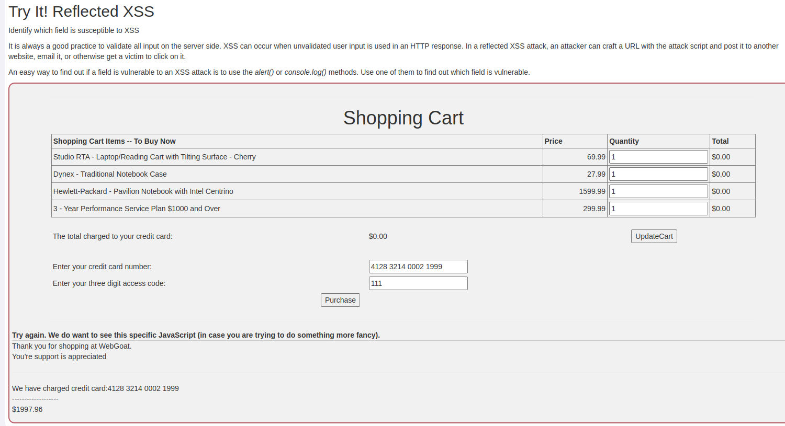
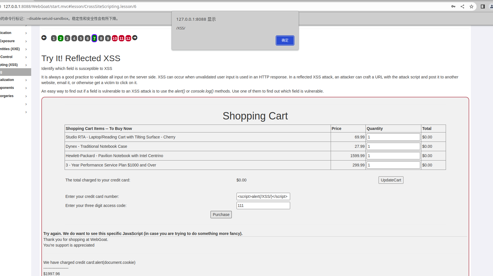

# 一、XSS及反射型XSS概述
1. XSS（跨站脚本攻击）是一种安全漏洞，允许攻击者将恶意脚本注入到其他用户查看的网页中。攻击者可以利用Web应用程序中的漏洞将自己的代码注入到页面中。  
2. XSS攻击有三种类型：存储型、反射型和基于DOM。存储型XSS发生在恶意脚本存储在服务器上并在每次加载页面时执行的情况下。反射型XSS发生在恶意脚本反射到服务器并在用户的浏览器中执行的情况下。基于DOM的XSS发生在恶意脚本在页面的文档对象模型（DOM）中执行的情况下。
3. 反射型XSS是一种XSS攻击类型，它发生在Web应用程序将用户输入发送到Web浏览器而没有正确验证或清理它的情况下。用户输入以错误消息或搜索结果的形式反射回用户，并在用户的浏览器中执行恶意脚本。反射型XSS只能执行一次，通常造成的危害较小，很多的SRC基本都不收反射型XSS漏洞。
4. 为了防止反射型XSS攻击，重要的是要正确验证和清理所有用户输入，特别是在网页上显示的输入。这可以通过使用Web应用程序防火墙、编码用户输入和使用内容安全策略来实现。
# 二、代码示例
1. 以下代码演示了反射型XSS漏洞的产生
```php
// 获取用户输入  
$search = $_GET['search'];  
// 构造搜索结果  
echo "搜索结果： " . $search;  
```
2. 在上述示例中，用户输入通过`$_GET`变量传递给PHP脚本，然后在搜索结果中反射回用户。如果攻击者在搜索框中输入恶意脚本，它将被反射回用户的浏览器并执行。  
3. 为了防止反射型XSS攻击，应该对所有用户输入进行正确的验证和清理。在这个示例中，可以使用htmlspecialchars()函数来转义用户输入，以防止恶意脚本被执行。将上述代码修改为如下示例，可防止反射型XSS的产生
```php
// 获取用户输入  
$search = $_GET['search'];  
// 转义用户输入  
$search = htmlspecialchars($search, ENT_QUOTES, 'UTF-8');  
// 构造搜索结果  
echo "搜索结果： " . $search;
```
# 三、webgoat靶场示例
1. 如下，可以看到页面中的card number会回显在页面上
	
2. 在card number处填入XSS代码，可以看到页面成功弹窗了
	