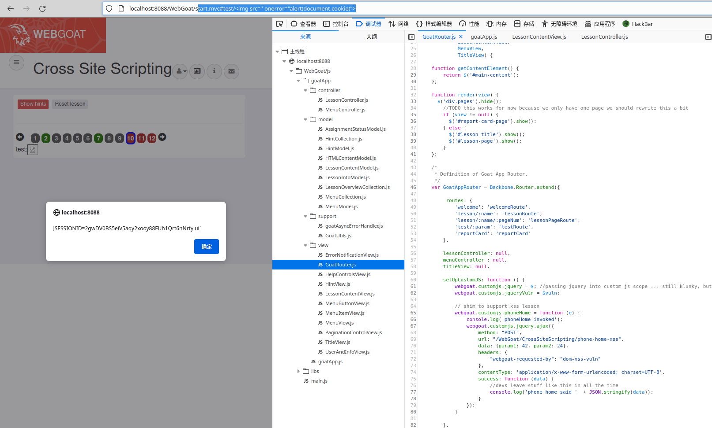

# 一、DOM型XSS概述
1. DOM型XSS是一种XSS攻击类型，它发生在Web应用程序使用不可信数据动态更新Web页面的文档对象模型(DOM)时。攻击者可以将恶意代码注入到DOM中，然后在受害者的浏览器中执行。
2. 与其他类型的XSS攻击不同，DOM型XSS攻击不涉及服务器端的漏洞，而是利用客户端脚本来执行恶意代码。攻击者可以通过修改DOM来欺骗用户，例如在页面中插入虚假的表单或链接，以窃取用户的敏感信息。
3. 为了防止DOM型XSS攻击，重要的是要正确验证和清理所有用户输入，特别是用于更新DOM的输入。这可以通过使用Web应用程序防火墙、编码用户输入和使用内容安全策略来实现。
# 二、代码示例
1. 使用PHP编写一个存在DOM型XSS的示例
```PHP
// 获取用户输入
$name = $_GET['name'];
// 将用户输入插入到HTML页面中
echo "<h1>Welcome, " . $name . "!</h1>";
```
2. 在这个示例中，攻击者可以通过在name参数中注入恶意代码来执行DOM型XSS攻击。为了防止这种攻击，应该对用户输入进行验证和清理，例如使用htmlspecialchars()函数对用户输入进行编码，以确保任何HTML标记都被转义。
3. 可以使用以下示例修复上述代码的漏洞
```PHP
// 获取用户输入
$name = $_GET['name'];
// 将用户输入插入到HTML页面中
echo "<h1>Welcome, " . htmlspecialchars($name) . "!</h1>";
```
# 三、webgoat靶场DOM型XSS示例
1. WebGoat靶场XSS的Less 10，页面中提示了路由，F12到网络选项下，刷新一下页面，查看数据包，发现有一个GoatRouter.js的数据包
	
2. 该数据包请求了WebGoat/js/goatApp/view/GoatRouter.js文件，查看该文件源码，发现存在test参数传递
	
3. 继续往下看，找到一个testRoute方法，该方法调用了lessonController.testHandler()方法，并将参数传递给了该方法
	
4. F12在调试器下找到lessonController.testHandler()方法所在的文件位置，即WebGoat/js/goatApp/controller/LessonController.js文件的testHandler()方法，查看源码
	
5. 发现testHandler()方法调用了lessonContentView.showTestParam()方法并将参数传递给了该方法，追踪该方法，即WebGoat/js/goatApp/view/LessonContentView.js文件中的showTestParam()方法，查看源码
	
6. 发现showTestParam()方法接收了传递过来的参数，并将参数输出到了页面中，整个路由调用过程中没有发现对传递的参数的过滤，这样就导致前端用户可以将恶意代码插入到参数中，然后通过路由调用最终被lessonContentView.showTestParam()方法执行，从而造成攻击。再看一下网站的URL如下。
```HTML
WebGoat/start.mvc#lesson/CrossSiteScripting.lesson/9
```
7. 从该页面的URL分析，网站是MVC设计模式的，`start.mvc#`为路由入口，后面接参数和路由，这样的话，漏洞函数的利用链如下，最终造成漏洞的lessonContentView.showTestParam()方法是由GoatRouter.testRoute()最初调用的，那么只要将XSS代码插入到test参数后面即可
```
GoatRouter.testRoute()——>lessonController.testHandler()——>lessonContentView.showTestParam()
```
8. 由此构造payload如下
```
start.mvc#test/
```
9. 浏览器访问payload，页面弹窗，成功获取到cookie
	