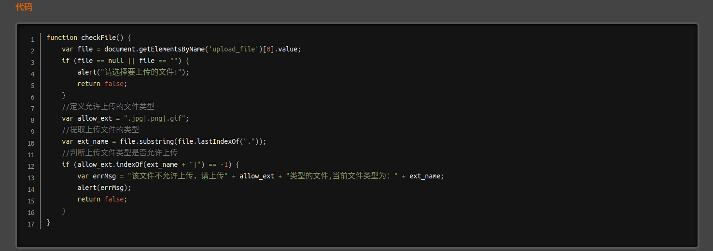
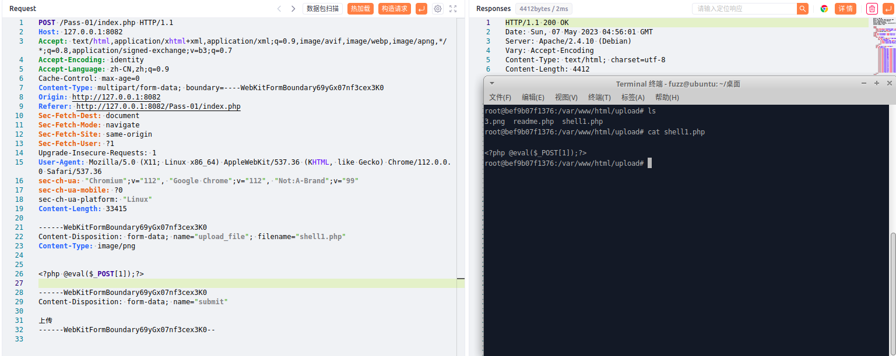
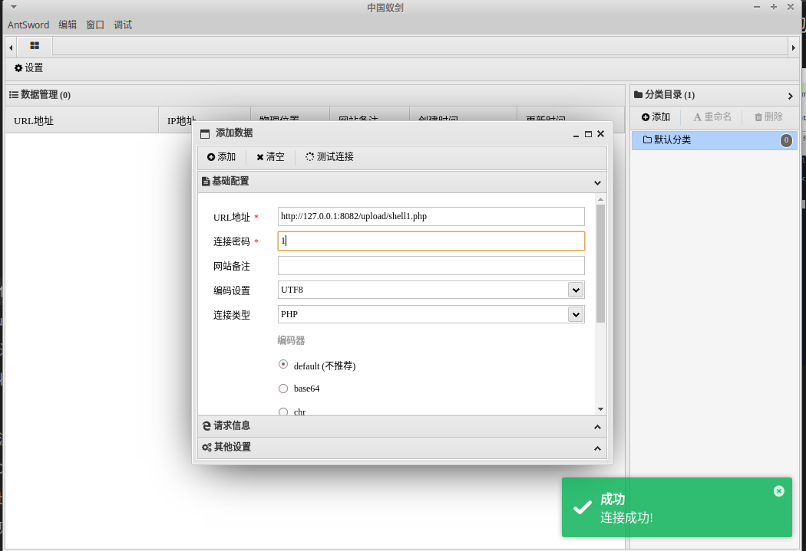

# 一、文件上传漏洞概述
1. 文件上传漏洞是一种安全漏洞，攻击者可以通过它向Web应用程序上传恶意文件，然后在Web服务器上执行该文件。
2. 攻击者可以利用这种漏洞来执行命令、窃取数据或在Web服务器上安装后门，从而使攻击者能够对受害者进行更广泛的攻击。
3. 文件上传漏洞可以分为两种类型：本地文件上传漏洞和远程文件上传漏洞。  
4. 文件上传的检测分为前端校验和后端校验，前端校验就是js校验
# 二、文件上传漏洞的防范
1. 为了防止文件上传漏洞，重要的是要对所有上传的文件进行严格的验证和过滤。可以检查文件类型、文件名和文件内容来确定文件是否是有效的，还可以对上传的文件进行隔离，并对其进行适当的文件权限设置。
# 三、代码示例
1. 使用PHP编写一个存在本地文件上传漏洞的代码示例
```PHP
// 获取用户上传的文件
$file = $_FILES["uploaded_file"]["name"];
// 设置上传目录
$upload_dir = "./uploads/";
// 将文件移动到上传目录
if(move_uploaded_file($_FILES["uploaded_file"]["tmp_name"], $upload_dir . $file)) {
	echo "文件" . $file . "上传成功。";
} else {
	echo "文件上传失败。";
}
```
2. 在这个示例中，我们没有对上传的文件类型进行任何验证，也没有对上传的文件进行任何隔离或限制，因此攻击者可以上传任何类型的文件，并在Web服务器上执行该文件。为了防止本地文件上传漏洞，我们应该对所有上传的文件进行严格的验证和过滤，以确保上传的文件是有效的，并且没有包含任何恶意代码。
# 四、upload-labs靶场示例
1. less1，先查看源码，如下所示，使用了前端js对上传文件的后缀进行了检测
	
2. 绕过方法很简单，先上传一个正常图片文件，然后抓包修改数据包即可，如下，上传成功
	
3. 使用蚁剑连接，如下，连接成功
	