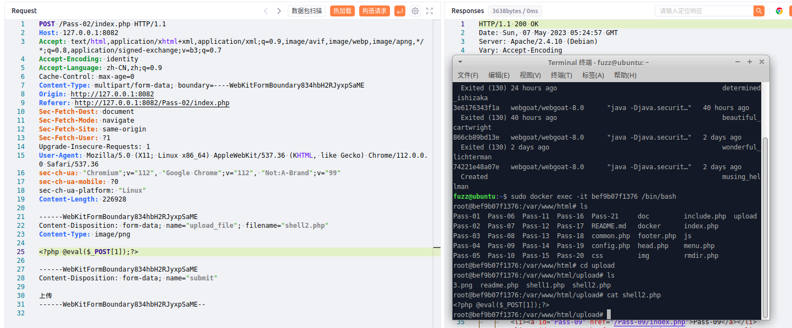
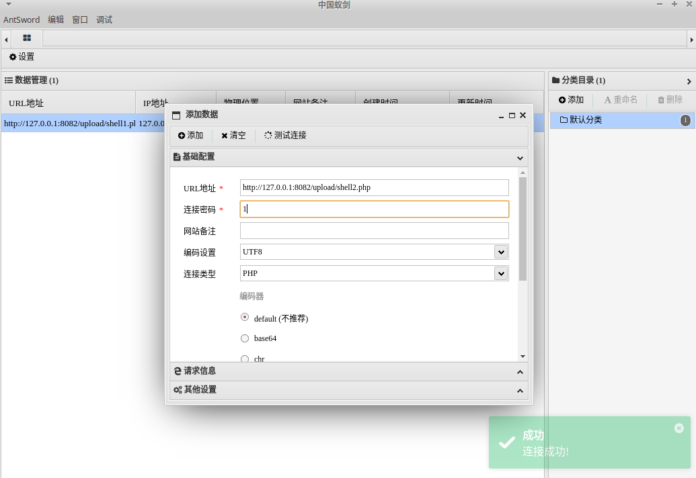

# 一、文件上传MIME绕过概述
1. 文件上传的MIME检测是一种检查上传文件的MIME类型的技术。MIME类型是一种在HTTP协议中用于标识文件类型的机制，它通过文件的扩展名或内容来确定文件的类型。在文件上传中，MIME检测用于检查上传文件的MIME类型是否合法。
2. 攻击者可以通过修改文件的扩展名或内容来伪装上传文件的MIME类型，并绕过MIME检测。例如，攻击者可以将一个PHP文件的扩展名修改为.jpg，并上传到服务器上，以绕过服务器的MIME检测。  
3. 攻击者可以通过发送伪造HTTP头部的方式欺骗服务器的MIME检测。例如，攻击者可以发送一条带有假的Content-Type头部的HTTP请求，以绕过服务器的MIME检测。
# 二、代码示例
1. 使用PHP编写一个示例
```PHP
$is_upload = false;
$msg = null;
if (isset($_POST['submit'])) {
    if (file_exists(UPLOAD_PATH)) {
        if (($_FILES['upload_file']['type'] == 'image/jpeg') || ($_FILES['upload_file']['type'] == 'image/png') || ($_FILES['upload_file']['type'] == 'image/gif')) {
            $temp_file = $_FILES['upload_file']['tmp_name'];
            $img_path = UPLOAD_PATH . '/' . $_FILES['upload_file']['name']            
            if (move_uploaded_file($temp_file, $img_path)) {
                $is_upload = true;
            } else {
                $msg = '上传出错！';
            }
        } else {
            $msg = '文件类型不正确，请重新上传！';
        }
    } else {
        $msg = UPLOAD_PATH.'文件夹不存在,请手工创建！';
    }
}
```
2. 在这个示例中，代码只检查文件是否为图像类型，但没有检查文件的实际MIME类型，可被攻击者绕过，上传非图像文件或带有恶意代码的图像文件。为了避免这种情况，应该使用`$FILES['myfile']['type']`变量来获取文件的实际MIME类型，并确保只有允许的类型被接受。
# 三、upload-labs靶场示例
1. 先上传一个正常的图片进行抓包，然后修改数据包，如下，成功上传
	
2. 使用蚁剑连接，如下，成功连接
	