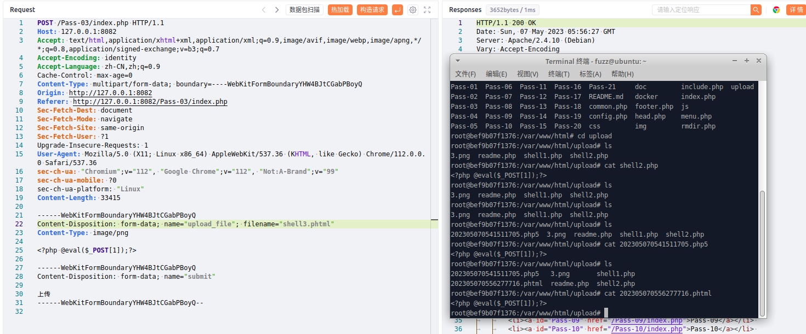
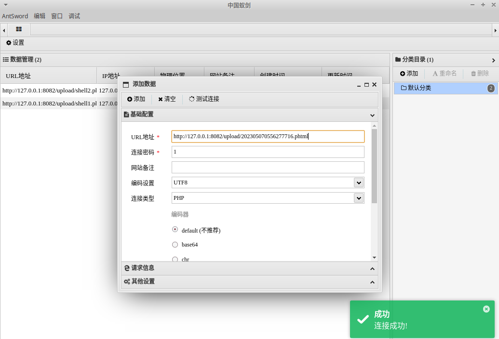

# 一、文件上传黑名单绕过概述
1. 文件上传黑名单绕过是指攻击者通过修改文件名或文件内容等方式，成功绕过基于文件名黑名单的文件上传安全校验，从而上传并执行恶意代码或文件。
2. 与文件类型白名单相比，黑名单更容易被攻击者绕过，因为攻击者可以使用多重扩展名或将恶意代码嵌入文档中等方式来绕过文件名过滤器。
# 二、代码示例
1. 使用PHP编写一个示例
```PHP
$is_upload = false;
$msg = null;
if (isset($_POST['submit'])) {
    if (file_exists(UPLOAD_PATH)) {
        $deny_ext = array('.asp','.aspx','.php','.jsp');
        $file_name = trim($_FILES['upload_file']['name']);
        $file_name = deldot($file_name);//删除文件名末尾的点
        $file_ext = strrchr($file_name, '.');
        $file_ext = strtolower($file_ext); //转换为小写
        $file_ext = str_ireplace('::$DATA', '', $file_ext);//去除字符串::$DATA
        $file_ext = trim($file_ext); //收尾去空

        if(!in_array($file_ext, $deny_ext)) {
            $temp_file = $_FILES['upload_file']['tmp_name'];
            $img_path = UPLOAD_PATH.'/'.date("YmdHis").rand(1000,9999).$file_ext;            
            if (move_uploaded_file($temp_file,$img_path)) {
                 $is_upload = true;
            } else {
                $msg = '上传出错！';
            }
        } else {
            $msg = '不允许上传.asp,.aspx,.php,.jsp后缀文件！';
        }
    } else {
        $msg = UPLOAD_PATH . '文件夹不存在,请手工创建！';
    }
}
```
2. 这个示例中使用黑名单的方式对上传的文件进行校验，在名单中的文件扩展名不允许上传，不在名单中的则可以被上传，这种情况下，攻击者只需要将文件扩展名修改为没有被禁止的类型即可绕过校验
# 三、upload-labs靶场示例
1. 先上传一个正常的图片，然后抓包修改，如下，成功上传后缀为phhtml的webshell文件
	
2. 使用蚁剑连接，如下，成功连接
	