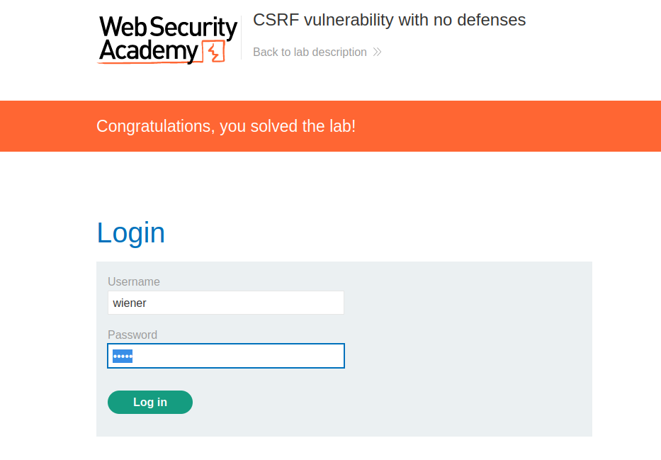
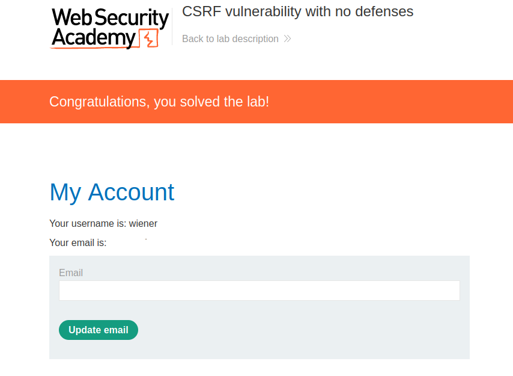
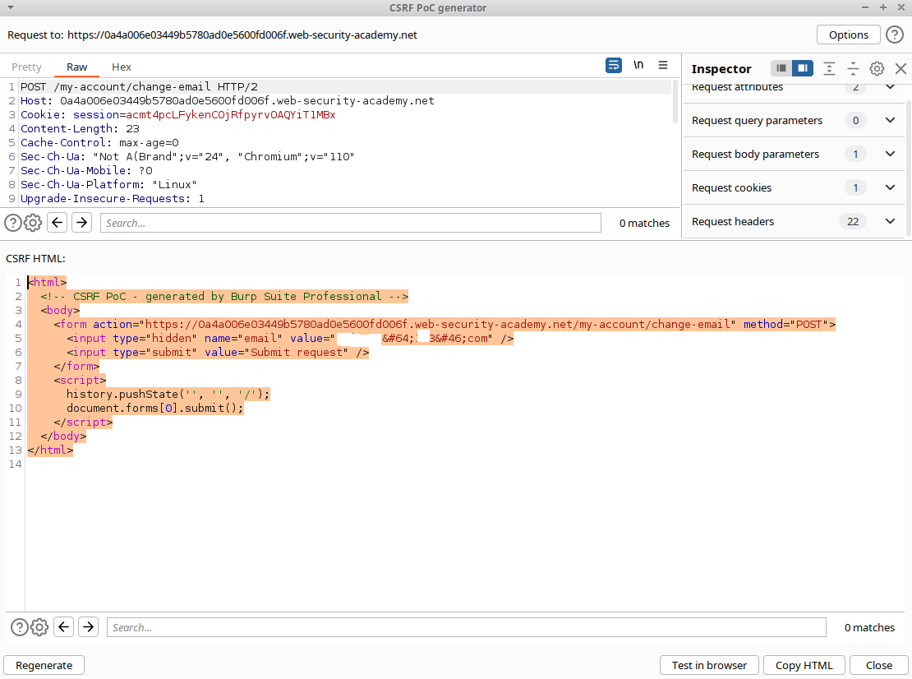
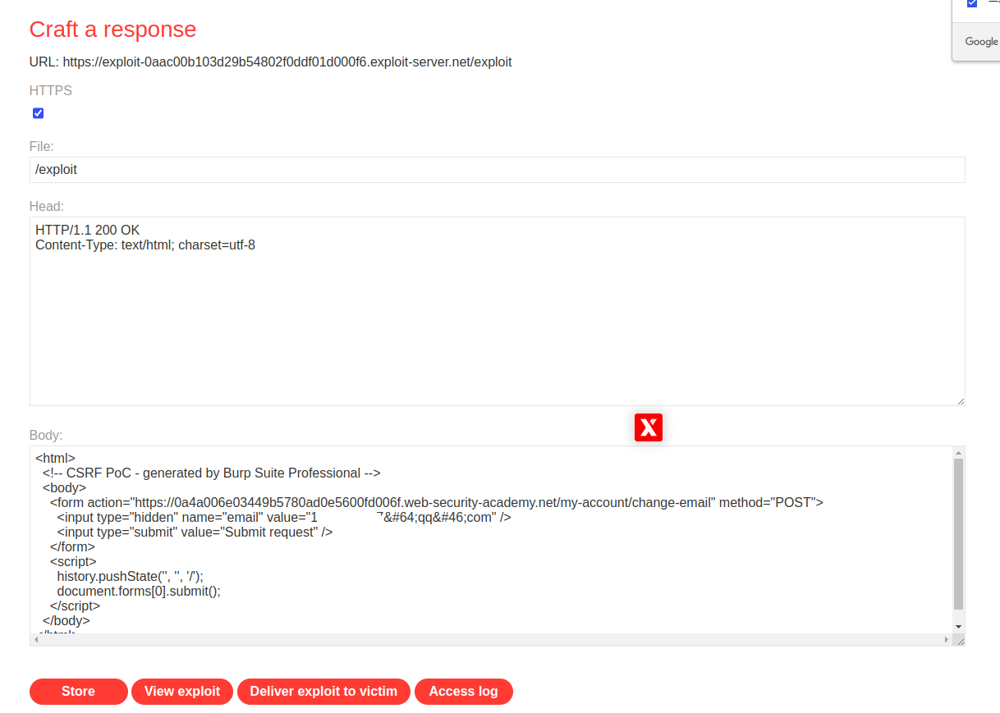

# 一、CSRF漏洞概述
1. CSRF漏洞（Cross-Site Request Forgery）是一种Web应用程序安全漏洞，攻击者可以利用该漏洞来执行未经授权的操作。
2. CSRF漏洞通常发生在Web应用程序未正确验证用户请求的来源时，攻击者可以通过构造恶意请求来欺骗用户执行恶意操作。例如，攻击者可以在受害者的浏览器中注入恶意代码，然后在用户不知情的情况下执行恶意操作，例如转账、修改密码等等。
3. 易出现CSRF的地方：
	- 表单提交：如果网站使用表单提交来处理用户输入，并未正确验证用户请求的来源，则可能存在CSRF漏洞。攻击者可以构造恶意请求，并将其发送到服务器，以执行未经授权的操作。  
	- URL参数：如果网站使用URL参数来处理用户输入，并未正确验证用户请求的来源，则可能存在CSRF漏洞。攻击者可以构造恶意URL，并将其发送到服务器，以执行未经授权的操作。  
	- Cookie：如果网站使用Cookie来存储用户会话信息，并未正确验证Cookie的来源，则可能存在CSRF漏洞。攻击者可以构造恶意请求
# 二、CSRF的利用条件
1. 一个相关的动作。应用程序中存在攻击者有理由诱导的操作。这可能是特权操作（例如修改其他用户的权限）或针对用户特定数据的任何操作（例如更改用户自己的密码）。
2. 基于 cookie 的会话处理。执行该操作涉及发出一个或多个 HTTP 请求，应用程序仅依赖会话 cookie 来识别发出请求的用户。没有其他机制来跟踪会话或验证用户请求。
3. 没有不可预测的请求参数。执行操作的请求不包含任何参数，其值攻击者无法确定或猜测。例如，当导致用户更改密码时，如果攻击者需要知道现有密码的值，则该函数不易受到攻击。
# 三、代码示例
1. 编写一个代码示例
```html
<!-- 存在CSRF漏洞的HTML代码示例 -->
<form action="http://example.com/transfer" method="POST">
<input type="hidden" name="amount" value="1000">
<input type="submit" value="转账">
</form>
```
2. 在这个示例中，我们使用HTML表单向http://example.com/transfer发出POST请求，转账1000元。如果用户已经登录到http://example.com，浏览器将自动发送该请求，并转账1000元。如果攻击者知道该请求的URL和参数，他们可以在另一个网站上注入恶意代码，并欺骗用户执行该请求，从而转账1000元。
3. 为了修复这个漏洞，我们需要在服务器端正确验证请求的来源。例如，我们可以在服务器端生成一个随机的令牌，并将其包含在表单中
```html
<!-- 修复CSRF漏洞的HTML代码示例 -->
<form action="http://example.com/transfer" method="POST">
  <input type="hidden" name="amount" value="1000">
  <input type="hidden" name="csrf_token" value="随机生成的令牌">
  <input type="submit" value="转账">
</form>
```
# 四、BurpSuite靶场示例
1. 打开靶场，打开BurpSuite抓包，但是不开启拦截，使用给定的wiener/peter登录

2. 登录后修改邮箱

3. 在历史数据包中找到302的那个修改邮箱的数据包，右键——>Generate CSRF Poc，生成一个CSRF的POC

4. 将POC复制到靶场提供的exploit server，将邮箱修改一下，如下

5. 点击store，然后点击Deliver exploit to victim（模拟发送给受害人、随后受害人点击的过程），随后即可看到该用户的邮箱被修改成了被你自定义的邮箱了。