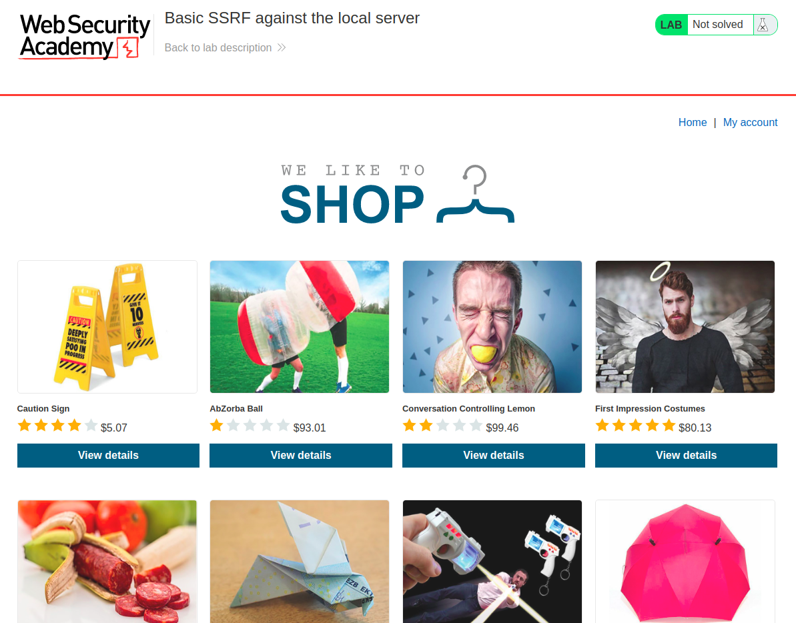
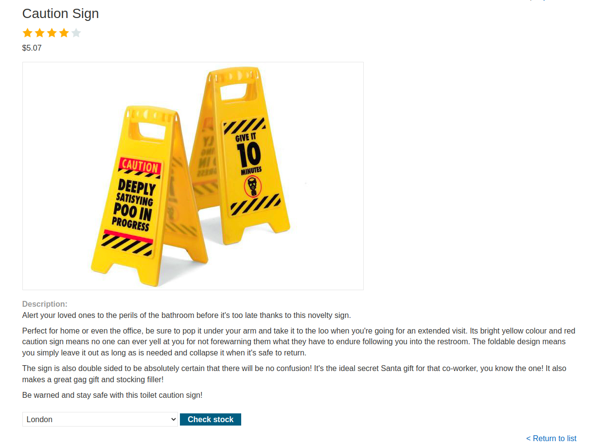
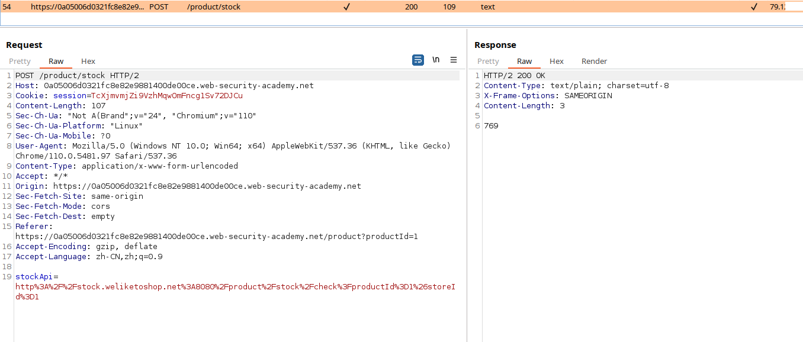
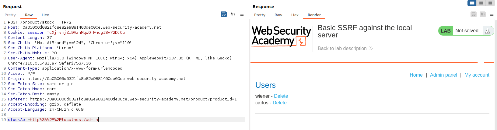
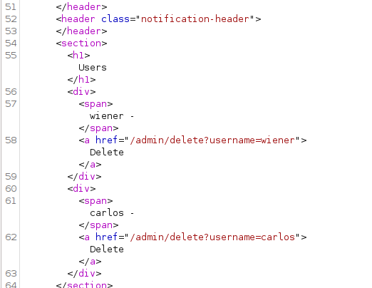
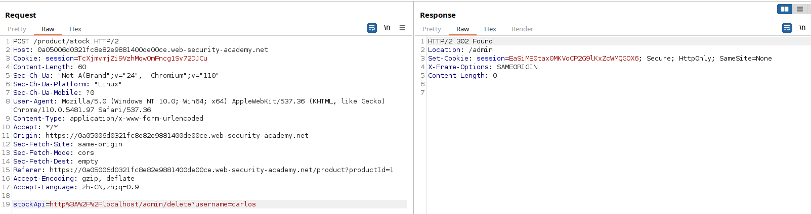
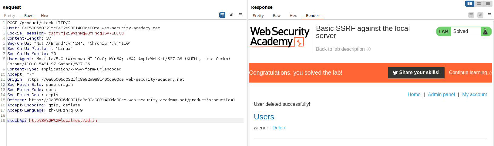

# 一、SSRF概述
1. SSRF（Server-Side Request Forgery）是一种Web应用程序安全漏洞，攻击者可以利用该漏洞来执行未经授权的操作。
2. SSRF漏洞通常发生在Web应用程序未正确验证用户请求的URL时，攻击者可以通过构造恶意请求来欺骗服务器执行恶意操作。例如，攻击者可以构造一个恶意请求，将其发送到服务器，并获取服务器上的敏感信息，例如访问内部网络、执行命令等等。
3. 易出现SSRF的地方：
	- 用户输入：如果网站允许用户输入URL或其他外部资源，而未正确验证用户输入的URL，则可能存在SSRF漏洞。攻击者可以构造恶意请求，将其发送到服务器，并获取服务器上的敏感信息，例如访问内部网络、执行命令等等。  
	- 文件上传：如果网站允许用户上传文件，并将其保存在服务器上，则可能存在SSRF漏洞。攻击者可以上传包含恶意URL的文件，并通过访问该文件来触发SSRF漏洞。  
	- HTTP请求：如果网站使用HTTP请求来访问外部资源，并未正确验证请求的URL，则可能存在SSRF漏洞。攻击者可以构造恶意请求，将其发送到服务器，并获取服务器上的敏感信息，例如访问内部网络、执行命令等等。  
# 二、SSRF的危害
1. 成功的 SSRF 攻击通常会导致未经授权的操作或对组织内数据的访问，无论是在易受攻击的应用程序本身还是在应用程序可以与之通信的其他后端系统上。
2. 在某些情况下，SSRF 漏洞可能允许攻击者执行任意命令。
3. 导致与外部第三方系统连接的 SSRF 攻击可能会导致恶意向前攻击，这些攻击似乎源自托管易受攻击应用程序的组织。
# 三、常见的SSRF攻击
1. 获取内部网络信息：攻击者可以构造恶意请求，将其发送到服务器，并获取服务器上的敏感信息，例如访问内部网络、执行命令等等。例如，攻击者可以使用SSRF漏洞来获取AWS元数据，从而获取AWS实例的访问密钥和其他敏感信息。  
2. 攻击内部系统：攻击者可以使用SSRF漏洞来攻击内部系统，例如通过访问内部管理界面来修改配置文件、执行命令等等。例如，攻击者可以使用SSRF漏洞来攻击内部Jenkins服务器，从而获取Jenkins的管理员权限。  
3. 攻击外部系统：攻击者可以使用SSRF漏洞来攻击外部系统，例如通过访问外部管理界面来修改配置文件、执行命令等等。例如，攻击者可以使用SSRF漏洞来攻击外部Redis服务器，从而获取Redis的管理员权限。
# 四、代码示例
1. 编写一个存在SSRF漏洞的代码示例
```PHP
// 存在SSRF漏洞的PHP代码示例
$url = $_GET['url'];
$data = file_get_contents($url);
echo $data;
```
2. 在这个示例中，我们使用filegetcontents函数从用户提供的URL中获取数据，并将其输出到浏览器。如果攻击者将恶意URL作为参数传递给该脚本，则服务器将执行该请求，并将响应数据返回给攻击者。攻击者可以使用该漏洞来获取服务器上的敏感信息，例如访问内部网络、执行命令等等。  
3. 为了修复这个漏洞，我们需要在服务器端正确验证用户请求的URL。例如，我们可以使用filtervar函数来验证URL是否合法，并使用parseurl函数来获取URL的主机名和端口号：
```PHP
// 修复SSRF漏洞的PHP代码示例
$url = $_GET['url'];
if (filter_var($url, FILTER_VALIDATE_URL)) {
  $parts = parse_url($url);
  if ($parts['host'] == 'example.com' && $parts['port'] == 80) {
    $data = file_get_contents($url);
    echo $data;
  } else {
    echo 'Invalid URL';
  }
} else {
  echo 'Invalid URL';
}
```
# 五、BurpSuite靶场示例
1. 打开靶场，BurpSuite开启抓包，但不要开启拦截，打开一个产品页面

2. 发现产品页面下方有一个chck stock，点击它

3. 观察数据包，发现请求体中有一个stockapi参数，参数的值为URL

4. 将stockapi参数中的url值修改为http://localhost/admin，如下，出现了后台管理的界面，仔细看发现可以删除用户


5. 将url修改为http://localhost/admin/delete?username=carlos，尝试删除用户carlos，如下

6. 再次访问localhost/admin，发现用户carlos被成功删除
