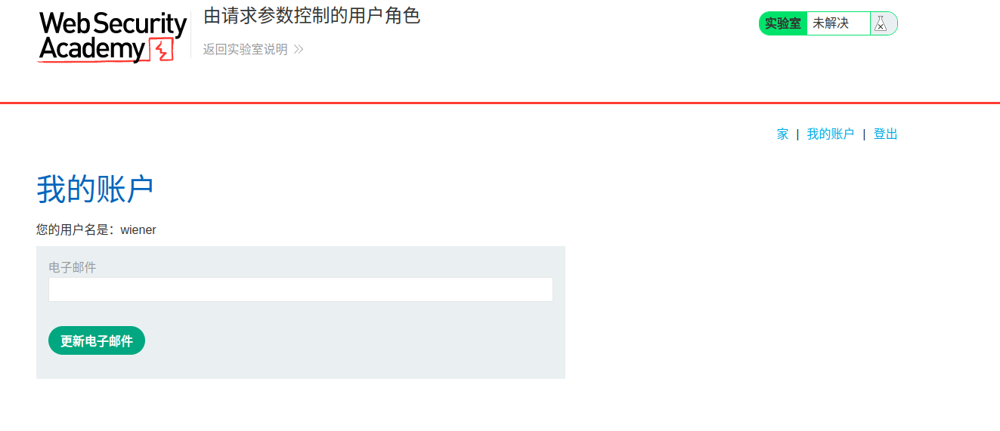

# 一、概述
1. 越权漏洞是web程序中一种常见的安全漏洞。它的威胁在于一个账户即可控制全站用户数据。越权漏洞的主要原因是因为开发人员在对数据进行增删改查时对客户端请求的数据过分相信而遗漏了权限的判定。属于逻辑漏洞的一种，防护和检测都不好做
# 二、越权漏洞的分类
1. 水平越权
	- 最重要的是要找有id控制的功能点。如地址、各种券、订单、评价、评论、商家后台等
	- url和数据包中各种表示用户、产品、文件等身份的参数，如user/xxx、userid/xxx、{userid: 123}等
2. 垂直越权
	- 低权限访问高权限功能
	- 高（低）权限抓包功能点，替换低（高）权限凭证
# 三、越权绕过
1. 数组绕过
	```json
	{"id":111}——>{"id":[111]}
```
2. json绕过
	```json
	{"id":111}——>{"id":{"id":111}}
```
3. 参数污染
	```http
	url?id=<正常>&id=<越权id>
	url?id=<正常>%26id=<越权id>   %26是&，urldecode转发到后端就变成了上面那样
```
4. 通配符
```json
{"user_id":"*"}
```
5. id垂直越权
```
users/01 ——> /user/02
```
6. 替换旧版api
```
/api/v3/users/01 ——>/api/v1/user2/02
```
7. 添加后缀
```
/users/01 ——> /users/02.json
```
8. 更改请求方式
9. 检查referer或其他的headers参数是否被用于用户权限的鉴定
10. 用数字或邮箱替换guid
11. 尝试如下guids
```
000000-000-000-0000000
```
# 四、代码示例
1. 使用PHP编写一个存在越权漏洞的代码示例
```PHP
// 这是一个存在越权漏洞的PHP代码示例
// 在此示例中，我们使用两个输入字段来模拟两个用户权限
// 获取用户输入
$username = $_POST['username'];
$password = $_POST['password'];
$servername = 'localhost';
$dbname = 'test';
//连接数据库
$conn = mysqli_connect($servername, $username, $password, $dbname);
// 构造SQL查询语句
$sql = "SELECT * FROM users";
// 执行SQL查询
$result = mysqli_query($conn,$sql);
// 处理查询结果
if ($result) {
    // 查询成功
    while ($row = mysqli_fetch_assoc($result)) {
        // 处理每一行数据
    }
} else {
    // 查询失败
    echo "查询失败";
}
// 关闭数据库连接
mysqli_close($conn);
```
2. 这段代码存在越权漏洞，因为它使用了两个用户输入来构造SQL查询语句，攻击者可以在其中一个输入中注入SQL代码，然后获取所有用户的信息。为了防止越权漏洞，应该使用参数化查询或转义用户输入。
# 五、BurpSuite靶场示例
1. 打开靶场[由请求参数控制的用户角色](https://portswigger.net/web-security/access-control/lab-user-role-controlled-by-request-parameter)，BurpSuite抓包但不拦截，使用给定的口令wiener/peter登录

2. 将域名后面改为/admin，再次访问，如下，提示必须以管理员权限登录

3. BurpSuite查看数据包，发现cookie中存在Admin=false

4. 修改Admin=false为true，发送数据包，可以看到返回数据包中成功进入了Admin panel

5. 可以看到Admin panel可以删除用户，修改url为/admin/delete?username=carlos尝试删除用户carlos

6. 重新进入Admin panel，可以看到用户carlos已被成功删除
