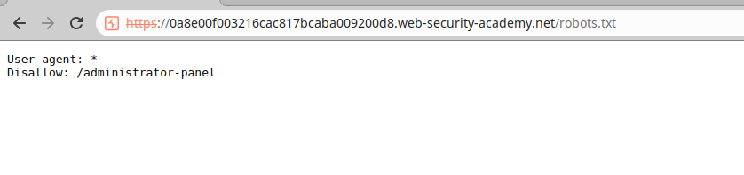
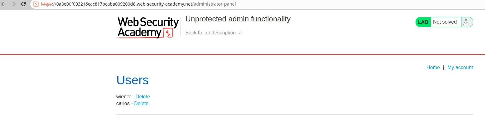
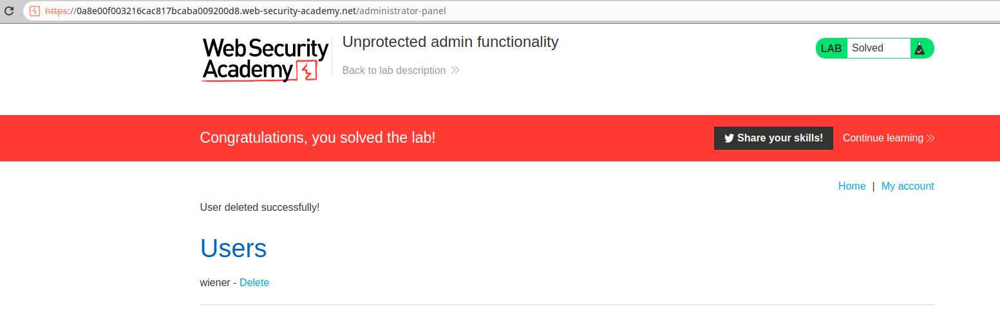

# 一、未授权访问概述
1. 未授权访问是指攻击者在没有得到授权的情况下，访问了正常情况下不应该被允许或执行的某个某个操作。这种安全问题通常是由于程序中的授权检查不严格或者根本没有进行授权检查导致的。
# 二、代码示例
1. 使用PHP编写一个存在未授权访问的代码示例
```PHP
// 这是一个存在未授权访问漏洞的PHP代码示例
// 在此示例中，我们使用一个输入字段来模拟用户权限
// 获取用户输入
$username = $_POST['username'];
$password = $_POST['password'];
$servername = 'localhost';
$dbname = 'test';
//连接数据库
$conn = mysqli_connect($servername, $username, $password, $dbname);
// 构造SQL查询语句
$sql = "SELECT * FROM users WHERE username='$username'";
// 执行SQL查询
$result = mysqli_query($conn,$sql);
// 处理查询结果
if ($result) {
    // 查询成功
    while ($row = mysqli_fetch_assoc($result)) {
        // 处理每一行数据
    }
} else {
    // 查询失败
    echo "查询失败";
}
// 关闭数据库连接
mysqli_close($conn);
```
2. 这段代码存在未授权访问漏洞，因为它没有对用户输入进行授权检查，攻击者可以通过构造恶意输入，获取所有用户的信息。为了防止未授权访问漏洞，应该对用户输入进行授权检查。
# 三、BurpSuite靶场示例
1. 打开BurpSuite的未授权访问靶场[不受保护的管理功能](https://portswigger.net/web-security/access-control/lab-unprotected-admin-functionality)，直接访问该靶场的robots.txt，如下，发现暴露了管理员面板路径

2. 访问/administrator-panel，如下，发现未经鉴权直接进入了管理后台，后台存在两个用户，且可以删除

3. 尝试删除用户carlos，可以看到用户carlos被成功删除
