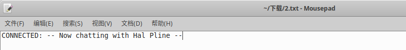

# 一、IDOR概述
1. IDOR是Insecure Direct Object Reference的缩写，中文翻译为不安全的直接对象引用。它是一种常见的安全漏洞，通常出现在Web应用程序中。IDOR漏洞的本质是程序没有对用户输入进行充分的授权检查，导致攻击者可以通过修改请求参数等方式，访问或操作未授权的资源或对象。例如，攻击者可以通过修改URL参数，访问其他用户的私人信息，或者修改订单状态等敏感操作。
2. 在Web应用程序中，经常存在一些功能，例如：用户信息页面、订单页面、支付页面等，这些功能处容易出现IDOR漏洞。具体来说，这些功能通常会涉及到一些敏感的对象或资源，例如：用户信息、订单信息、支付信息等。如果程序没有对用户输入进行充分的授权检查，攻击者可以通过修改请求参数等方式，访问或操作未授权的资源或对象，从而导致IDOR漏洞的出现。
# 二、代码示例
1. 使用PHP编写一个存在IDOR的代码示例
```PHP
// 这是一个存在IDOR漏洞的PHP代码示例
// 在此示例中，我们使用一个输入字段来模拟用户权限
// 获取用户输入
$id = $_POST['id'];
$servername = 'localhost';
$dbname = 'test';
//连接数据库
$conn = mysqli_connect($servername, 'root', '', $dbname);
// 构造SQL查询语句
$sql = "SELECT * FROM users WHERE id='$id'";
// 执行SQL查询
$result = mysqli_query($conn,$sql);
// 处理查询结果
if ($result) {
    // 查询成功
    while ($row = mysqli_fetch_assoc($result)) {
        // 处理每一行数据
    }
} else {
    // 查询失败
    echo "查询失败";
}
// 关闭数据库连接
mysqli_close($conn);
```
2. 这段代码存在IDOR漏洞，因为它没有对用户输入进行充分的授权检查，攻击者可以通过修改请求参数，访问其他用户的私人信息。为了防止IDOR漏洞，应该对用户输入进行充分的授权检查。
# 三、BurpSuite靶场示例
1. 打开BurpSuite靶场[不安全的对象直接引用](https://portswigger.net/web-security/access-control/lab-insecure-direct-object-references)，同时打开BurpSuite抓包，进入靶场

2. 点击右上角Live chat，在message输入框中输入，点击View transcript，然后发现浏览器下载了一个2.txt文件

3. 打开2.txt文件，查看内容如下，没有什么有用的信息

4. 查看BurpSuite数据包记录，发现下载2.txt的数据包，将数据包发送到Repeater

5. 修改数据包中的2.txt为1.txt，然后发送数据包，如下，返回数据包中回显了密码信息

6. 返回该靶场主页，使用carlos/iysqd880cd8wbf0p02rd登录，成功登入后台
