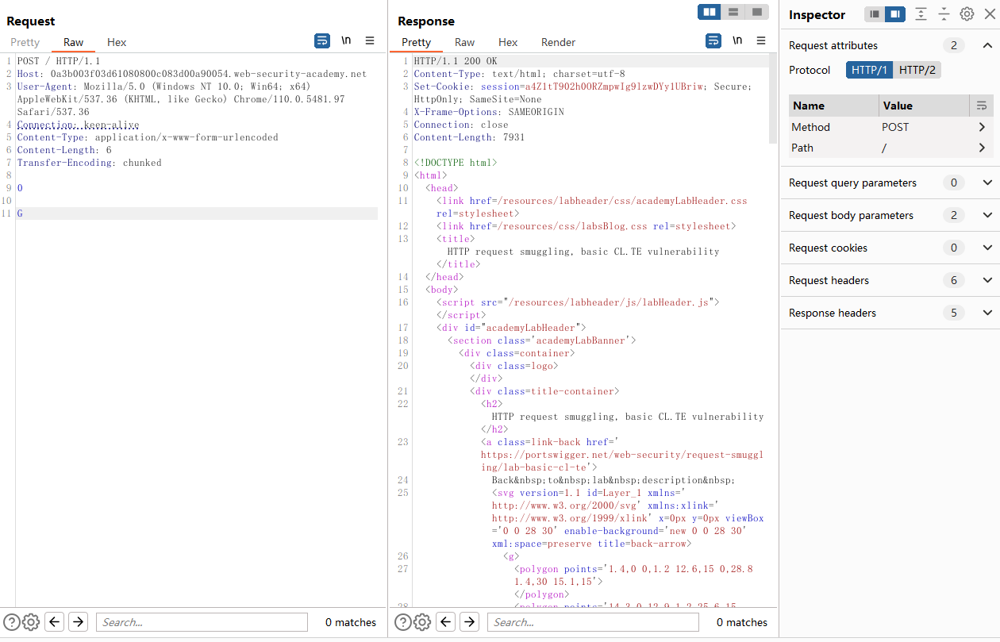

# 一、HTTP请求走私概述
1. HTTP请求走私是指攻击者利用HTTP请求头中的不一致性和解释性差异，欺骗缓存服务器或代理服务器，将一些请求被视为分离的多个请求，从而绕过安全保护机制，窃取用户数据或进行其他恶意活动。
2. 造成HTTP请求走私的原因
	- 不同的代理服务器或缓存服务器之间处理请求头的逻辑不一致，可能导致请求被解释为不同数量的请求。 
	- 攻击者可能会利用请求头中支持多种不同编码方式的功能来欺骗服务器，使其将请求解释成不同的请求。 
	- 部分Web应用程序对请求头参数缺乏验证，而攻击者可以通过设置不同的请求头来欺骗服务器，将其视为多个请求。
	- 攻击者可能会利用某些错误配置的服务器来实现HTTP请求走私攻击。
# 二、HTTP请求走私的危害
1. 窃取用户数据：攻击者可以通过HTTP请求走私攻击绕过安全机制，窃取用户的敏感信息，如登录凭据、身份证件、银行账号等。 
2. 劫持用户会话：攻击者可以通过请求走私攻击模拟用户会话，冒充合法用户进行恶意操作，如修改他人账户、购买商品等。 
3. 绕过Web安全控制：HTTP请求走私攻击可以绕过一些Web安全机制，如Web应用程序防火墙（WAF）和入侵检测系统（IDS），从而进一步攻击Web应用程序或服务器。 
4. 其他攻击：攻击者可以使用HTTP请求走私来进行其他攻击，如跨站脚本攻击、SQL注入等，危害Web应用程序和用户的安全。
# 三、代码示例
1. 使用PHP编写一个存在HTTP请求走私的代码示例
```PHP
$fp = fsockopen("www.example.com", 80);
if ($fp) {
    $headers = "GET / HTTP/1.1\r\n";
    $headers .= "Host: www.example.com\r\n";
    $headers .= "Transfer-Encoding: chunked\r\n";
    $headers .= "Connection: close\r\n";
    $headers .= "X-Forwarded-For: 127.0.0.1\r\n\r\n";
    $data = "G\r\nGET /admin/login HTTP/1.0\r\n\r\n";
    fwrite($fp, $headers . dechex(strlen($data)) . "\r\n" . $data . "\r\n0\r\n\r\n");
    while (!feof($fp)) {
        echo fgets($fp, 1024);
    }
    fclose($fp);
}
```
2. 这个示例演示了HTTP请求走私的攻击原理，代码使用Transfer-Encoding分块编码，欺骗服务器接收到多个HTTP请求，以获取对敏感信息的访问权限。
# 四、BurpSuite靶场示例
1. 打开靶场[HTTP请求走私](https://portswigger.net/web-security/request-smuggling/lab-basic-cl-te)，同时打开BurpSuite抓包，查看BurpSuite历史数据包记录，如下

2. 将第一个数据包转发到Repeater，并在左侧的Request attributes中将HTTP/2修改为HTTP/1，修改数据包如下，点击发送

3. 正常情况下没有漏洞的话这个请求应该是被禁止的，但是可以看到请求却成功被发送给了后台并回显了数据，再发送一次，发现返回数据包回显了"Unrecognized method GPOST"，网站的安全机制被成功绕过

