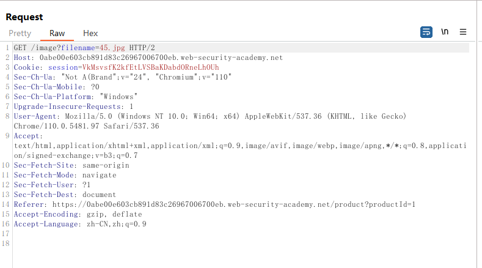
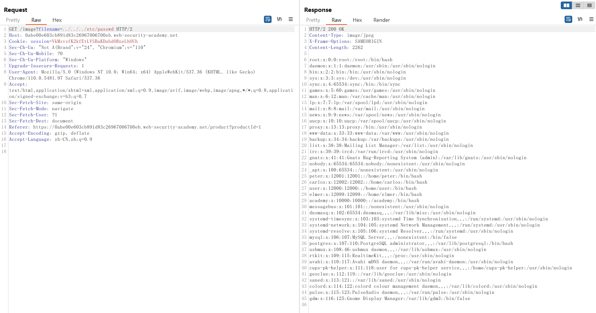

# 一、目录遍历概述
1. 目录遍历是一种Web安全漏洞，攻击者通过利用Web应用程序中缺少有效的输入过滤和文件路径验证，访问他们没有权限访问的文件和目录。攻击者通过使用".."符号来返回到父目录，进而访问目标目录的上一级目录，最终访问到敏感的文件目录，这样攻击者就能够获取到他们没有权限访问的文件和目录。
2. 目录遍历漏洞的危害较大，攻击者可能会利用目录遍历漏洞获取敏感的配置文件、数据库备份、密码文件和用户信息等。
# 二、代码示例
1. 使用PHP编写一个目录遍历的代码示例
```PHP
if(isset($_GET['file'])){
  $file=$_GET['file'];
  $path = "/var/www/app/uploads/" . $file;
  if(file_exists($path)){
    header("Content-Disposition: attachment; filename=" . basename($path));
    header("Content-Type: application/octet-stream");
    readfile($path);
    exit;
  }else{
    echo "File not found";
  }
}
```
2. 此代码接受"file"参数并将其直接以拼接的方式附加到Web应用程序的文件路径上，以获取文件的内容。由于没有进行安全过滤，攻击者可以利用输入验证不足的漏洞，使用../符号通过路径遍历攻击来访问系统敏感文件。
# 三、BurpSuite靶场示例
1. 打开BurpSuite靶场[目录遍历](https://portswigger.net/web-security/file-path-traversal/lab-simple)，同时打开BurpSuite进行抓包，进入靶场后发现历史数据包中会出现一些带有filename参数的数据包，但加载出来后很快数据包就没有了，因此需要开启拦截，点击商品详情页邮件查看图片，拦截数据包如下

2. 修改filename参数值，尝试直接读取/etc/passwd文件，如下，成功读取到文件内容
