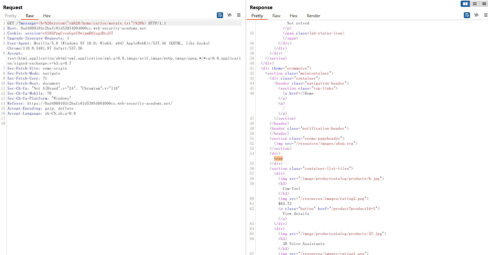

# 一、SSTI概述
1. 模板引擎旨在通过将固定模板与易变数据相结合来生成网页。当用户输入直接连接到模板中而不是作为数据传入时，可能会发生服务器端模板注入攻击。这允许攻击者注入任意模板指令以操纵模板引擎，通常使他们能够完全控制服务器。顾名思义，服务器端模板注入有效载荷是在服务器端交付和评估的，这可能使它们比典型的客户端模板注入危险得多。
2. SSTI代表服务器端模板注入。这是一种Web应用程序安全漏洞，攻击者可以利用该漏洞向应用程序中注入恶意代码。攻击者可以利用此漏洞来窃取敏感数据、执行任意代码以及绕过应用程序的安全机制。
3. SSTI漏洞通常由于应用程序使用了未经过滤的用户输入，以及应用程序使用了可执行模板语言（如Jinja、Thymeleaf、Freemarker等）而导致。攻击者可以通过注入恶意代码来利用这些漏洞。例如，在使用Jinja模板语言的应用程序中，攻击者可以向应用程序中注入Jinja模板代码，从而导致SSTI漏洞的产生。
# 二、SSTI的危害及常出现的功能点
1. SSTI的危害：
	- 数据泄露：攻击者可以通过SSTI攻击获取服务器端应用程序中的敏感数据，如密码、私人密钥以及其他敏感数据。 
	- 身份验证绕过：攻击者可以通过SSTI攻击绕过身份验证，进而获得管理员权限，控制整个服务器。 
	- 服务器接管：攻击者可以通过SSTI攻击以管理员权限访问服务器，再利用漏洞接管服务器，进而对服务器进行进一步的攻击。
2. 产生SSTI的常见功能点：
	- 搜索功能：攻击者可以构造恶意的搜索条件，然后将其注入到应用程序的搜索功能中，从而导致SSTI漏洞的产生。 
	- 表单提交：攻击者可以向应用程序的表单中注入恶意代码，从而导致SSTI漏洞的产生。 
	- 注释和查询参数：攻击者可以利用应用程序的注释和查询参数来注入恶意代码，从而导致SSTI漏洞的产生。 
	- 用户输入：由于大多数SSTI漏洞是由于应用程序未正确过滤用户输入导致的，因此攻击者可以通过发送恶意的用户输入来利用该漏洞。
# 三、代码示例
1. 使用PHP编写一个SSTI的代码示例
```PHP
$template = '<h1>Hello {{name}}!</h1>';
$name = $_GET['name'];
$content = str_replace('{{name}}', $name, $template);
echo $content;
```
2. 以上是一段简单的PHP代码，它使用了一个模板引擎来输出一个HTML页面。攻击者可以绕过输入验证，注入恶意代码，从而执行任意脚本。例如，如果我们使用以下URI: `?name={{phpinfo()}}` ，攻击者可以利用SSTI来注入恶意PHP代码，从而执行phpinfo()函数，输出服务器信息。
# 四、BurpSuite靶场示例
1. 打开BurpSuite靶场[基本服务器端模板注入](https://portswigger.net/web-security/server-side-template-injection/exploiting/lab-server-side-template-injection-basic)，同时打开BurpSuite抓包，进入靶场，点击打开商品详情页没有反应，查看数据包如下

2. 发现请求数据包中有一个参数message，参数的值为"Unfortunately%20this%20product%20is%20out%20of%20stock"，发送该数据包到Repeater，修改该数据包message参数值如下进行测试
```HTTP
<%= 7*7 %>
```

3. 发现表达式被执行了，返回页面输出了`7*7`的结果49，确认此处存在SSTI，修改POC尝试执行系统命令，如下，当前用户为carlos，当前路径下存在一个morale.txt文件
```HTTP
<%= system("ls") %>
<%= system("whoami") %>
```


4. 尝试使用系统命令删除morale.txt文件，先获取当前所在的系统路径，如下，当前路径为`/home/carlos`
```HTTP
<%= system("pwd") %>
```

5. 修改POC如下，执行删除，命令执行成功
```HTTP
<%= system("rm /home/carlos/morale.txt") %>
```

6. 再次查看当前路径下的文件，发现morale.txt文件已经不存在了
