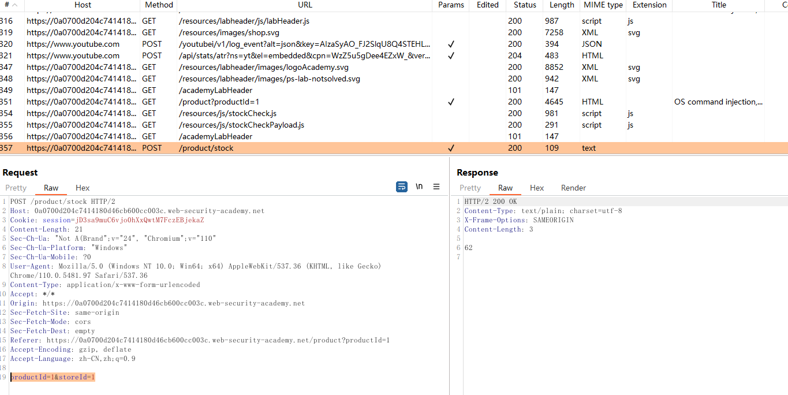
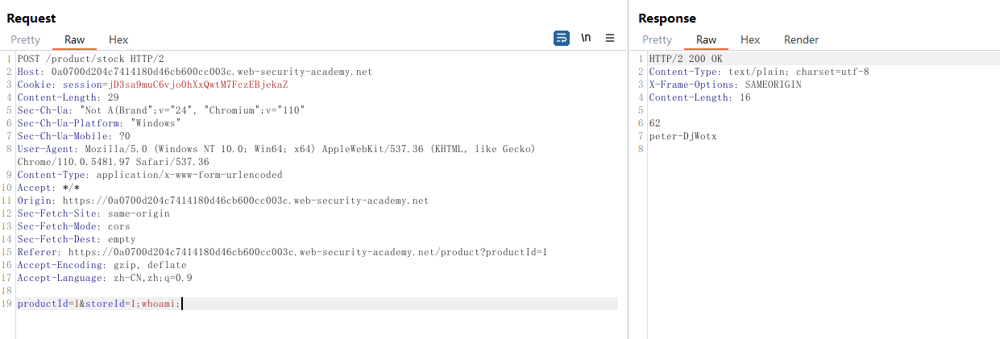

# 一、RCE概述
1. RCE的全称是远程命令执行（Remote Code Execution），是指攻击者通过远程方式执行恶意代码，从而控制或接管目标系统。一旦攻击者成功利用RCE漏洞攻击了一个系统，就可以在受害者不知情的情况下控制目标系统，执行任意命令，例如修改/删除文件、窃取敏感信息、植入后门程序等，给系统带来巨大的风险和威胁。
2. RCE通常是由于软件中存在安全漏洞或设计缺陷而导致的。攻击者利用这些漏洞或缺陷，注入恶意代码或命令，从而远程控制受害者的系统。其中常见的攻击方式包括：输入验证不足、越权访问、代码注入、文件包含、反序列化漏洞等，这些漏洞往往是由于程序员的疏忽或设计不周所导致的。为了避免RCE漏洞的产生，开发人员在编写代码时应该注重安全性，并对输入进行有效的验证和过滤。此外，系统管理员也应该及时更新系统和应用程序的补丁，以避免已知漏洞的利用。
# 二、RCE常出现的功能点与参数位置
1. RCE常出现的功能点：
	- 文件上传功能：攻击者通过上传恶意文件来执行远程代码 
	- 邮箱服务功能：攻击者通过发送含有恶意代码的邮件，来执行远程代码 
	- 数据库服务功能：攻击者通过SQL注入漏洞，来执行远程代码 
	- Web服务功能：攻击者通过提供恶意代码，来执行远程代码 
	- 脚本解释器功能：攻击者通过利用脚本解释器漏洞，来执行远程代码 
	- 操作系统服务功能：攻击者通过利用操作系统漏洞，来执行远程代码 
	- 应用程序服务功能：攻击者通过利用应用程序漏洞，来执行远程代码
	- 计划任务、定时任务：通过建立计划任务、定时任务，攻击者可以直接调用系统程序执行远程代码
2. RCE常出现的参数位置：
	- 用户输入参数：如用户名、密码、搜索关键词等 
	- 数据库查询参数：如SQL查询语句中的参数 
	- 文件上传参数：如上传的文件名、文件类型、文件内容等 
	- cookie参数：如用户登录凭证、用户权限等 
	- HTTP请求参数：如HTTP请求的头部、方法、URL、主体内容等
# 三、代码示例
1. 使用PHP编写一个RCE的代码示例
```PHP
$cmd = $_GET['cmd'];
$output = shell_exec('ls ' . $cmd); // 执行用户输入的命令
echo "<pre>$output</pre>";
```
2. 在这个程序中，$cmd变量从用户输入获取，然后直接作为参数传递给shell_exec()函数，该函数会执行用户输入的命令并返回输出结果，最后将结果输出到页面上。 这段代码存在RCE漏洞，因为攻击者可以在cmd参数中注入恶意代码，从而执行任意命令，例如：http://example.com/vuln.php?cmd=;id;
3. 在这个例子中，攻击者在cmd参数中注入了一个分号，然后执行了id命令，输出了当前用户的ID号。如果攻击者能够执行其他更危险的命令，例如删除文件、修改系统设置等，就会对目标系统造成严重伤害。
# 四、BurpSuite靶场示例
1. 打开BurpSuite靶场[操作系统命令注入](https://portswigger.net/web-security/os-command-injection/lab-simple)，同时打开BurpSuite抓包观察数据包，进入靶场后打开商品详情页，点击底部的check stock，如下

2. 观察数据包，发现点击check stock后的数据包中存在两个参数productId与storeId，productId应该是产品的ID

3. 尝试修改storeId，如下，成功回显了用户名，可以执行系统命令
```HTTP
storeId=1;whoami;
```

