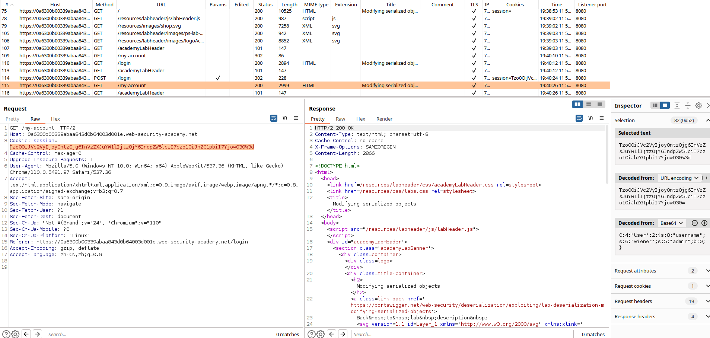
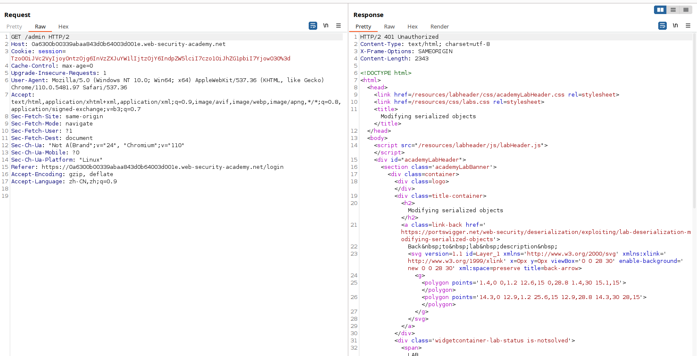
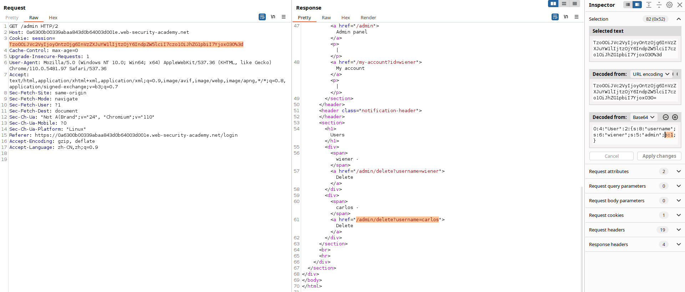
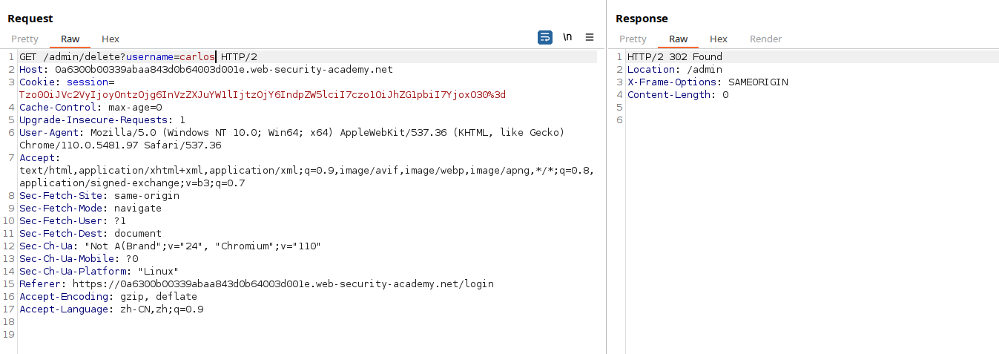
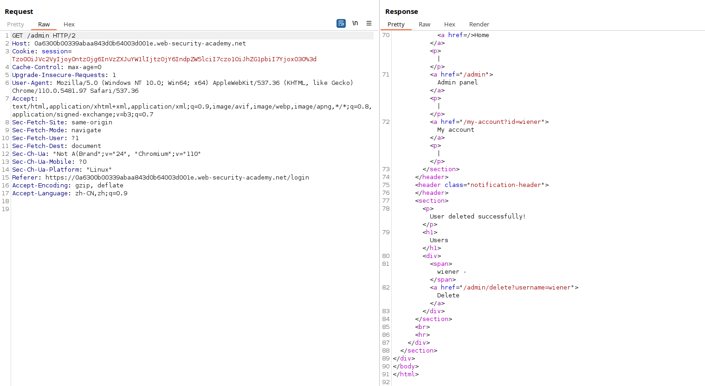

# 一、序列化与反序列化概述
1. 序列化是将复杂的数据结构（例如对象及其字段）转换为可以作为顺序字节流发送和接收的“更扁平”格式的过程。序列化数据使以下操作变得更加简单：
	- 将复杂数据写入进程间内存、文件或数据库
	- 发送复杂数据，例如，通过网络、在应用程序的不同组件之间或在 API 调用中
	- 至关重要的是，在序列化一个对象时，它的状态也会被持久化。换句话说，对象的属性及其分配的值将被保留。
2. 反序列化是将此字节流恢复为原始对象的完整功能副本的过程，其状态与序列化时的状态完全相同。然后网站的逻辑可以与这个反序列化的对象交互，就像它与任何其他对象交互一样。
3. 在编程中，序列化是将对象或数据结构转换为一系列字节的过程，以便它们可以在网络上传输或在磁盘上存储。反序列化是将这些字节转换回原始对象或数据结构的过程。
# 二、不安全的反序列化
1. 不安全的反序列化是指用户可控的数据被网站反序列化。这可能使攻击者能够操纵序列化对象，以便将有害数据传递到应用程序代码中。
2. 甚至可以用完全不同类的对象替换序列化对象。令人担忧的是，网站可用的任何类的对象都将被反序列化和实例化，而不管预期的是哪个类。因此，不安全的反序列化有时被称为“对象注入”漏洞。
3. 意外类的对象可能会导致异常。然而，到这个时候，损害可能已经造成。许多基于反序列化的攻击是在反序列化完成之前完成的。这意味着反序列化过程本身可以发起攻击，即使网站自身的功能不直接与恶意对象交互也是如此。因此，其逻辑基于强类型语言的网站也容易受到这些技术的攻击。
# 三、不安全的反序列化的危害
1. 远程代码执行（Remote Code Execution，RCE）：攻击者可以通过序列化恶意对象来执行任意代码，从而完全控制受害者的系统。  
2. 拒绝服务攻击（Denial of Service，DoS）：攻击者可以通过序列化大量的数据来占用系统资源，从而导致系统崩溃或无法正常工作。  
3. 敏感信息泄露：攻击者可以通过序列化恶意对象来获取系统中的敏感信息，例如密码、密钥等。
# 四、代码示例
1. 使用PHP编写一个不安全的反序列化代码示例
```PHP
// 获取用户输入
$data = $_POST['data'];
// 反序列化用户输入的数据
$obj = unserialize($data);
// 处理反序列化后的对象
```
2. 在上面的代码中，我们从用户输入中获取了一个名为$data的变量，然后使用PHP的unserialize函数将其反序列化为一个对象。但是，我们没有对输入数据进行任何验证或过滤，这可能会导致安全漏洞的出现。攻击者可以通过序列化恶意对象来执行远程代码执行攻击，从而完全控制受害者的系统。
# 五、BurpSuite靶场示例
1. BurpSuite靶场[修改序列化对象](https://portswigger.net/web-security/deserialization/exploiting/lab-deserialization-modifying-serialized-objects)，打开BurpSuite抓包，进入靶场后点击右上角的My account使用给定的口令wiener/peter登录，查看数据包

2. 选中/my-account数据包中的cookie，在右侧的Inspector中进行解码，可以看到网站对用户登录数据进行了一个序列化过程的处理，然后又以base64编码的方式将反序列化还原处理后的用户登录数据返回给用户作为登录的身份凭证，在数据最后发现有一个`s:5:"admin";b:0;`，我们可以猜测这个是用于判断用户是否为管理员的，尝试修改数据包的url为/admin，然后发送数据包查看返回数据包
```JSON
O:4:"User":2:{s:8:"username";s:6:"wiener";s:5:"admin";b:0;}
```

3. 发现返回数据包提示Unauthorized，尝试修改cookie中admin后面的b:0为b:1，再次发送数据包查看回显，发现成功绕过认证进入了管理员后台

4. 发现管理员后台可以操作删除用户，尝试删除用户carlos，如下

5. 再次进入后台，发现用户carlos已被成功删除
