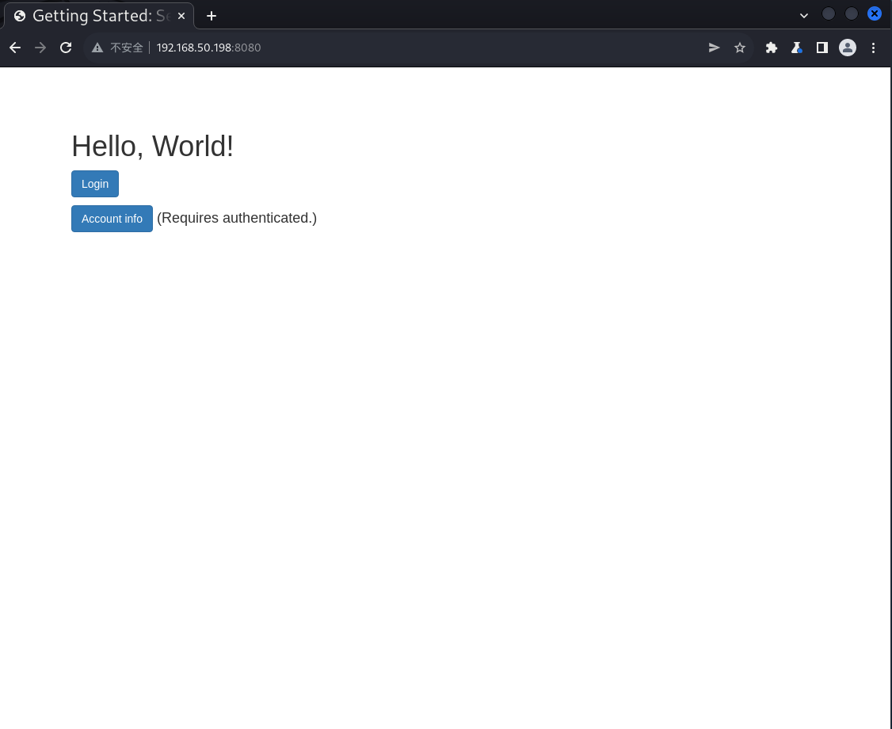
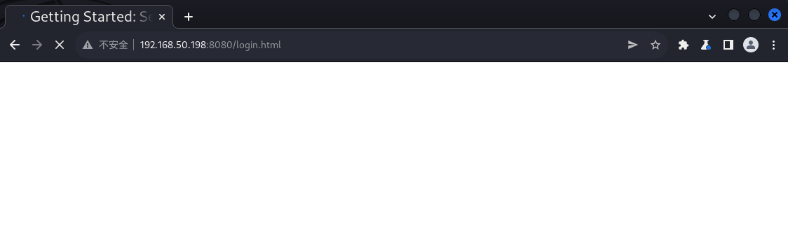
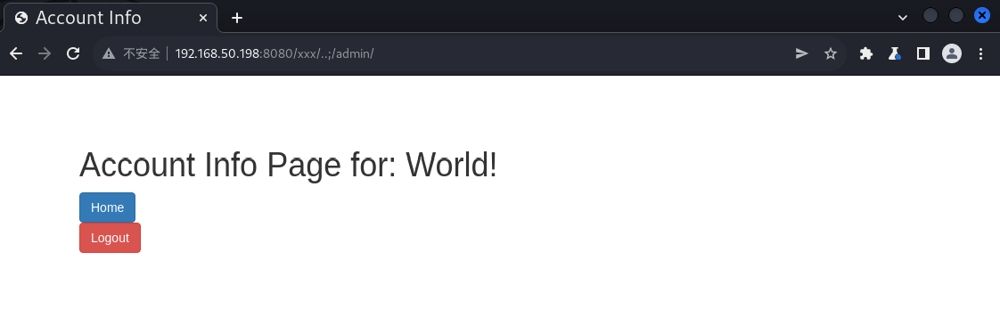

# 漏洞复现——Apache Shiro 认证绕过漏洞CVE-2020-1957

# 一、Apache Shiro认证绕过漏洞

在Apache Shiro 1.5.2以前的版本中，在使用Spring动态控制器时，攻击者通过构造..;这样的跳转，可以绕过Shiro中对目录的权限限制

# 二、影响版本

Apache Shiro <=1.5.2
# 三、漏洞复现

1. 进入靶机~/vulhub/shiro/CVE-2020-1957目录，docker启动

   ``` shell
   sudo docker-compose up -d
   ```

2. 访问http://靶机IP:8080



3. 直接访问/admin/会跳转到登录界面



4. 把URL改为/xxx/..;/admin/，访问，成功绕过登录认证直接访问到后台

