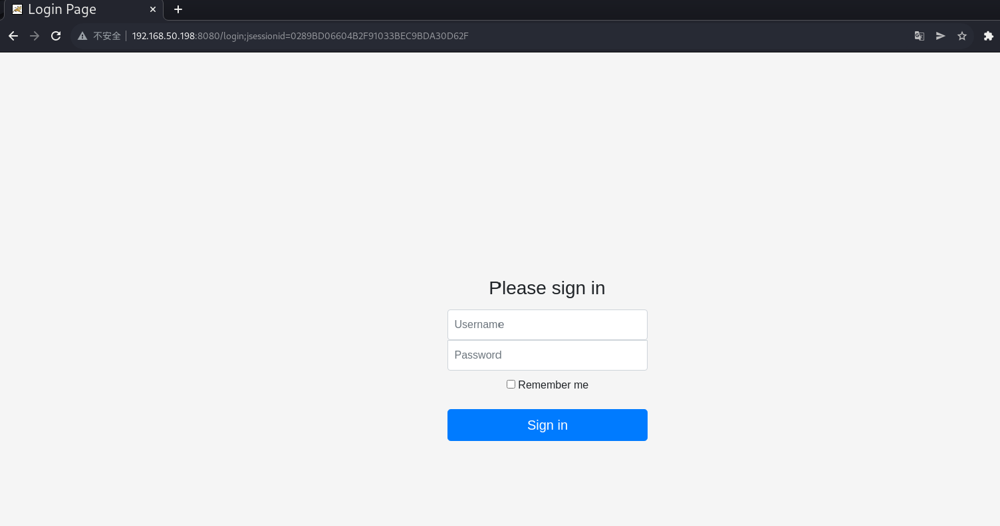
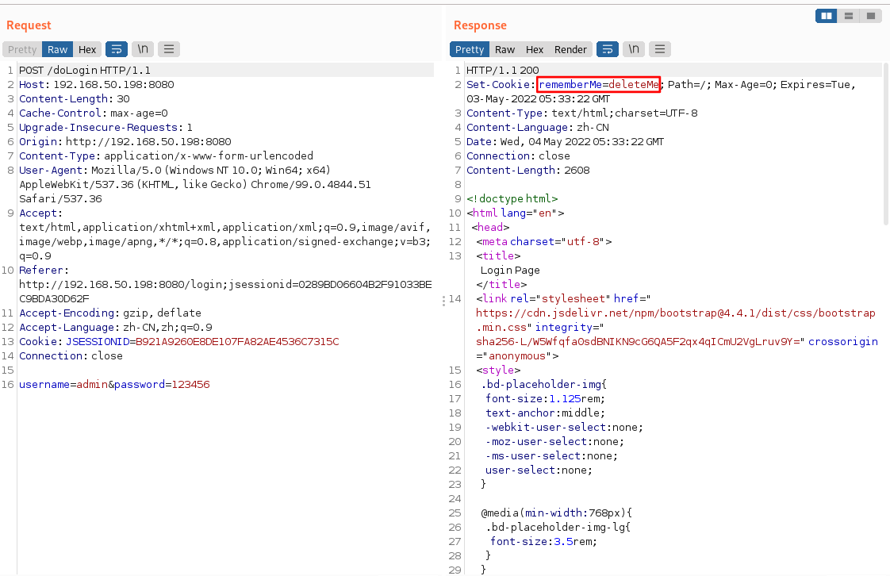
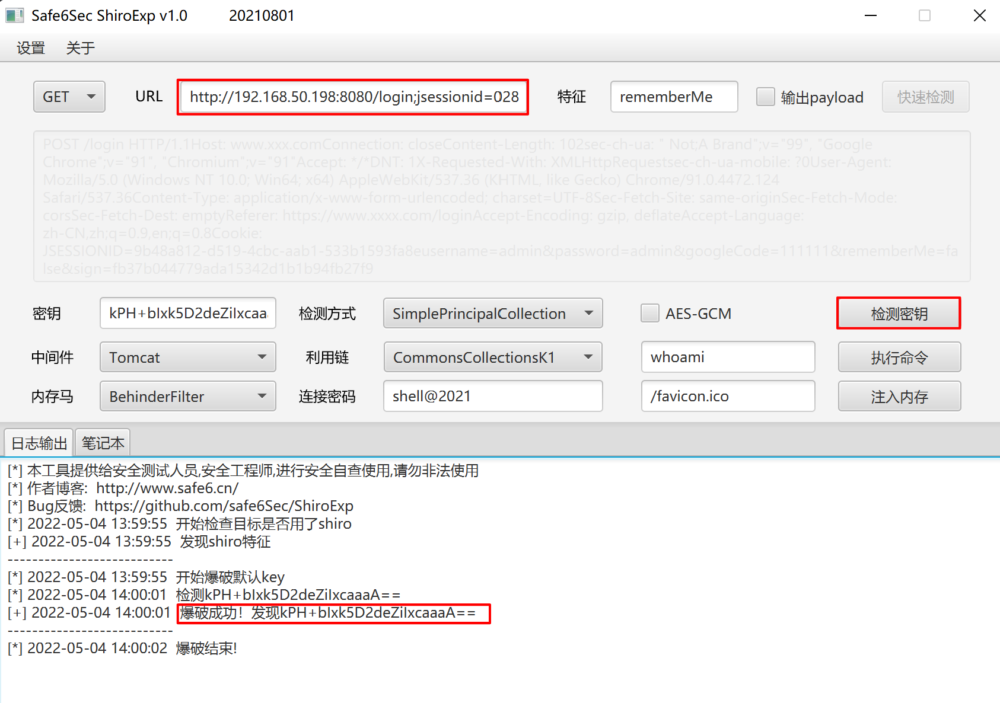
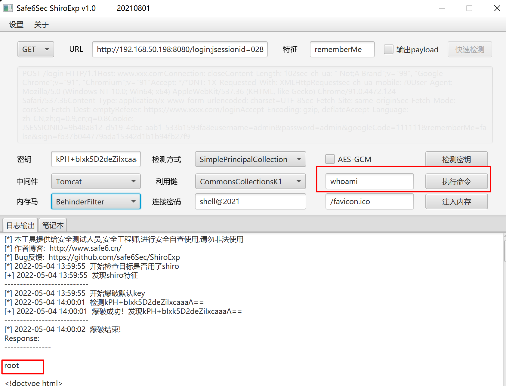

# 漏洞复现——Apache Shiro反序列化CVE-2016-4437

# 一、Apache Shiro

## （一）Apache Shiro概述

Apache Shiro是一款开源安全框架，提供身份验证、授权、密码学和会话管理。Shiro框架直观、易用，同时也能提供健壮的安全性

## （二）Apache Shiro CVE-2016-4437反序列化漏洞

pache Shiro默认使用了CookieRememberManager，其处理cookie的流程是：得到rememberMe的cookie值>Base64解码>ASE解密>反序列化。然而AES的密钥是硬编码的，攻击者可以使用Shiro的默认密钥伪造用户Cookie，构造恶意数据触发Java反序列化漏洞，进而在目标机器上执行任意命令。

## （三）Shiro反序列化特征

在响应数据包的Set-Cookie中存在remember=deleteMe字段

# 二、漏洞危害与防护

## （一）危害

1. 可以直接绕过WAF防护进入服务器执行命令

2. 可直接获取服务器权限，getshell3、影响版本：1.2.4及以下

## （二）防护

1. 更新升级最新版Shiro

2. 确保密钥的安全性，不使用公开的密钥

# 三、检测与利用

## （一）检测方法

1. 该漏洞多半发生在登录处，响应数据包中包含rememberMe=deleteMe字段

2. 直接发送原数据包，响应数据包中不存在关键字，可以通过在请求数据包的cookie字段中增加字段rememberMe=deleteMe，查看响应数据包中是否存在关键字

3. 使用插件或脚本检测

## （二）利用

1. 反弹shell

2. 执行系统命令

# 四、漏洞复现

1. 进入靶机~/vulhub/shiro/CVE-2016-4437目录，docker启动环境

   ``` shell
   sudo docker-compose up -d
   ```

2. kali访问http://靶机IP:8080，进入如下界面

   

3. 使用BurpSuite进行抓包，查看响应数据包，存在rememberMe=deleteMe字段

   

4. 使用ShiroExp v1.0利用工具进行检测，成功检测到密钥



5. 继续使用该工具执行命令，执行命令whoami，命令执行成功

