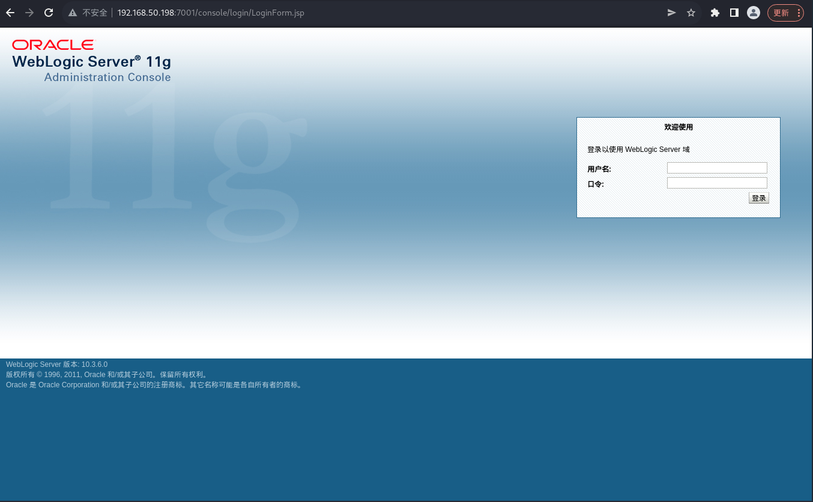
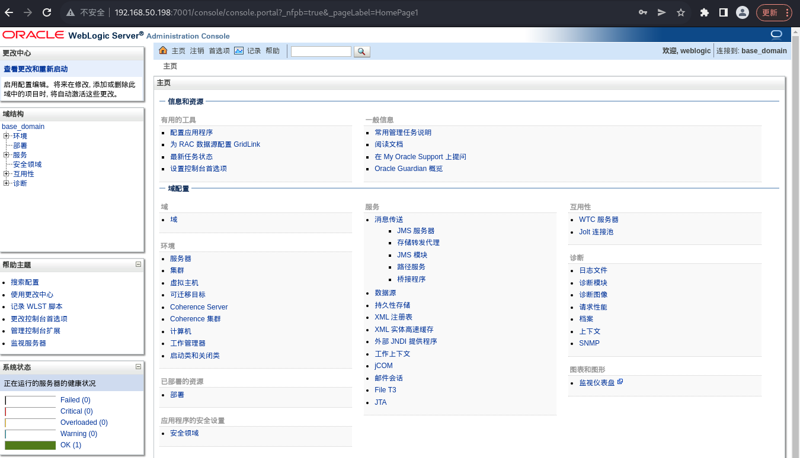
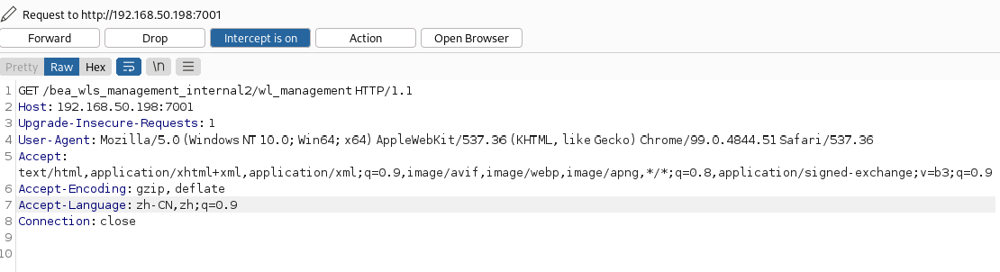
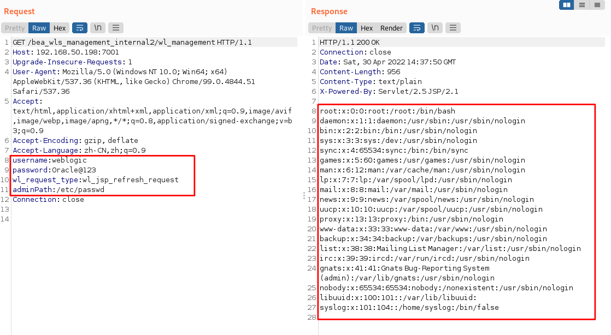

# 漏洞复现——weblogic弱口令与任意文件读取

# weblogic与弱口令、任意文件读取概述

1. weblogic是Oracle公司出品的一个应用服务器（application server），是一个基于Java EE架构的中间件是用于开发、集成、部署和管理大型分布式Web应用、网络应用和 数据库应用的Java应用服务器。Weblogic将Java的动态功能和Java Enterprise标准的安全性引入大型网络应用的开发、集成、部署和管理之中，是商业市场上主要的Java（Java EE）应用服务器软件之一，也是世界上第一个成功商业化的Java EE应用服务器，具有可扩展性、快速开发、灵活、可靠等优势。

2. 在功能性上，Weblogic是Java EE的全能应用服务器，包括EJB 、JSP、servlet、JMS等，是商业软件里排名第一的容器（JSP、servlet、EJB等），并提供其他工具（例如Java编辑器），因此也是一个综合的开发及运行环境。在扩展性上，Weblogic Server凭借其出色的群集技术，拥有处理关键Web应用系统问题所需的性能、可扩展性和高可用性。Weblogic Server既实现了网页群集，也实现了EJB组件群集，而且不需要任何专门的硬件或操作系统支持。网页群集可以实现透明的复制、负载平衡以及表示内容容错。无论是网页群集，还是组件群集，对于电子商务解决方案所要求的可扩展性和可用性都是至关重要的。目前Weblogic在全球的使用量也占居前列。

3. weblogic存在管理后台，通过验证账号密码的方式登录，由于管理员的疏忽，使用默认口令或弱口令，导致weblogic管理后台存在被爆破的风险。

4. weblogic任意文件读取——CVE-2019-2615。该漏洞是任意文件读取漏洞，这个漏洞接口是文件下载相关功能使用的接口，也是weblogic server中内部使用的正常功能，所以该漏洞需要weblogic的用户名密码，所以也是个鸡肋的漏洞。

# 漏洞复现

1. weblogic弱口令

   - 进入靶机的~/vulhub/weblogic/weak_password目录，docker启动环境

     ``` shell
     sudo docker-compose up -d
     ```

   - 访问http://靶机IP:7001/console，进入weblogic登录界面

     

   - 使用弱口令爆破成功登录，口令为`weblogic/Oracle@123`weblogic常用弱口令： http://cirt.net/passwords?criteria=weblogic

     

2. weblogic任意文件读取——CVE-2019-2615

   - 利用弱口令登录成功后，访问http://192.168.50.198:7001/bea_wls_management_internal2/wl_management，使用BurpSuite抓包

     

   - 修改数据包，添加POC到数据包中尝试读取/etc/passwd文件

     ```shell
     username:weblogic
     password:Oracle@123
     wl_request_type:wl_jsp_refresh_request
     adminPath:/etc/passwd
     ```

   - 释放数据包，成功读取/etc/passwd文件

     