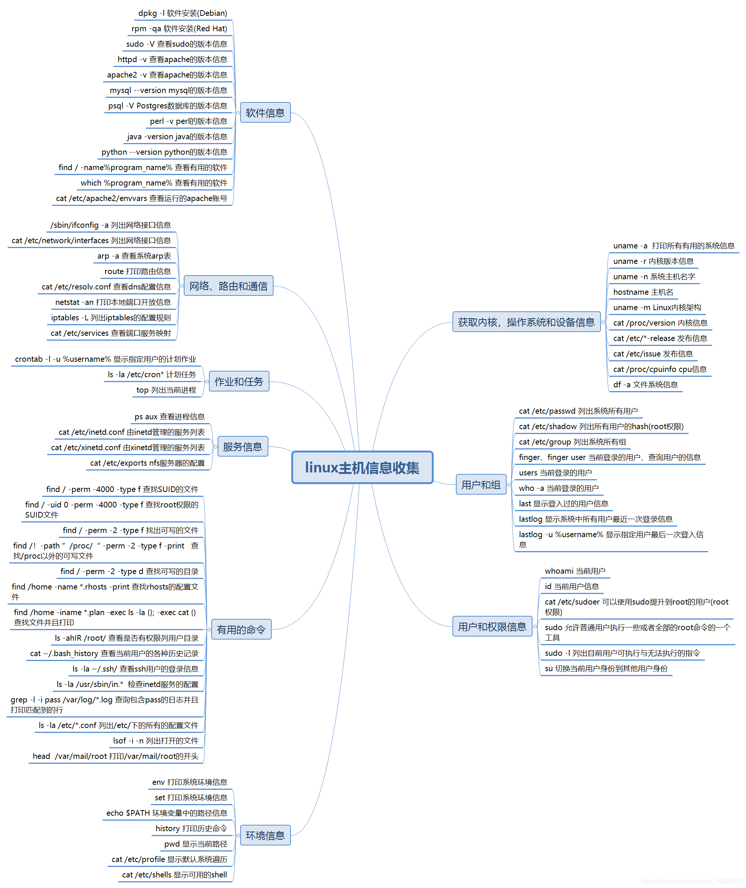
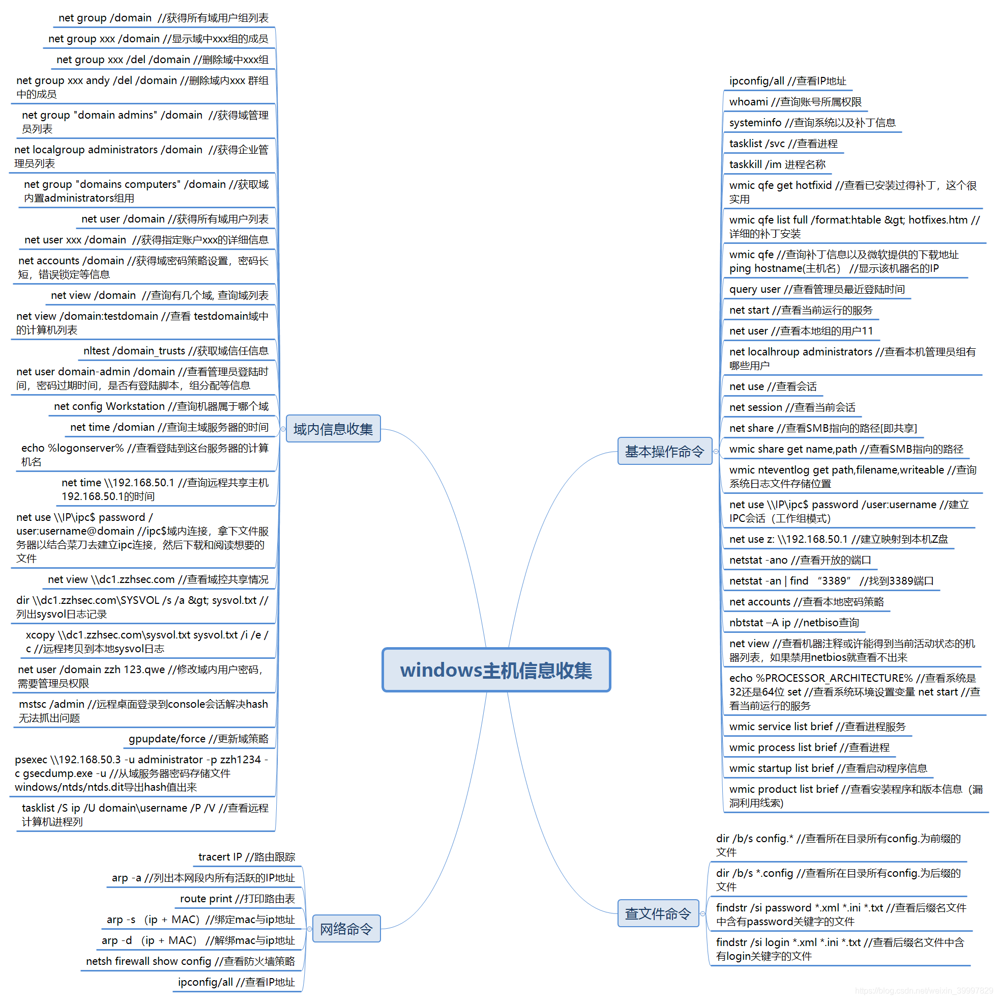

# 内网安全——域信息收集

## 常规信息类收集

``` shell
systeminfo 详细信息
netstat -ano 端口列表
route print 路由表
net start 启动服务
tasklist 进程列表
schtasks 计划任务
ipconfig /all 判断存在域
net view /domain 判断存在域
net time /domain 判断主域
netstat -ano 当前网络端口开放
nslookup 域名 追踪来源地址
wmic service list brief 查询本机服务
net config workstation  查询当前登录域及登录用户信息
wmic startup get command,caption 查看已启动的程序信息
```






## 架构信息类收集

1. 为后续横向思路做准备，针对应用，协议等各类攻击手法

2. 收集存活主机、端口服务、域控定位、域用户、组

3. [wmic_info整合收集](https://codeload.github.com/Alex-null/wmic_info_gather/)

4. ``` shell
   whoami /all 用户权限
   net config workstation 登录信息
   net user 本地用户
   net localgroup 本地用户组
   net user /domain 获取域用户信息
   net group /domain 获取域用户组信息
   wmic useraccount get /all 涉及域用户详细信息
   net group "Domain Admins" /domain 查询域管理员账户
   net group "Enterprise Admins" /domain 查询管理员用户组
   net group "Domain Controllers" /domain 查询域控制器
   ```

## 关键信息类收集

1. 旨在收集各种密文，明文，口令等，为后续横向渗透做好测试准备
   - 计算机用户HASH，明文获取-mimikatz(win)，mimipenguin(linux)
   - 计算机各种协议服务口令获取-LaZagne(all)，XenArmor(win)

2. 工具：
   - [mimikatz](https://github.com/gentilkiwi/mimikatz/)
   - [LaZagne](https://github.com/AlessandroZ/LaZagne/)
   - [mimipenguin](https://github.com/huntergregal/mimipenguin)
   - [allinone-password-recovery-pro-software](https://xenarmor.com/allinone-password-recovery-pro-software/)

3. 收集的信息：
   - 站点源码备份文件、数据库备份文件等
   - 各类数据库Web管理入口，如PHPMyAdmin
   - 浏览器保存密码、浏览器Cookies
   - 其他用户会话、3389和ipc$连接记录、回收站内容
   - Windows 保存的WIFI密码
   - 网络内部的各种帐号和密码，如：Email、VPN、FTP、OA等


## 自动化工具收集

1. 工具：

   - [LadonGo](https://github.com/k8gege/LadonGo)
   - [BloodHound](https://github.com/BloodHoundAD/BloodHound)
   - [freetools-adfind](http://www.joeware.net/freetools/tools/adfind/index.htm)

2. LadonGO。扫描&探针、检测、爆破等模块

3. Adfind

   - 列出域控制器名称：

     ``` shell
     AdFind -sc dclist
     ```

   - 查询当前域中在线的计算机：

     ``` shell
     AdFind -sc computers_active
     ```

   - 查询当前域中在线的计算机(只显示名称和操作系统)：

     ``` shell
     AdFind -sc computers_active name operatingSystem
     ```

   - 查询当前域中所有计算机：

     ``` shell
     AdFind -f "objectcategory=computer"
     ```

   - 查询当前域中所有计算机(只显示名称和操作系统)：

     ``` shell
     AdFind -f "objectcategory=computer" name operatingSystem
     ```

   - 查询域内所有用户：

     ``` shell
     AdFind -users name
     ```

   - 查询所有GPO：

     ``` shell
     AdFind -sc gpodmp
     ```

4. BloodHound域分析使用

   - [安装使用](http://cn-sec.com/archives/146548.html)

   - 启动neo4j 

     ``` shell
     neo4j.bat console
     ```

   - 启动BloodHound 

     ``` shell
     BloodHound.exe
     ```

   - 运行程序后将生成数据导入，筛选查看