# 代码审计——PHP审计之SQL注入

# 代码审计流程

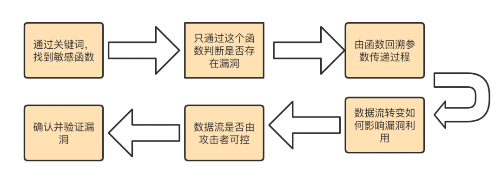

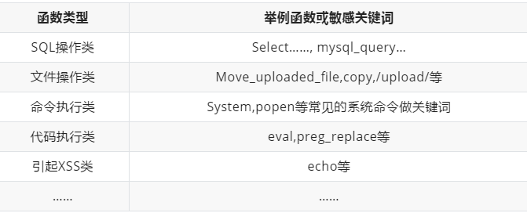

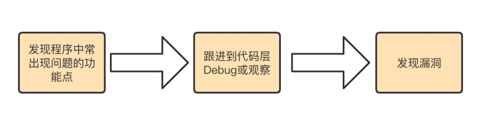

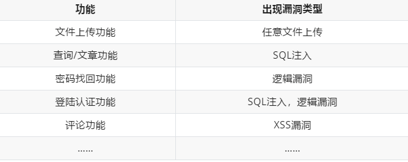

# PHP代码审计之SQL注入

## 审计发现方法

1. 使用正则表达式搜索`(update|select|insert|delete|).*?where.*=\`，或者直接全家搜索SQL操作语句，查看有哪些文件、函数进行了数据库交互操作
2. 跟踪找出来的函数，看有没有可控参数传入
3. 若存在可控参数传入，则跟踪查看是否对传入的参数进行了过滤

## bluecmsSQL注入

1. 使用PhpStorm载入cms，使用正则表达式在项目中搜索sql语句关键字，如下所示

   ``` sql
   (update|select|insert|delete|).*?where.*=
   ```

   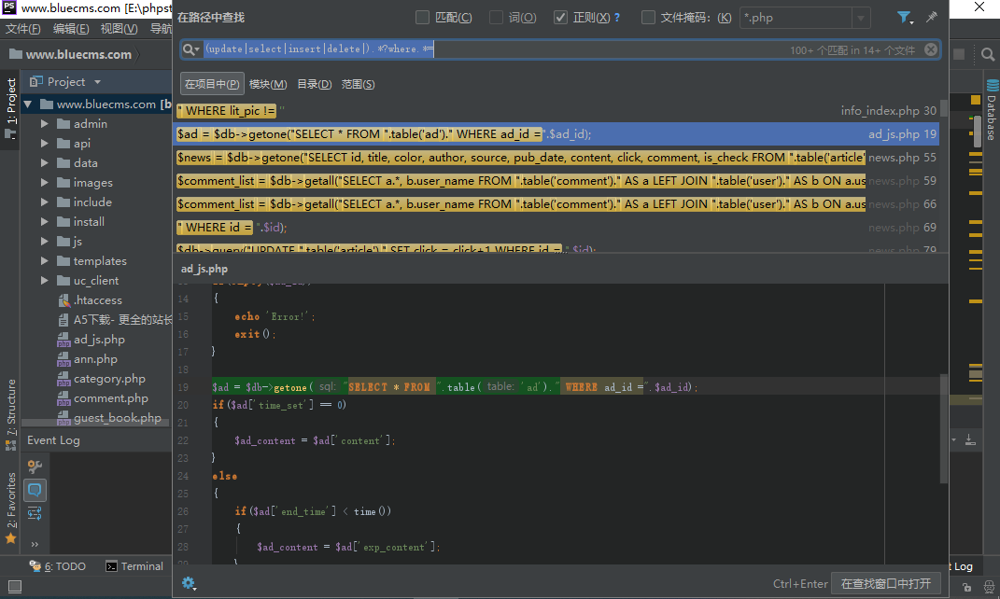

2. 在匹配出来的结果中，逐个点击查看是否存在变量，优先查看变量写在where后的SQL语句，写在order by后的SQL可能注入不下去，选择第二个结果，存在变量`$ad_id`的语句，如上图所示，在下方可以直接看到具体代码，发现sql语句传递给了getone函数，转到getone()的声明，查看是否存在过滤

   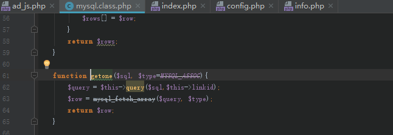

3. 如上图，getone()中并没有进行过滤，sql语句被传递给了query()进行执行操作，再转到query()查看是否有过滤

   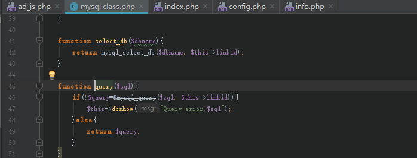

4. query()中也没有过滤，sql语句由query执行后，执行结果由dbshow()方法进行显示，转到dbshow方法查看是否有过滤

   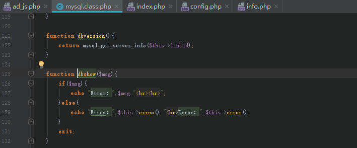

5. 可以看到，整个链中所有调用的函数都没有对sql语句进行过滤，访问`ad_js.php?ad_id=`

   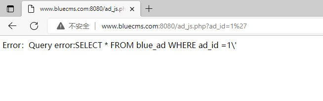

   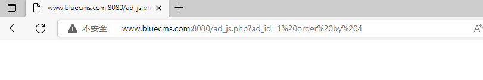

6. 如上图，存在注入，但是没有回显，使用sqlmap进行测试，如下所示

   ```shell
   python3 sqlmap.py -u "http://www.bluecms.com:8080/ad_js.php?ad_id=1" --batch
   ```

   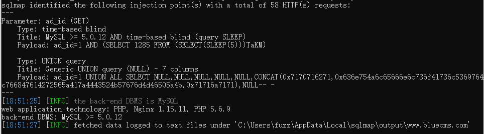

## 梦想CMS（lmxcms）后台SQL注入——CNVD-2020-59466

1. cnvd漏洞详情

   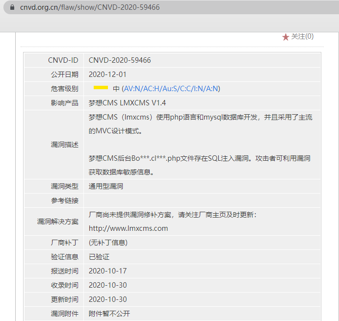

2. 该漏洞出现在后台，且该CMS使用MVC设计模式，先登录后台。可以看到后台的URL是admin.php?m=Index&a=index，这就是典型的MVC设计模式，即Model View Controller，是模型(model)－视图(view)－控制器(controller)的缩写，是一种软件设计典范，将M和V的实现代码分离，从而使同一个程序可以使用不同的表现形式。这里m是model，a就是方法的意思。

   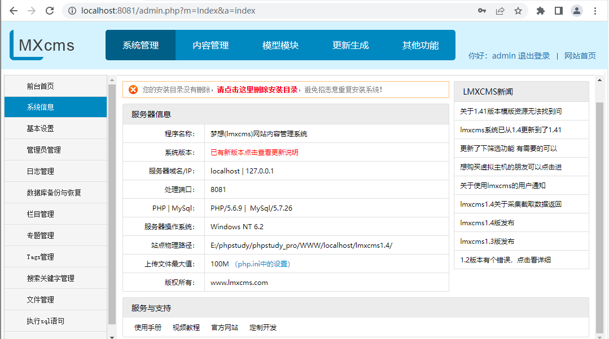

3. 查看一下后台中文件名吻合的文件，只有BookAction.calss.php这一个文件符合要求

   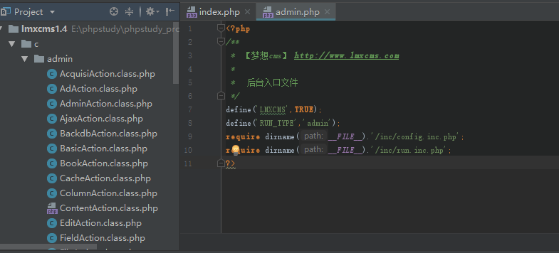

4. 点击BookAction.calss.php，查看类文件中传入了变量的函数

   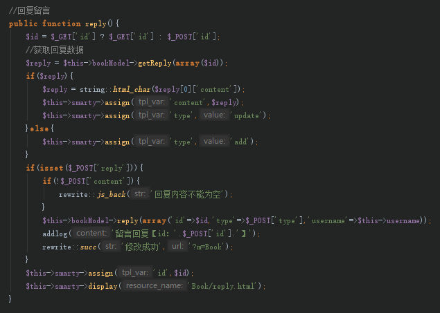

5. 只有这个回复留言的reply()函数中传入了变量id，但是reply()中没有sql语句，id变量被传入了getReply()中，转到getReply()中看一下源代码

   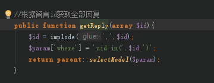

6. 同样没有sql语句，但是返回了一个selectModel()，id变量又被传入了selectModel()中，继续转到selectModel()

   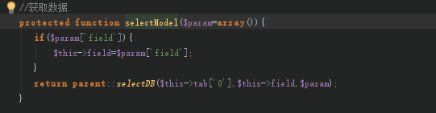

7. selectModel()也没有sql语句，但是返回了一个selectDB()，转到selectDB()

   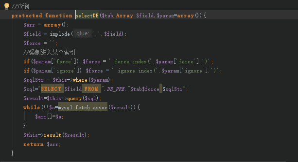

8. selectDB()中出现了sql语句，id变量最终被传递到了selectDB函数中，但selectModel()和selectDB都是被reply()方法所调用的，所以只需要访问reply方法，将id变量传递给reply方法，即可实现sql操作

   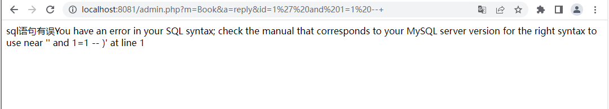

   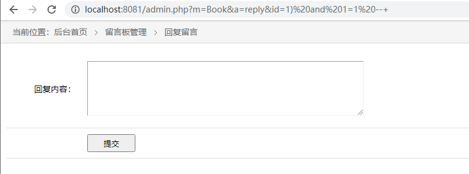

9. 测试发现该注入点为`)`注入，为了方便测试，将selectDB中的sql语句输出

   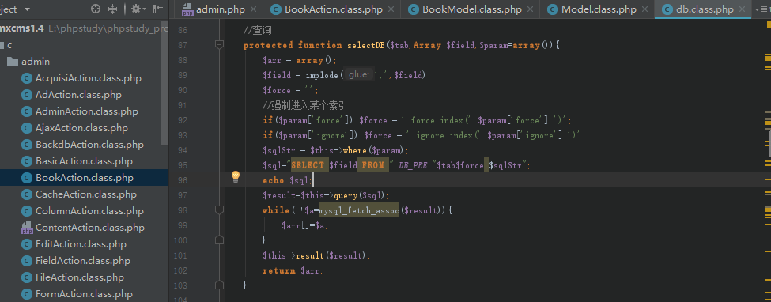

10. 使用报错注入，查询数据库用户名，如下，注入成功

    ``` sql
    id=1)%20and%20updatexml(0,concat(0x7e,user()),1)%23
    ```

    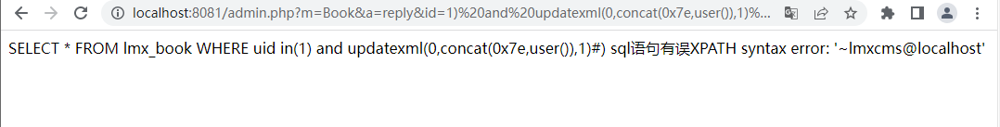

## 梦想CMS（lmxcms）前台SQL注入——CNVD-2019-05674

1. 漏洞详情

   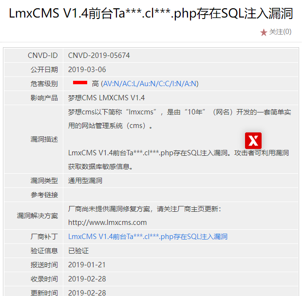

2. 根据描述，找到存在注入的文件，文件路径为`c/index/TagsAction.class.php`，寻找传入了变量的方法，刻意可以看到有一个data变量，data变量的值等于p()方法的值，下面还有一个urldecode转码的操作

   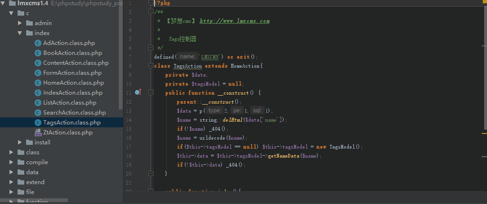

3. 转到p()看一下，如下，p()是一个表单验证，data变量get数据、有转义、验证非法字符，也就是说这里存在过滤，过滤了单双引号、反斜杠和null。sql语句被传入了filter_sql()方法，该方法使用正则表达式进行匹配，过滤了大小写、count、create、delete、select、update、use、drop、insert、info、from

   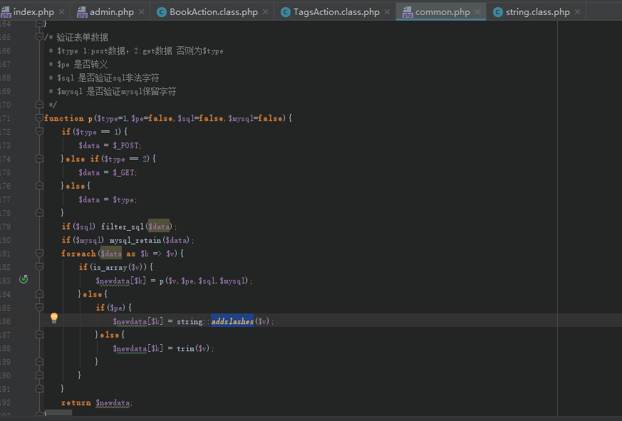

   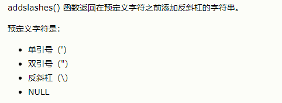

   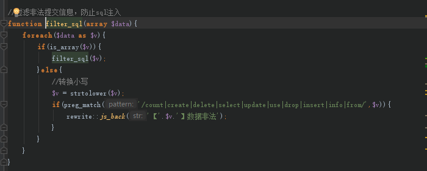

4. 常见的关键字都被过滤了，但是TagsAction类中有一个urldecode，可以对传入数据进行解码，攻击者将注入语句进行一次编码后，通过浏览器提交到服务器的时候，浏览器会自动将转码成URL编码数据进行一次解码，因此，将注入语句进行一重URL加密，并不能绕过，如果进行双重加密，则浏览器解码后的数据仍是经过了一重URL加密的语句，因此过滤函数无法匹配到非法字符，然后语句再经过urldecode解码后送入数据库，就造成了SQL注入

5. 寻找sql语句getNameData->oneModel->oneDB

   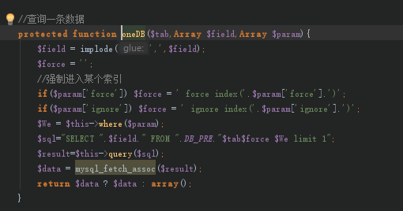

6. 将上图中的sql语句输出一下，构造注入语句，进行双重URL加密，

   ``` sql
   ?m=Tags&name=%25%33%31%25%32%37%25%32%30%25%36%31%25%36%65%25%36%34%25%32%30%25%37%35%25%37%30%25%36%34%25%36%31%25%37%34%25%36%35%25%37%38%25%36%64%25%36%63%25%32%38%25%33%30%25%32%63%25%36%33%25%36%66%25%36%65%25%36%33%25%36%31%25%37%34%25%32%38%25%33%30%25%37%38%25%33%37%25%36%35%25%32%63%25%37%35%25%37%33%25%36%35%25%37%32%25%32%38%25%32%39%25%32%39%25%32%63%25%33%31%25%32%39%25%32%33
   ```

7. 如下所示，注入成功

   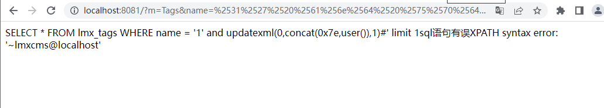