# 一、PHP的文件操作函数
1. **fopen()**。fopen()函数是PHP中一个非常常用的文件操作函数，用于打开文件并返回一个文件句柄（file handle）。该函数可以打开本地文件和网络文件，并且支持多种文件访问模式。语法如下
	```PHP
	resource fopen ( string $filename , string $mode [, bool $use_include_path = FALSE [, resource $context ]] )
	```
	- 参数说明
	```PHP
	- $filename ：必需。要打开的文件名称和路径。可以是本地文件或网络文件。 
	- $mode ：必需。打开文件的模式。以下为可用的模式： 
	- r：只读模式，从文件开头开始读取。
	- r+：读写模式，从文件开头开始读取。 
	- w：写入模式，从文件开头开始写入（如果文件不存在则创建文件）。 
	- w+：读写模式，从文件开头开始写入（如果文件不存在则创建文件）。 
	- a：追加模式，从文件末尾开始写入，如果文件不存在则创建文件。 
	- a+：读写模式，从文件末尾开始写入，如果文件不存在则创建文件。 
	- x：创建并写入模式，从文件开头开始写入，如果文件已经存在则 fopen() 返回 FALSE。 
	- x+：创建并读写模式，从文件开头开始写入，如果文件已经存在则 fopen() 返回 FALSE。 
	- $use_include_path ：可选。如果设置为 true，则还会在 include_path 中搜寻文件。 
	- $context ：可选。规定文件句柄的上下文（例如指定 HTTP 请求头）。 
	- 返回值： 返回文件句柄，返回 FALSE 如果打开文件失败。
	```
	- fopen()函数返回一个资源类型的文件句柄，可以被用于读取、写入以及其他文件操作。在使用完之后，需要使用fclose()函数来关闭文件句柄，避免资源浪费。
	```PHP
	$file = fopen("test.txt", "r");
	if ($file) {
	    while (($line = fgets($file)) !== false) {
	        echo $line;
	    }
	    fclose($file);
	} else {
	    echo "读取文件失败！";
	}
	```
2. fclose() - 关闭文件 
3. **fread()**。fread()函数是PHP中一个常用的文件操作函数，它用于读取文件的内容。该函数可以读取指定长度的文件内容，并将读取的内容返回到一个字符串中。 函数语法：
	```PHP
	string fread ( resource $handle , int $length )
	```
	- 参数说明
	```PHP
	- $handle ：必需。文件句柄，通过fopen()函数打开的。 
	- $length ：必需。要读取的长度。如果文件的剩余长度小于要读取的长度，那么剩余的全部被读取并返回。 
	- 返回值： 返回读取的内容，如果读取失败或已到达文件末尾，则返回 FALSE。
	```
	- 示例
	```PHP
	$file = fopen("test.txt", "r");
	if ($file) {
	    $content = fread($file, filesize("test.txt"));
	    echo $content;
	    fclose($file);
	} else {
	    echo "读取文件失败！";
	}
	```
4. **fwrite()**。fwrite()函数是PHP中一个常用的文件操作函数，它用于向文件中写入内容。该函数可以将指定的字符串写入到文件中，并返回写入的字节数。 函数语法：
	```PHP
	int fwrite ( resource $handle , string $string [, int $length ] )
	```
	- 参数说明
	```PHP
	- $handle ：必需。文件句柄，通过fopen()函数打开的。 
	- $string ：必需。要写入的字符串。 
	- $length ：可选。要写入的字节数，默认为写入整个字符串。
	- 返回值： 返回实际写入的字节数，如果写入失败则返回 FALSE。
	```
	- 示例
	```PHP
	$file = fopen("test.txt", "w");
	if ($file) {
	    $content = "这是要写入的内容！";
	    fwrite($file, $content);
	    fclose($file);
	} else {
	    echo "写入文件失败！";
	}
	```
5. **fgets()**。 fgets()函数是PHP中一个常用的文件操作函数，它用于逐行读取文件内容。该函数每次读取一行，并返回一个字符串。 函数语法：
	```PHP
	string fgets ( resource $handle [, int $length ] )
	```
	- 参数说明
	```PHP
	- $handle ：必需。文件句柄，通过fopen()函数打开的。 
	- $length ：可选。要读取的最大字节数，如果未指定，则默认为读取一行的长度（包括行结束符）。 
	- 返回值： 返回读取的一行字符串，如果读取失败或已到达文件末尾，则返回 FALSE。
	```
	- 示例
	```PHP
	$file = fopen("test.txt", "r");
	if ($file) {
	    while (($line = fgets($file)) !== false) {
	        echo $line . "<br>";
	    }
	    fclose($file);
	} else {
	    echo "读取文件失败！";
	}
	```
6. **file()**。file()函数是PHP中一个常用的文件操作函数，它用于把整个文件读入一个数组中。该函数可以将指定文件中的每一行读取到数组的一个元素中，并返回包含文件内容的数组。 函数语法：
	```PHP
	array file ( string $filename [, int $flags = 0 [, resource $context ]] )
	```
	- 参数说明
	```PHP
	- $filename ：必需。要读取的文件名。 
	- $flags ：可选。指定常量来控制文件读取的行为。常用的常量有FILE_USE_INCLUDE_PATH（在include_path中查找文件）、FILE_IGNORE_NEW_LINES（省略行结束符）和FILE_SKIP_EMPTY_LINES（跳过空行）。 
	- $context ：可选。文件上下文资源，可以通过stream_context_create()函数创建。 
	- 返回值： 返回包含文件内容的数组，其中每个元素对应文件中的一行。
	```
	- 示例
	```PHP
	$lines = file("test.txt");
	foreach ($lines as $line) {
	    echo $line . "<br>";
	}
	```
7. **file_get_contents()**。file_get_contents()函数是PHP中一个常用的文件操作函数，它用于把整个文件读入一个字符串中。该函数可以读取指定文件的所有内容，并将其保存在一个字符串变量中。 函数语法：
	```PHP
	string file_get_contents ( string $filename [, bool $use_include_path = false [, resource $context [, int $offset = 0 [, int $maxlen ]]]] )
	```
	- 参数说明
	```PHP
	- $filename ：必需。要读取的文件名。 
	- $use_include_path ：可选。指定是否在include_path中查找文件，默认为false，即不在include_path中查找。 
	- $context ：可选。文件上下文资源，可以通过stream_context_create()函数创建。 
	- $offset ：可选。指定从文件的哪个位置开始读取，默认为0，即从文件的开头开始读取。 
	- $maxlen ：可选。指定最多读取的字节数，默认为读取整个文件内容。 
	- 返回值： 返回包含文件内容的字符串。
	```
	- 示例
	```PHP
	$content = file_get_contents("test.txt");
	echo $content;
	```
8. **file_put_contents()**。file_put_contents()函数是PHP中一个常用的文件操作函数，它用于将一个字符串写入文件中。该函数可以创建文件（如果文件不存在），也可以覆盖已存在的文件内容。 函数语法：
	```PHP
	int file_put_contents ( string $filename , mixed $data [, int $flags = 0 [, resource $context ]] )
	```
	- 参数说明
	```PHP
	- $filename ：必需。要写入的文件名。 
	- $data ：必需。要写入文件的数据，可以是字符串、数组或其他值。
	- $flags ：可选。定义写入文件时的行为，常用的标志有FILE_APPEND（追加写入）、LOCK_EX（独占锁定文件）、FILE_USE_INCLUDE_PATH（在include路径中查找文件）等。
	- $context ：可选。文件上下文资源，可以通过stream_context_create()函数创建。 
	- 返回值： 如果写入文件成功，则返回写入的字节数目。如果写入文件失败，则返回false。
	```
	- 示例
	```PHP
	$data = "Hello, world!";
	file_put_contents("test.txt", $data);
	```
9. **copy()**。copy()函数是PHP中一个常用的文件操作函数，它用于将一个文件复制到指定的目录中。 函数语法：
	```PHP
	bool copy ( string $source , string $dest [, resource $context ] )
	```
	- 参数说明
	```PHP
	- $source ：必需。要复制的文件路径和文件名。 
	- $dest ：必需。新文件的路径和文件名，如果指定了一个目录，该函数将复制到该目录中，并使用与原始文件相同的名字。 
	- $context ：可选。文件上下文资源，可以通过stream_context_create()函数创建。 
	- 返回值： 如果成功地复制了文件，则返回true。如果复制失败，则返回false。 
	```
	- 示例
	```PHP
	if (copy("source.txt", "destination.txt")) {
	    echo "File copied successfully.";
	} else {
	    echo "File copying failed.";
	}
	```
10. **rename()**。rename()函数是PHP中一个常用的文件操作函数，它用于将一个文件重命名或将一个文件移动到另一个文件夹中。 函数语法：
	```PHP
	bool rename ( string $oldname , string $newname [, resource $context ] )
	```
	- 参数说明
	```PHP
	- $oldname ：必需。要重命名或移动的文件路径和文件名。 
	- $newname ：必需。新文件的路径和文件名，如果指定了一个目录，该函数将移动到该目录中，并使用新的名字。 
	- $context ：可选。文件上下文资源，可以通过stream_context_create()函数创建。 
	- 返回值： 如果成功地将文件重命名或移动，则返回true。如果操作失败，则返回false。
	```
	- 示例
	```PHP
	if (rename("oldfile.txt", "newfile.txt")) {
	    echo "File renamed successfully.";
	} else {
	    echo "File renaming failed.";
	}
	```
11. **unlink()**。unlink()函数是PHP中一个常用的文件操作函数，它用于删除文件。 函数语法：
	```PHP
	bool unlink ( string $filename [, resource $context ] )
	```
	- 参数说明
	```PHP
	- $filename : 必需。要删除的文件路径和文件名。 
	- $context : 可选。文件上下文资源，可以通过stream_context_create()函数创建。 
	- 返回值： 如果成功地将文件删除，则返回true。如果删除失败，则返回false。
	```
	- 示例
	```PHP
	if (unlink("file.txt")) {
	    echo "File deleted successfully.";
	} else {
	    echo "File deletion failed.";
	}
	```

# 二、代码审计案例
## （一）梦想CMS（lmxcms）文件删除

1. 漏洞详情——CNVD-2020-59469

   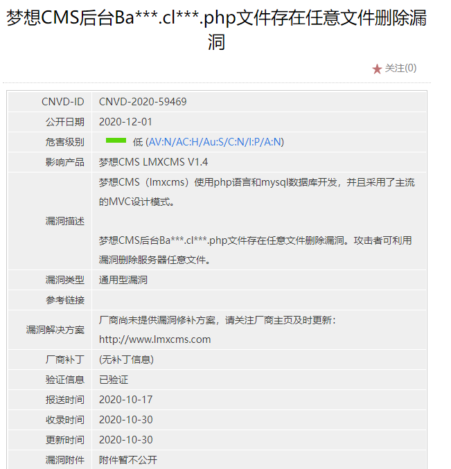

2. 漏洞描述称后台`Ba***.cl***.php`文件存在任意文件删除，查看cms源码，只有BackdbAction.class.php和BasicAction.class.php这两个类文件符合名字要求

   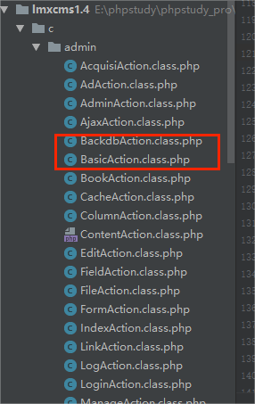

3. 查看源代码，代码中的注释显示只有BackdbAction.class.php有文件删除功能。php中的文件删除函数是unlink()，搜索一下该函数，发现BackdbAction.class.php文件存在该函数，且有变量传入，那么应该就是这个文件存在文件删除漏洞了

   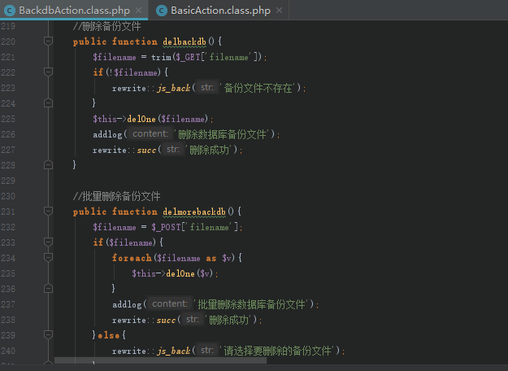

   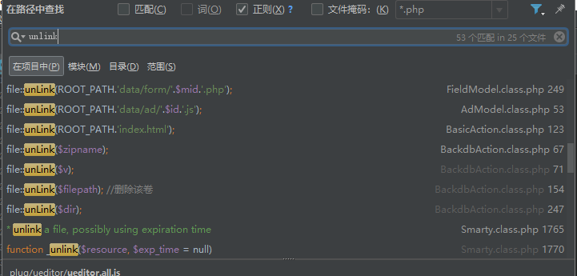

4. 类文件最下方的delOne()方法中传入了filename的变量，并且与`file/back`进行拼接组成文件路径，也就是说只能删除`file/back`这个目录下的文件，但只要能绕过路径，就能实现任意文件删除

   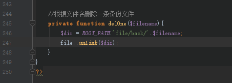

5. 可以看到文件中的delbackdb()和delmorebackdb()都调用了delOne()方法，delbackdb()中支队文件名进行了首尾两端的空格去除，而且只校验了文件名。

   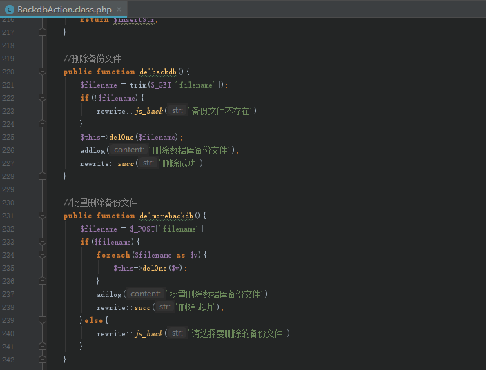

6. 使用`../../`即可绕过目录限制，在根目录下新建一个test.txt文件，尝试删除test.txt文件，如下所示，文件被成功删除

   ``` html
   http://localhost:8081/admin.php?m=backdb&a=delbackdb&filename=../../test.txt
   ```

   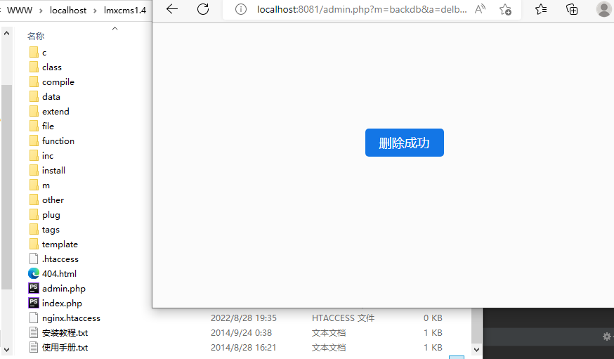

7. 若网站的install目录在完成安装后没有删除，则利用该文件删除漏洞删除install目录下的install_ok.txt文件，则可实现对网站的重新覆盖安装

## （二）梦想CMS（lmxcms）任意文件读取与写入

## 文件读取

1. php文件读取的函数

   ``` php
   fread()
   fgets()
   fgetss()
   file()
   readfile()
   file_get_contents()
   fpassthru()
   ```

2. 漏洞详情————CNVD-2020-51412

   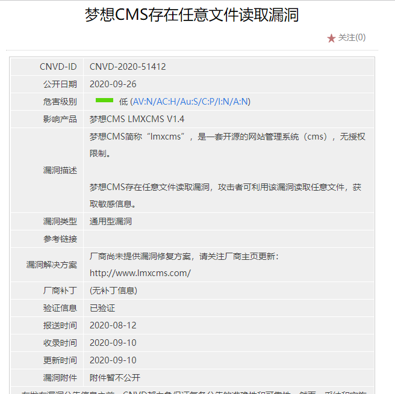

3. 漏洞详情中没有给出任何提示，但是只给了低危，说明漏洞在后台，在项目中搜索`file_get_contents`

   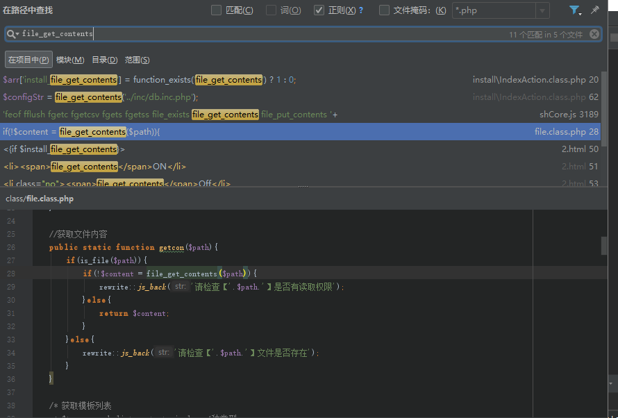

4. 只有file.class.php文件中的file_get_contents存在变量传入，该函数被getcon函数调用，查看getcon函数被哪些方法调用了，双击进入该文件，选择getcon右键查找使用，如下，可以看到getcon被TemplateAction.class.php文件的TemplateAction类的editfile方法调用了，并且传入了dir变量

   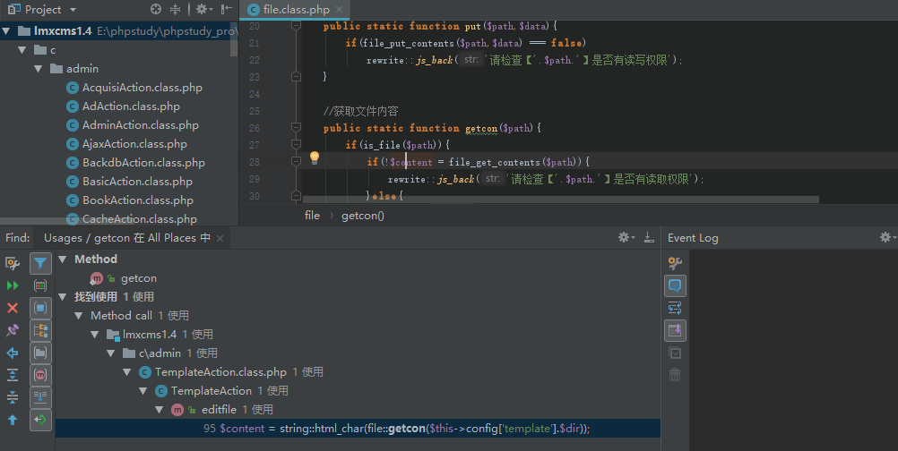

5. dir变量传入editfile方法后，与`$this->config['template']`进行拼接，echo输出一下`$this->config['template'].$dir`，访问一下看拼接的是什么

   ``` html
   admin.php?m=template&a=editfile&dir=1
   ```

   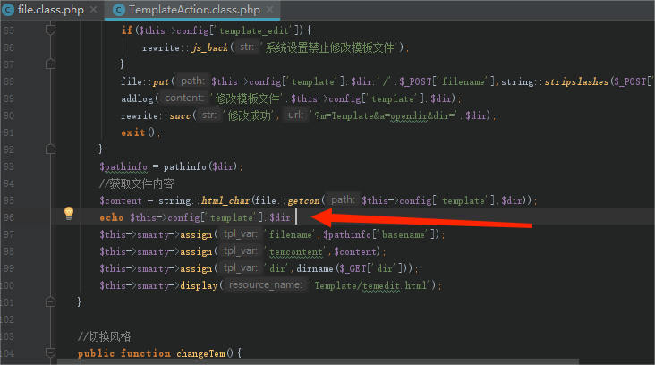

6. 如下所示，拼接的是`E:/phpstudy/phpstudy_pro/WWW/localhost/lmxcms1.4/template/`，也就是模板文件所在的目录

   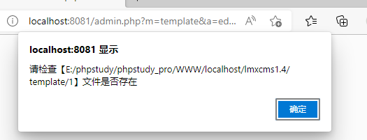

7. 尝试一下读取网站配置文件，如下所示，成功读取到配置文件

   ``` html
   http://localhost:8081/admin.php?m=Template&a=editfile&dir=../inc/db.inc.php
   ```

   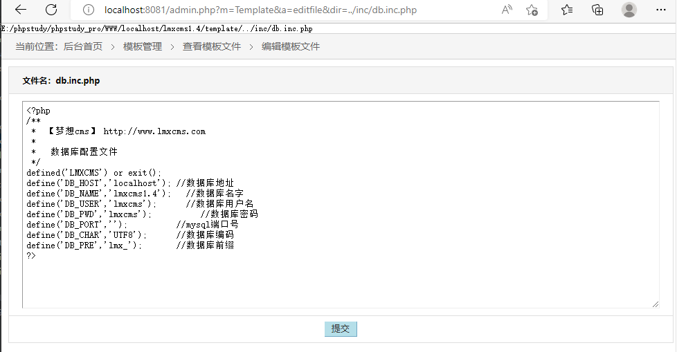

## 文件写入

1. 如上所示，成功读取到文件后，可以直接编辑读取到的文件并提交，我们可以直接在读取到的文件中写入webshell，这样就能直接上线了

2. 既然可以修改文件，说明一定还有修改文件的方法，查看源码，发现还是在editfile方法中，存在一个`file::put()`，先判断POST数据里面是否设置了settemcontent，然后再进行写入操作

   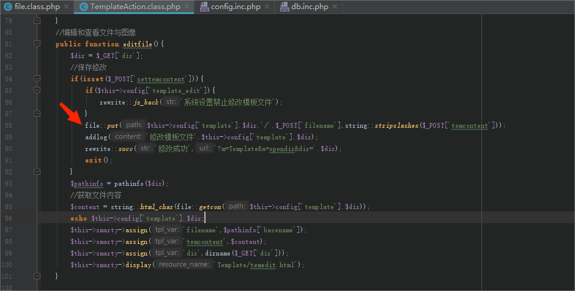

3. 搜索fileput，方法介绍如下，有两个参数，file参数规定要写入数据的文件，文件不存在则创建新文件，data参数规定要写入的数据

   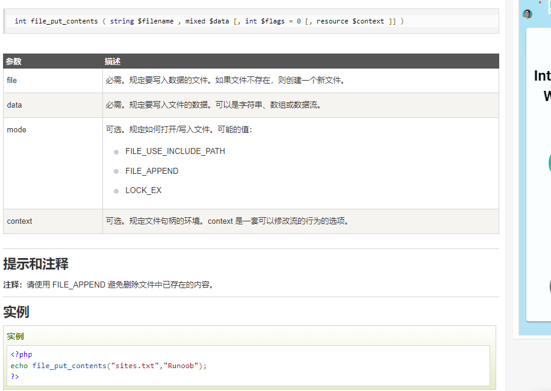

4. 尝试写入一个webshell，可以看到成功在template目录下写入了shell.php，也可以加上`../`写入到根目录下

   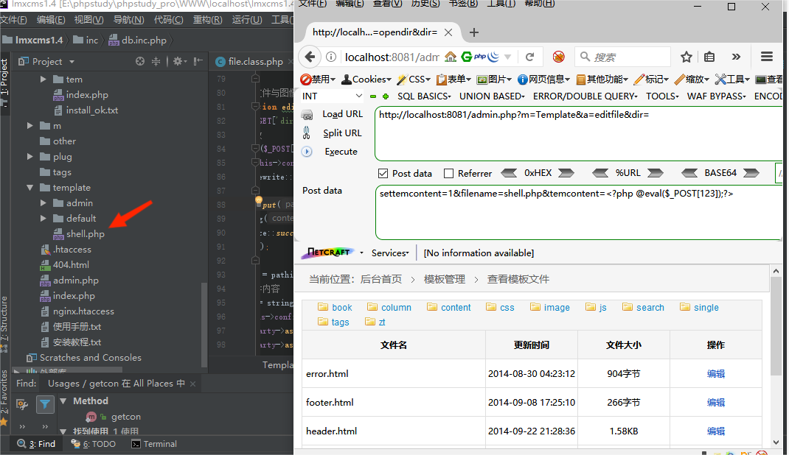

5. 使用蚁剑连接成功

   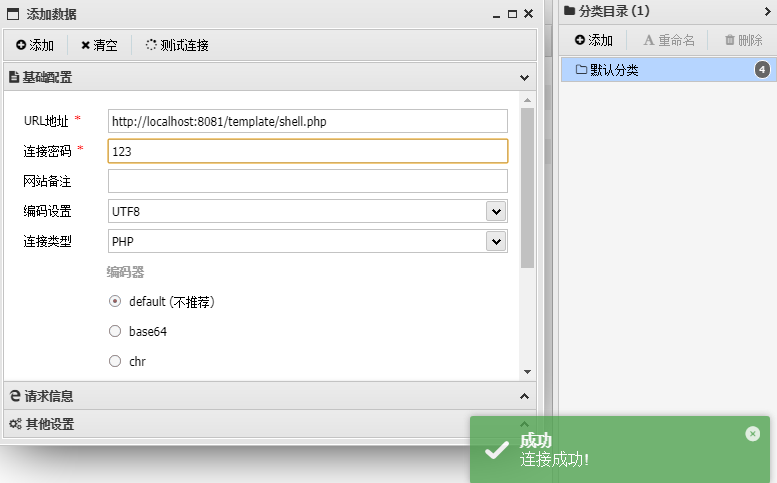