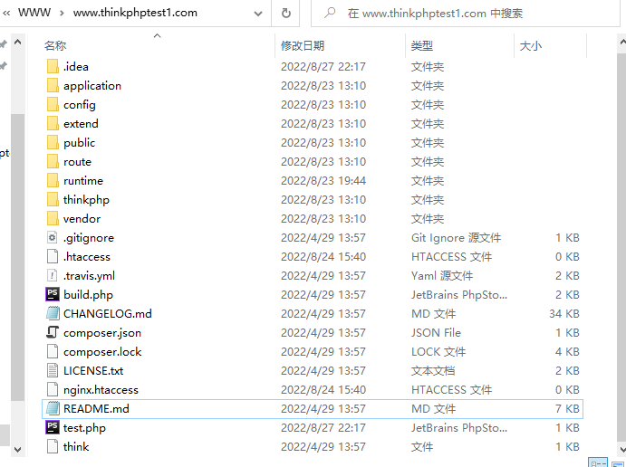

# PHP代码审计——thinkphp反序列化文件删除

# PHP反序列化的常见起点

1. `__wakeup ` 一定会调用
2. `__destruct`  一定会调用  
3. `__toString`  当一个对象被反序列化后又被当作字符串使用

# PHP反序列化的常见中间跳板

1. `toString`  当一个对象被当作字符串使用
2. `__get`  读取不可访问或不存在属性时被调用
3. `__set`  当给不可访问或不存在属性赋值时被调用
4. `__isset`  对不可访问或不存在的属性调用isset()或empty()时被调用
5. 形如`$this->$func()`

# PHP反序列化的常见终点

1. `__call`  调用不可访问或不存在的方法时被调用
2. `call_user_func`  一般php代码执行都会选择这里
3. `call_user_func_array`  一般php代码执行都会选择这里
4. phar反序列化利用方式，能够反序列化其metadata部分

# thinkphp反序列化文件删除

1. 环境

   - thinkphp 5.1.37 
   - phpstudy + xdebug

2. 过程

   - 先修改`application/index/controller/Index.php`，构造一个未过滤的反序列化方法，接受id参数传入值

     

   - 寻找`function __destruct`的析构函数，这里选择跟windows类

     

   - windows类中的`function __destruct`析构函数实现了两个方法，一个是关闭方法，一个时删除方法，如果能够传入值，且值可控，都可以通过外部构造序列化方法进行操作

     

     

     

   - `removeFiles()`方法可以通过传入一个数组进行遍历，调用`file.exists()`方法判断是否存在，若存在则调用`@unlink()`进行删除

   - 因Windows类中的file变量是私有的，只要把文件名传递到file数组变量中，即可操作`removeFile()`进行文件删除

     

   - 构造一个poc，对一个文件进行序列化处理，在根目录下创建一个poctest1.txt文件

     

   - 访问一下test.php，如果没有出错，则会出现如下界面，成功将刚刚创建的poctest1.txt文件进行了序列化处理

     

   - 赋值序列化处理的值，访问`/public/index.php?id=`后面加上序列化处理后的值，poctes1.txt文件被成功删除

     

3. 思路：寻找源代码中重装的文件，重装一般都是可以写文件的，通过传入特点对象进行文件操作可以触发php的一些魔术方法，查看写文件的数据库配置是否存在过滤，如果没有过滤或过滤不严，就可以getshell