# 5x04 代码审计——PHP审计之YCCMS审计

## 一、环境搭建与使用工具

### （一）环境搭建

1. 打开源码查看安装要求

   

2. PHP 5.4+，Mysql 5.0.*，直接使用phpstudy配置即可

3. 查看源码目录结构，发现是mvc模式的，那么我们重点关注的就是controller、public、model下的文件

   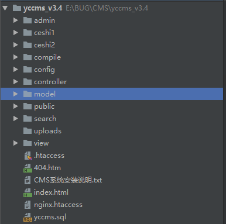

   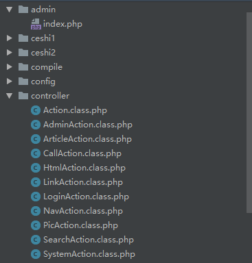

### （二）使用工具

1. 集成网站环境搭建：phpstudy
2. 代码静态扫描：Fortify、seay源码审计系统
3. 代码调试：phpstorm
4. 抓包：BurpSuite
5. 浏览器测试插件：Hackbar

## 二、静态代码扫描

1. Fortify的扫描情况

   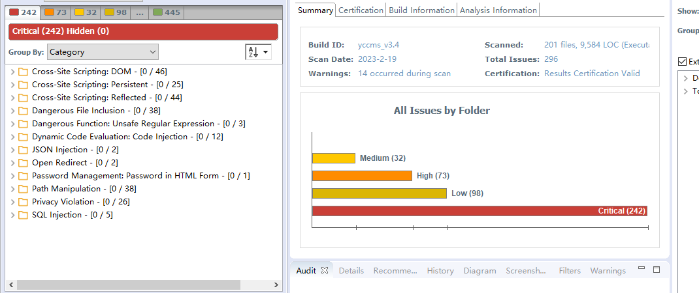

2. 再使用seay源码审计系统扫描一下，方便后面代码函数跟进

   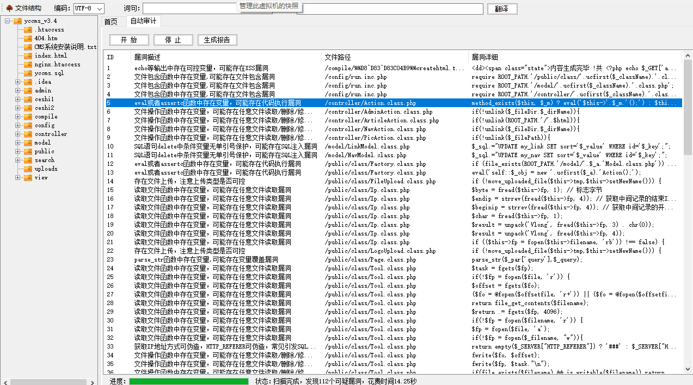

## 三、代码审计过程

### （一）代码执行

1. public/class目录下的Factory.class.php文件，文件类名为Factory

   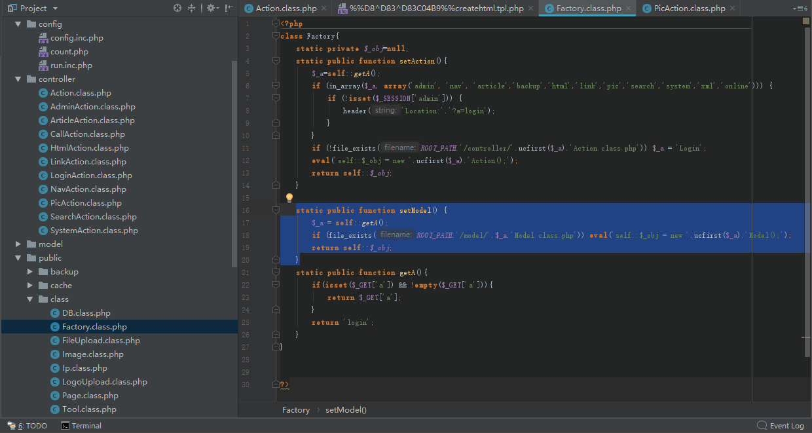

2. 使用setModel方法调用self::getA()方法获取a参数进行跳转检查操作，通过file_exists()函数判断文件路径是否存在，然后通过eval()函数实例化a参数执行代码

3. 这里想要利用eval()执行代码，则必须绕过file_exists()函数的检查，该函数允许路径中存在特殊字符，且遇到`/../`的时候会返回到上级目录，可以利用以下形式尝试绕过

   ```
    ?a=Factory();phpinfo();//../
   ```

   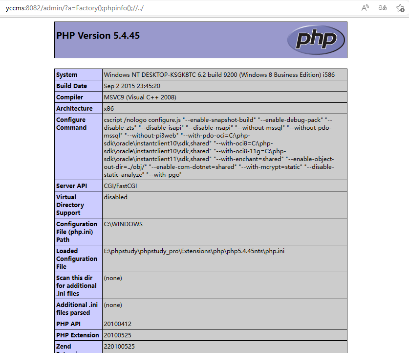

4. 成功绕过。发现eval函数中存在对a参数的实例化，把前面的执行代码phpinfo()改成`system('whoami')`后，出现报错，报错信息中出现了一个实例化路径config/run.inc.php

   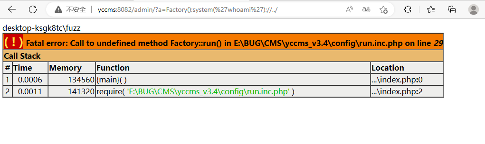

5. 在项目中搜索Factory，找到的唯一的有效实例化也是config/run.inc.php

   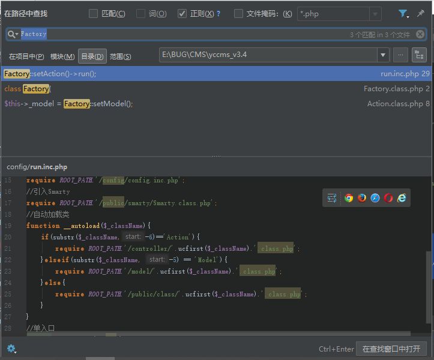

6. config/run.inc.php文件无法直接访问，继续找包含了这个文件的其他可用文件，找到admin/index.php、config/count.php、search/index.php三个文件，也就是说需要通过这三个文件对Factory()进行实例化调用才可以利用此处的代码执行漏洞。由于index.php是默认的首页文件，所以通过admin/index.php进行利用时可以省略index.php

   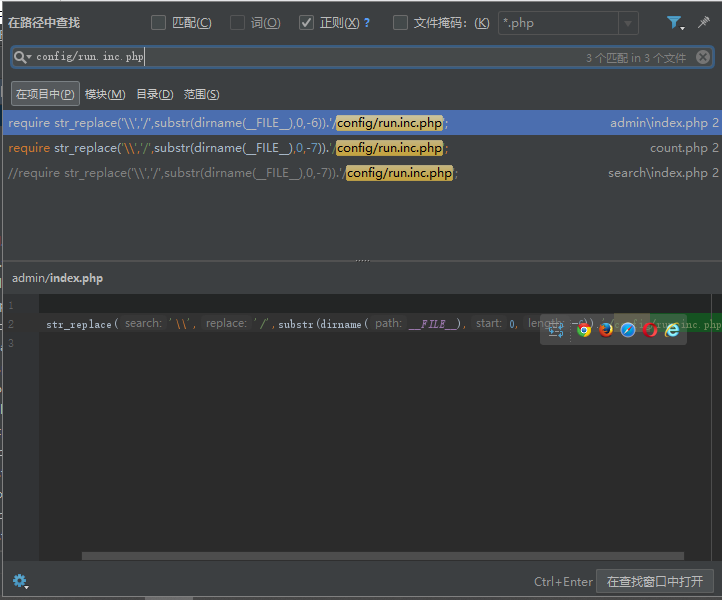

7. 构造webshell，使用蚁剑尝试连接成功

   ```
    ?a=Factory();@eval($_POST[1]);//../
   ```

   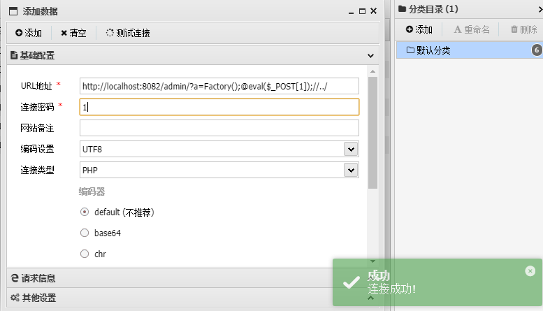

### （二）无需登录任意文件文件删除

1. seay中提示controller目录下有三处文件删除，但是只有PicAction.class.php文件中没有对路径获取文件名进行校验，另外三个都存在对文件路径或文件名的校验

   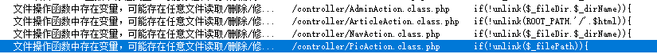

2. 先看controller/PicAction.class.php，查看代码如下，发现是一处删除图片的功能点，且没有检验文件路径和文件名

   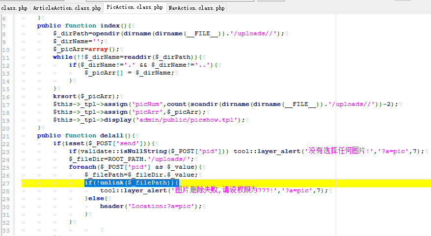

3. 先随便传张图片上去，或者放一张图片到upload目录下，到后台的图片管理抓个包看一下

   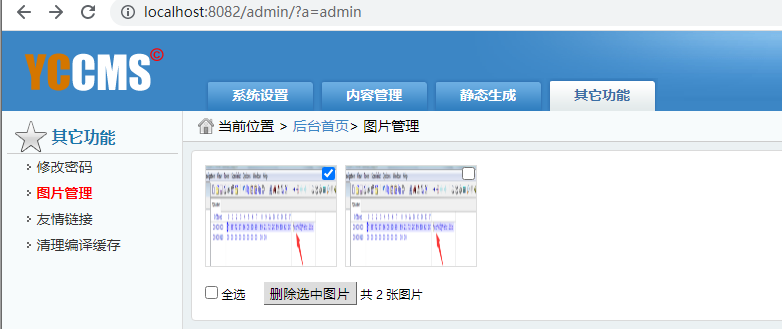

   数据包如下，body部分的参数为`pid[1]=xxx.png&send=删除选中图片`

   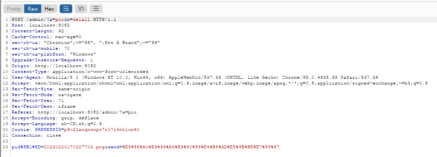

4. 在网站根目录下新建一个1.txt文件，浏览器中退出管理员账号，hackbar构造poc尝试删除该文件

   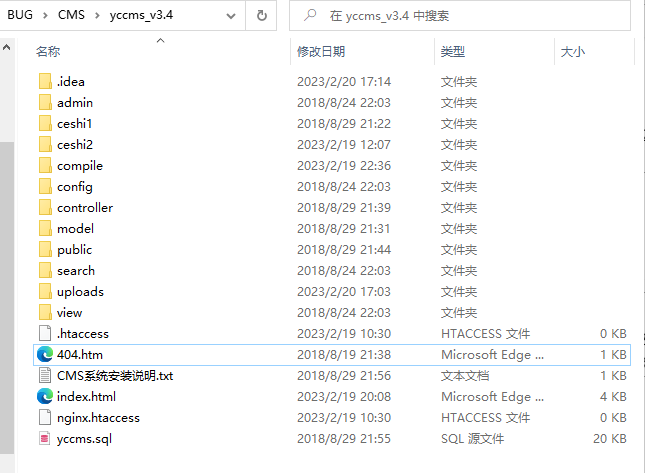

   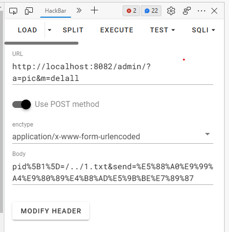

5. 执行后发现网站根目录下的1.txt文件被删除了

### （三）无需登录任意文章删除

1. 第二处文件删除在controller/ArticleAction.class.php，查看代码如下，以get方法接收id参数，先连接数据库查找该id是否存在，若存在则删除该id所对应的文章，因此这里无法删除任意文件，只能删除文章

   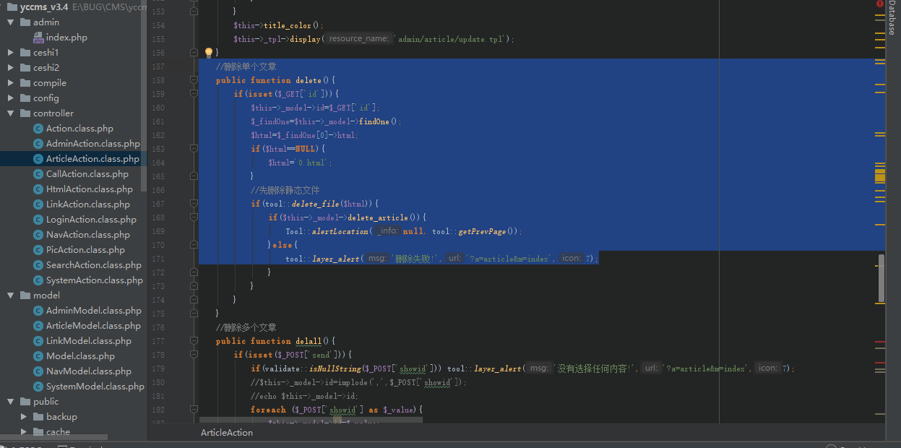

2. 还是先退出登录，使用hackbar构造poc测试，尝试删除id为2446的文章

   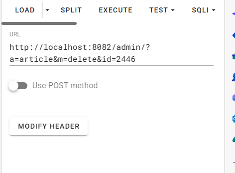

3. 登录后台查看，发现id为2446的文章确实被删除了

   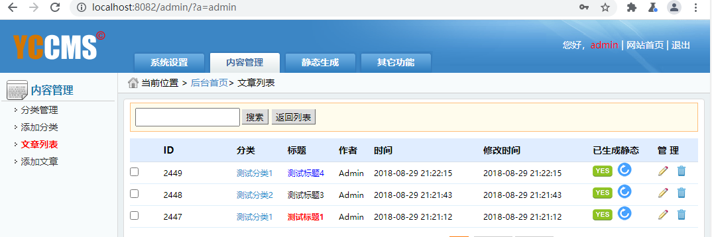

### （四）任意文件上传一

1. public/class/LogoUpload.class.php文件，查看代码

   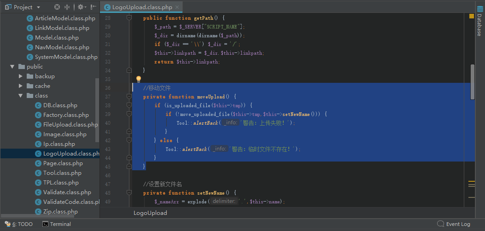

2. 先到后台查看一下这处上传点

   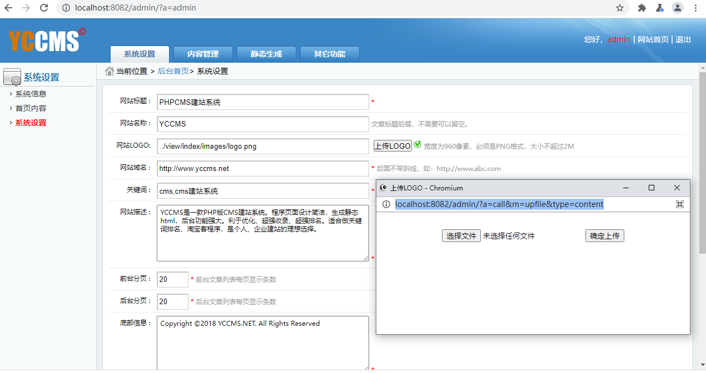

3. 尝试前台不登陆访问上传点，发现可以直接访问

   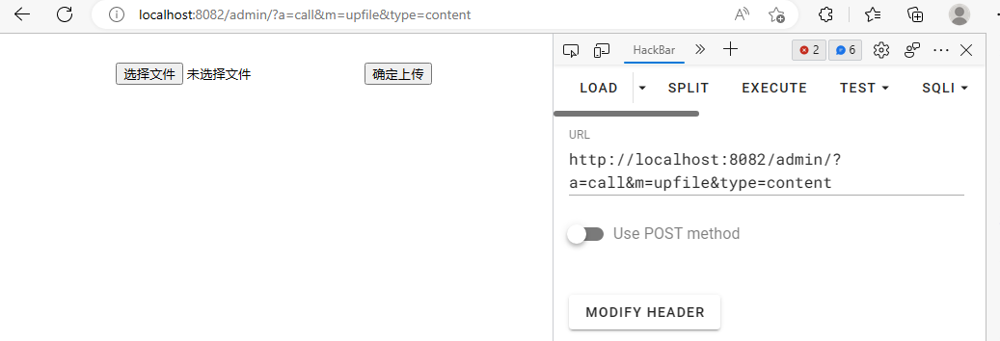

4. 尝试上传一个webshell，先正常选择上传一个png图片，然后burpsuite抓包修改成一句话木马再发送，如下

   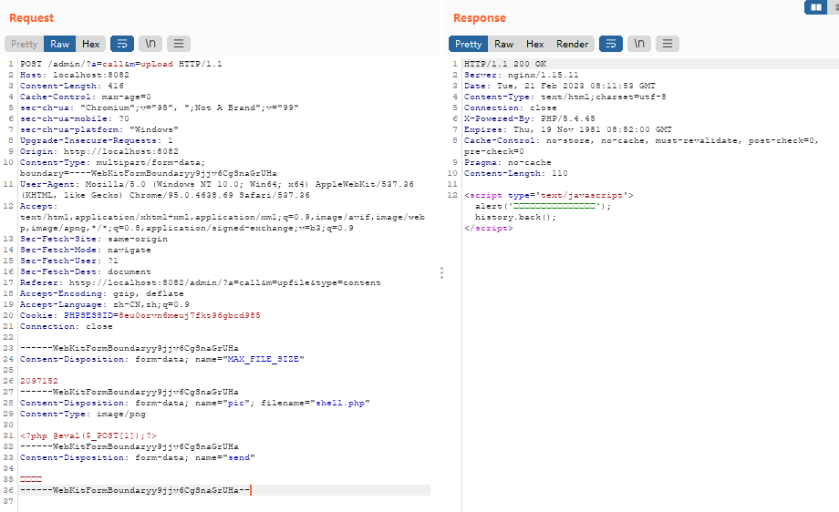

5. 再查看源码，发现LogoUpload.class.php文件中还有一个上传后的校验，重命名文件名为logo，验证上传目录，校验文件类型是否为png图片

   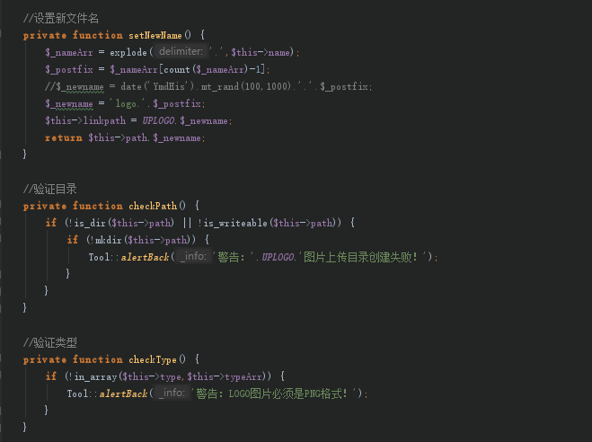

6. 根据上述规则，上传的shell.php文件应该被重命名为了logo.php，找到logo上传目录view/index/images/，发现里面有一个logo.php文件，使用蚁剑尝试连接成功

   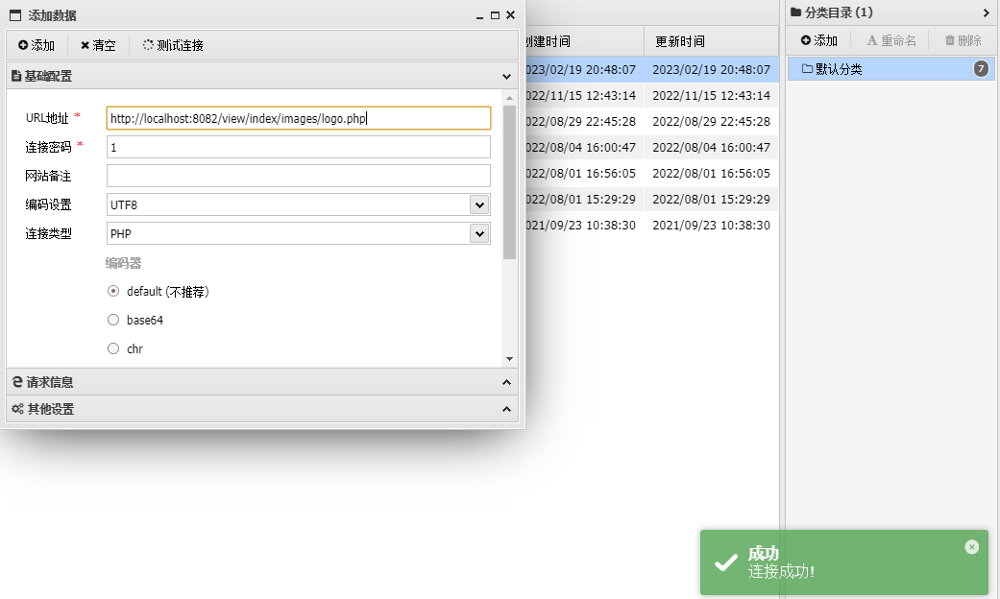

### （五）任意文件上传二

1. 第二处文件上传点public/class/FileUpload.class.php，查看代码如下，逻辑跟上面那一处上传差不多，但是文件名以时间+100到1000之间的随机数进行重命名

   

2. 抓包测试一下

   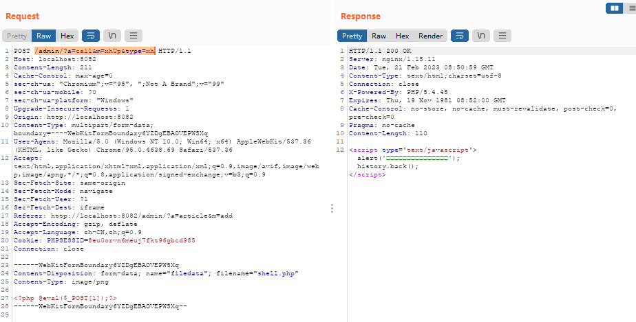

3. 到uploads目录下看一下，发现多了一个20230221165059459.php文件，文件名被通过时间进行了重命名

   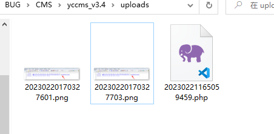

4. 尝试使用蚁剑连接成功，这一处上传点同样可以前台不登陆直接访问，不过有js校验

   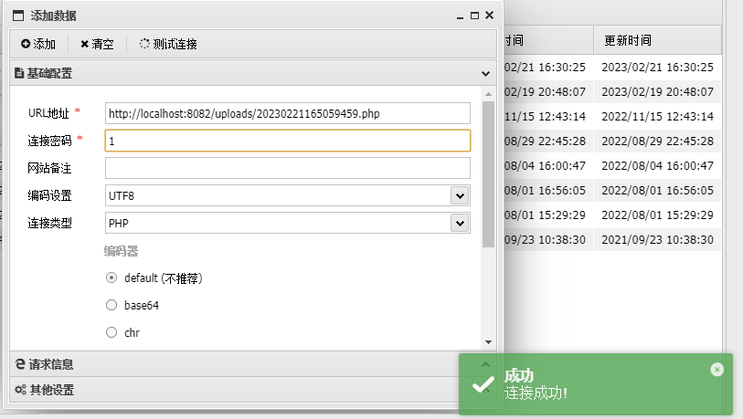

### （六）验证码复用漏洞

1. 这个都不需要看代码，直接测就行，验证码不会变，可以重复使用