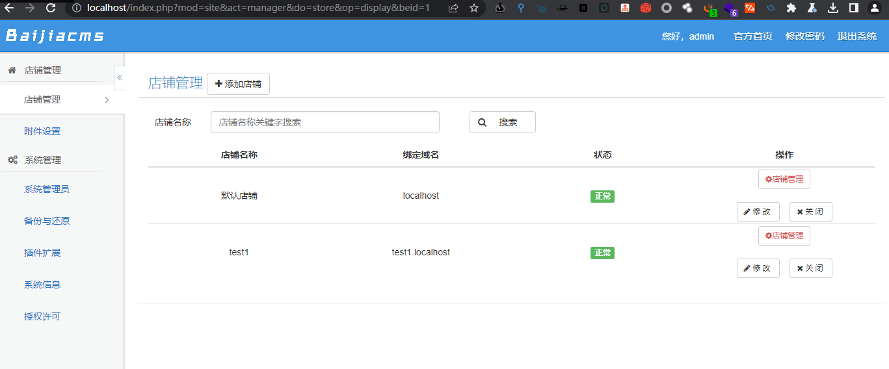

# 一、PHP中代码执行与命令执行的函数
1.  **eval()**。eval()函数是PHP中的一个内置函数，用于执行字符串形式的PHP代码。eval()函数是PHP中的一个内置函数，用于执行字符串形式的PHP代码。它的语法如下：
	```PHP
	mixed eval ( string $code )
	```
	- 其中，$code参数是要执行的PHP代码字符串。eval()函数会将这个字符串作为PHP代码进行解析和执行，并返回执行结果。eval()函数可以执行任意的PHP代码，包括用户输入的恶意代码，因此非常危险。如果不加以限制地使用eval()函数，可能会导致代码注入漏洞。
	- 在PHP中，eval()函数通常用于动态生成代码或执行动态生成的代码。例如，可以使用eval()函数来执行从数据库中读取的PHP代码字符串，或者执行从用户输入中构造的PHP代码字符串。但是，由于eval()函数的危险性，建议在使用时进行严格的输入验证和过滤，以确保代码的安全性。
	```PHP
	// 定义一个字符串形式的PHP代码
	$code = '$a = 1 + 2; echo $a;';
	// 使用eval()函数执行这个字符串
	eval($code);
	```
2. **pregreplace()**。pregreplace()函数是PHP中的一个内置函数，用于使用正则表达式替换字符串。它的语法如下：
	```PHP
	mixed preg_replace ( mixed $pattern , mixed $replacement , mixed $subject [, int $limit = -1 [, int &$count ]] )
	```
	- 其中，`$pattern`参数是要匹配的正则表达式，`$replacement`参数是要替换成的字符串，`$subject`参数是要进行替换的字符串。pregreplace()函数会在`$subject`字符串中查找与`$pattern`匹配的部分，并将其替换成`$replacement`字符串。如果`$pattern`是一个数组，那么pregreplace()函数会依次对每个正则表达式进行匹配和替换。  
	- pregreplace()函数可以用于很多字符串操作，例如替换字符串中的某些字符、删除字符串中的某些字符、提取字符串中的某些部分等。但是，如果使用不当，也可能会导致代码注入漏洞。例如，如果`$replacement`参数是一个字符串形式的PHP代码，那么它将被解释为PHP代码并执行，因此可能会导致代码注入漏洞。
	- 在下面的示例中，我们首先定义了一个字符串和一个正则表达式，其中正则表达式用于匹配字符串中的"World"部分。然后，我们使用pregreplace()函数来替换字符串中的匹配部分，将其替换成"PHP"。最后，我们输出替换后的字符串。 当我们运行这个脚本时，会输出"Hello, PHP!"，即替换后的字符串。这说明pregreplace()函数成功地替换了字符串中的匹配部分。
	```PHP
	// 定义一个字符串和一个正则表达式
	$str = 'Hello, World!';
	$pattern = '/World/';
	// 使用preg_replace()函数替换字符串中的匹配部分
	$result = preg_replace($pattern, 'PHP', $str);
	// 输出替换后的字符串
	echo $result;
	```
3. **assert()**。assert()函数是PHP中的一个内置函数，用于检查一个表达式是否为真。它的语法如下：
	```PHP
	void assert ( mixed $assertion [, mixed $description ] )
	```
	- 其中，`$assertion`参数是要检查的表达式，`$description`参数是可选的描述信息。assert()函数会检查`$assertion`表达式是否为真，如果为假，则会抛出一个致命错误，并输出一个错误信息。如果`$description`参数被指定，那么这个错误信息会包含这个描述信息。
	- assert()函数通常用于调试和测试代码。在开发过程中，我们可以使用assert()函数来检查代码中的一些假设条件是否成立。如果某个假设条件不成立，那么assert()函数会抛出一个致命错误，从而帮助我们快速地发现和修复问题。
	- 在下面的示例中，我们首先定义了一个表达式，其中包含了一个简单的数学运算。然后，我们使用assert()函数来检查这个表达式是否等于2。如果这个表达式不等于2，那么assert()函数会抛出一个致命错误，并输出一个错误信息。如果这个表达式等于2，那么assert()函数会继续执行，不会有任何输出。 当我们运行这个脚本时，如果表达式等于2，那么会输出"assert()函数检查通过！"，即检查结果。如果表达式不等于2，那么会抛出一个致命错误，并输出一个错误信息。
	```PHP
	// 定义一个表达式和一个assert()函数
	$expression = 1 + 1;
	assert($expression == 2);
	// 输出检查结果
	echo "assert()函数检查通过！";
	```
4. **exec()**。exec()函数是PHP中的一个内置函数，用于执行外部命令。它的语法如下：
	```PHP
	string exec ( string $command [, array &$output [, int &$return_var ]] )
	```
	- 其中，`$command`参数是要执行的外部命令，`$output`参数是可选的输出数组，`$returnvar`参数是可选的返回值。exec()函数会执行`$command`参数指定的外部命令，并返回命令的输出结果。如果指定了`$output`参数，那么命令的输出结果会被存储在这个数组中。如果指定了`$returnvar`参数，那么命令的返回值会被存储在这个变量中。  
	- exec()函数通常用于执行一些系统命令或者调用一些外部程序。例如，我们可以使用exec()函数来执行一个Linux系统命令，或者调用一个Python脚本。但是，由于exec()函数的危险性，建议在使用时进行严格的输入验证和过滤，以确保代码的安全性。
	- 在下面的示例中，我们首先定义了一个外部命令，其中包含了一个Linux系统命令"ls -l"。然后，我们使用exec()函数来执行这个外部命令，并将命令的输出结果存储在一个数组中。最后，我们使用printr()函数来输出这个数组，以展示命令的输出结果。  当我们运行这个脚本时，会输出一个类似于"total 8\ndrwxr-xr-x 2 user user 4096 Sep 1 10:00 dir1\ndrwxr-xr-x 2 user user 4096 Sep 1 10:00 dir2\n-rw-r--r-- 1 user user 12 Sep 1 10:00 file.txt\n"的字符串，即命令的输出结果。这说明exec()函数成功地执行了外部命令，并返回了命令的输出结果。
	```PHP
	// 定义一个外部命令和一个exec()函数
	$command = 'ls -l';
	$output = array();
	exec($command, $output);
	// 输出命令的输出结果
	echo "<pre>";
	print_r($output);
	echo "</pre>";
	```
5. **system()**。system()函数是PHP中的一个内置函数，用于执行外部命令。它的语法如下：
	```PHP
	string system ( string $command [, int &$return_var ] )
	```
	- 其中，`$command`参数是要执行的外部命令，`$returnvar`参数是可选的返回值。system()函数会执行`$command`参数指定的外部命令，并返回命令的输出结果。如果指定了`$returnvar`参数，那么命令的返回值会被存储在这个变量中。  
	- system()函数通常用于执行一些系统命令或者调用一些外部程序。例如，我们可以使用system()函数来执行一个Linux系统命令，或者调用一个Python脚本。但是，由于system()函数的危险性，建议在使用时进行严格的输入验证和过滤，以确保代码的安全性。
	- 在下面的示例中，我们首先定义了一个外部命令，其中包含了一个Linux系统命令"ls -l"。然后，我们使用system()函数来执行这个外部命令，并将命令的返回值存储在一个变量中。最后，我们使用echo语句来输出这个变量，以展示命令的返回值。  当我们运行这个脚本时，会输出一个类似于"命令的返回值为：0"的字符串，即命令的返回值。这说明system()函数成功地执行了外部命令，并返回了命令的返回值。
	```PHP
	// 定义一个外部命令和一个system()函数
	$command = 'ls -l';
	$return_var = 0;
	system($command, $return_var);
	// 输出命令的返回值
	echo "命令的返回值为：".$return_var;
	```
6. **passthru()**。passthru()函数是PHP中的一个内置函数，用于执行外部命令并将命令的输出直接输出到浏览器。它的语法如下：
	```PHP
	void passthru ( string $command [, int &$return_var ] )
	```
	- 其中，`$command`参数是要执行的外部命令，`$returnvar`参数是可选的返回值。passthru()函数会执行`$command`参数指定的外部命令，并将命令的输出直接输出到浏览器。如果指定了`$returnvar`参数，那么命令的返回值会被存储在这个变量中。  
	- passthru()函数通常用于执行一些系统命令或者调用一些外部程序，并将它们的输出直接输出到浏览器。例如，我们可以使用passthru()函数来执行一个Linux系统命令，或者调用一个Python脚本，并将它们的输出直接输出到浏览器。但是，由于passthru()函数的危险性，建议在使用时进行严格的输入验证和过滤，以确保代码的安全性。
	-   在下面的示例中，我们首先定义了一个外部命令，其中包含了一个Linux系统命令"ls -l"。然后，我们使用passthru()函数来执行这个外部命令，并将命令的输出直接输出到浏览器。 当我们运行这个脚本时，会输出一个类似于"total 8\ndrwxr-xr-x 2 user user 4096 Sep 1 10:00 dir1\ndrwxr-xr-x 2 user user 4096 Sep 1 10:00 dir2\n-rw-r--r-- 1 user user 12 Sep 1 10:00 file.txt\n"的字符串，即命令的输出结果。这说明passthru()函数成功地执行了外部命令，并将命令的输出直接输出到了浏览器。
	```PHP
	// 定义一个外部命令和一个passthru()函数
	$command = 'ls -l';
	passthru($command);
	```
7. **shellexec()**。shellexec()函数是PHP中的一个内置函数，用于执行外部命令并返回命令的输出结果。它的语法如下：
	```PHP
	string shell_exec ( string $cmd )
	```
	- 其中，`$cmd`参数是要执行的外部命令。shellexec()函数会执行`$cmd`参数指定的外部命令，并返回命令的输出结果。  
	- shellexec()函数通常用于执行一些系统命令或者调用一些外部程序，并获取它们的输出结果。例如，我们可以使用shellexec()函数来执行一个Linux系统命令，或者调用一个Python脚本，并获取它们的输出结果。但是，由于shellexec()函数的危险性，建议在使用时进行严格的输入验证和过滤，以确保代码的安全性。
	-   在下面的示例中，我们首先定义了一个外部命令，其中包含了一个Linux系统命令"ls -l"。然后，我们使用shellexec()函数来执行这个外部命令，并将命令的输出结果存储在一个变量中。最后，我们使用echo语句来输出这个变量，以展示命令的输出结果。 当我们运行这个脚本时，会输出一个类似于"total 8\ndrwxr-xr-x 2 user user 4096 Sep 1 10:00 dir1\ndrwxr-xr-x 2 user user 4096 Sep 1 10:00 dir2\n-rw-r--r-- 1 user user 12 Sep 1 10:00 file.txt\n"的字符串，即命令的输出结果。这说明shellexec()函数成功地执行了外部命令，并返回了命令的输出结果。
	```PHP
	// 定义一个外部命令和一个shellexec()函数
	$cmd = 'ls -l';
	$output = shell_exec($cmd);
	// 输出命令的输出结果
	echo "<pre>".$output."</pre>";
	```
8. **backtick操作符()**。backtick操作符（也称为反引号操作符）是PHP中的一种特殊语法，用于执行外部命令并返回命令的输出结果。backtick操作符的语法如下：
	```PHP
	`command`
	```
	- 其中，command是要执行的外部命令。backtick操作符会执行command参数指定的外部命令，并返回命令的输出结果。  
	- backtick操作符通常用于执行一些系统命令或者调用一些外部程序，并获取它们的输出结果。例如，我们可以使用backtick操作符来执行一个Linux系统命令，或者调用一个Python脚本，并获取它们的输出结果。但是，由于backtick操作符的危险性，建议在使用时进行严格的输入验证和过滤，以确保代码的安全性。
	- 在下面的示例中，我们首先定义了一个外部命令，其中包含了一个Linux系统命令"ls -l"。然后，我们使用backtick操作符来执行这个外部命令，并将命令的输出结果存储在一个变量中。最后，我们使用echo语句来输出这个变量，以展示命令的输出结果。 当我们运行这个脚本时，会输出一个类似于"total 8\ndrwxr-xr-x 2 user user 4096 Sep 1 10:00 dir1\ndrwxr-xr-x 2 user user 4096 Sep 1 10:00 dir2\n-rw-r--r-- 1 user user 12 Sep 1 10:00 file.txt\n"的字符串，即命令的输出结果。这说明backtick操作符成功地执行了外部命令，并返回了命令的输出结果。
	```PHP
	// 定义一个外部命令和一个backtick操作符
	$command = 'ls -l';
	$output = `{$command}`;
	// 输出命令的输出结果
	echo "<pre>".$output."</pre>";
	```
9. **popen()**。popen()函数是PHP中的一个内置函数，用于执行外部命令并返回一个文件指针。它的语法如下：
	```PHP
	resource popen ( string $command , string $mode )
	```
	- 其中，`$command`参数是要执行的外部命令，`$mode`参数是打开文件的模式。popen()函数会执行`$command`参数指定的外部命令，并返回一个文件指针，可以通过这个文件指针来读取命令的输出结果。 
	- popen()函数通常用于执行一些系统命令或者调用一些外部程序，并获取它们的输出结果。例如，我们可以使用popen()函数来执行一个Linux系统命令，或者调用一个Python脚本，并获取它们的输出结果。与其他执行外部命令的函数（如shellexec()和backtick操作符）不同，popen()函数返回一个文件指针，可以通过这个文件指针来读取命令的输出结果，而不是直接返回命令的输出结果。
	-   在下面的示例中，我们首先定义了一个外部命令，其中包含了一个Linux系统命令"ls -l"。然后，我们使用popen()函数来执行这个外部命令，并返回一个文件指针。接着，我们使用一个while循环来读取文件指针中的数据，并将数据存储在一个变量中。最后，我们使用echo语句来输出这个变量，以展示命令的输出结果。 当我们运行这个脚本时，会输出一个类似于"total 8\ndrwxr-xr-x 2 user user 4096 Sep 1 10:00 dir1\ndrwxr-xr-x 2 user user 4096 Sep 1 10:00 dir2\n-rw-r--r-- 1 user user 12 Sep 1 10:00 file.txt\n"的字符串，即命令的输出结果。这说明popen()函数成功地执行了外部命令，并返回了一个文件指针，可以通过这个文件指针来读取命令的输出结果。
	```PHP
	// 定义一个外部命令和一个popen()函数
	$command = 'ls -l';
	$handle = popen($command, 'r');
	// 读取命令的输出结果
	$output = '';
	while (!feof($handle)) {
	    $output .= fread($handle, 8192);
	}
	// 关闭文件指针
	pclose($handle);
	// 输出命令的输出结果
	echo "<pre>".$output."</pre>";
	```
10. **ReflectionClass::export()**。ReflectionClass::export()函数是PHP中的一个内置函数，用于输出一个类的反射信息。它的语法如下：
	```PHP
	void ReflectionClass::export(mixed $argument [, bool $return = false ])
	```
	- 其中，`$argument`参数是要输出反射信息的类名或对象，`$return`参数是一个可选参数，用于指定是否返回输出结果。ReflectionClass::export()函数会输出`$argument`参数指定的类的反射信息，包括类的名称、父类、接口、属性、方法等信息。 
	- ReflectionClass::export()函数通常用于调试和分析PHP代码，可以帮助开发人员了解一个类的结构和属性，以及类的继承关系和方法调用等信息。例如，我们可以使用ReflectionClass::export()函数来输出一个PHP类的反射信息，以便了解这个类的结构和属性。
	```PHP
	// 定义一个简单的PHP类
	class MyClass {
	    public $name;
	    private $age;
	    public function __construct($name, $age) {
	        $this->name = $name;
	        $this->age = $age;
	    }
	
	    public function sayHello() {
	        echo "Hello, my name is ".$this->name." and I am ".$this->age." years old.";
	    }
	}
	
	// 使用ReflectionClass::export()函数输出这个类的反射信息
	ReflectionClass::export('MyClass');
	```
	- 在这个示例中，我们首先定义了一个简单的PHP类MyClass，其中包含了一个公共属性$name和一个私有属性$age，以及一个构造函数和一个公共方法sayHello()。然后，我们使用ReflectionClass::export()函数来输出这个类的反射信息，包括类的名称、父类、接口、属性、方法等信息。 当我们运行这个脚本时，会输出一个类似于下面的字符串，即这个类的反射信息：
	```PHP
	Class [ class MyClass ] {
	  - Constants [0] {
	  }
	  - Static properties [0] {
	  }
	  - Static methods [0] {
	  }
	  - Properties [2] {
	    Property [ public $name ]
	    Property [ private $age ]
	  }
	  - Methods [2] {
	    Method [ public method __construct ] {
	      Parameters [2] {
	        Parameter #0 [ $name ]
	        Parameter #1 [ $age ]
	      }
	    }
	    Method [ public method sayHello ] {
	      Parameters [0] {
	      }
	    }
	  }
	}
	```
11. **Phar::mapPhar()**。Phar::mapPhar()函数是PHP中的一个内置函数，用于将一个Phar归档文件映射到一个虚拟文件系统中。它的语法如下：
	```PHP
	void Phar::mapPhar([string $alias [, int $dataoffset [, string $pharfile]]])
	```
	- 其中，`$alias`参数是要映射的Phar归档文件的别名，`$dataoffset`参数是Phar归档文件中数据的偏移量，`$pharfile`参数是Phar归档文件的路径。Phar::mapPhar()函数会将指定的Phar归档文件映射到一个虚拟文件系统中，以便在运行时访问Phar归档文件中的文件和目录。
	- Phar::mapPhar()函数通常用于将Phar归档文件集成到PHP应用程序中，以便在运行时访问Phar归档文件中的资源。例如，我们可以使用Phar::mapPhar()函数将一个Phar归档文件映射到一个虚拟文件系统中，然后使用PHP的文件操作函数来访问Phar归档文件中的文件和目录。
	```PHP
	// 定义一个Phar归档文件和一个Phar::mapPhar()函数
	$pharfile = 'path/to/archive.phar';
	$alias = 'myarchive';
	Phar::mapPhar($alias);
	
	// 使用PHP的文件操作函数来访问Phar归档文件中的文件和目录
	$file = 'phar://'.$alias.'/path/to/file.txt';
	$dir = 'phar://'.$alias.'/path/to/dir';
	
	echo file_get_contents($file);
	print_r(scandir($dir));
	```
	- 在这个示例中，我们首先定义了一个Phar归档文件`$pharfile`和一个Phar::mapPhar()函数，其中`$alias`参数指定了Phar归档文件的别名。然后，我们使用Phar::mapPhar()函数将Phar归档文件映射到一个虚拟文件系统中。接着，我们使用PHP的文件操作函数filegetcontents()和scandir()来访问Phar归档文件中的文件和目录，其中`$file`和`$dir`参数分别指定了要访问的文件和目录的路径。  
	- 当我们运行这个脚本时，会输出Phar归档文件中指定文件的内容和目录中的文件列表，以展示Phar::mapPhar()函数的作用。这说明Phar::mapPhar()函数成功地将Phar归档文件映射到一个虚拟文件系统中，并可以通过PHP的文件操作函数来访问Phar归档文件中的文件和目录。
12. **unserialize_callback_func()**。unserializecallbackfunc()函数是PHP中的一个内置函数，用于设置在反序列化对象时调用的回调函数。它的语法如下：
	```PHP
	mixed unserialize_callback_func(string $classname)
	```
	- 其中，`$classname`参数是要反序列化的对象的类名。unserializecallbackfunc()函数会在反序列化对象时调用指定的回调函数，以便在对象被创建之前执行一些额外的操作，例如检查对象的合法性、初始化对象的属性等。  
	- unserializecallbackfunc()函数通常用于在反序列化对象时执行一些额外的操作，以确保对象的安全性和正确性。例如，我们可以使用unserializecallbackfunc()函数来设置一个回调函数，在反序列化对象时检查对象的合法性和完整性，以避免对象被篡改或损坏。
	```PHP
	// 定义一个自定义类
	class MyClass {
	    public $name;
	    private $age;
	
	    public function __construct($name, $age) {
	        $this->name = $name;
	        $this->age = $age;
	    }
	
	    public function sayHello() {
	        echo "Hello, my name is ".$this->name." and I am ".$this->age." years old.";
	    }
	}
	
	// 定义一个unserialize_callback_func()函数
	function my_callback_func($classname) {
	    if ($classname == 'MyClass') {
	        return new MyClass('Alice', 25);
	    }
	}
	
	// 使用unserialize()函数反序列化一个包含MyClass对象的字符串
	$str = 'O:7:"MyClass":2:{s:4:"name";s:5:"Alice";s:3:"age";i:25;}';
	$obj = unserialize($str);
	
	// 调用MyClass对象的方法
	$obj->sayHello();
	```
	- 在这个示例中，我们首先定义了一个自定义类MyClass，其中包含了一个公共属性`$name`和一个私有属性`$age`，以及一个构造函数和一个公共方法sayHello()。然后，我们定义了一个unserializecallbackfunc()函数mycallbackfunc()，用于在反序列化对象时创建MyClass对象。接着，我们使用unserialize()函数反序列化一个包含MyClass对象的字符串，然后调用MyClass对象的方法sayHello()。 
	- 当我们运行这个脚本时，会输出一个字符串，即MyClass对象的sayHello()方法的输出结果：
	```PHP
	Hello, my name is Alice and I am 25 years old.
	```
	- 这个输出结果说明unserializecallbackfunc()函数成功地创建了一个MyClass对象，并在反序列化对象时调用了指定的回调函数。
13. **extract()**。extract()函数是PHP中的一个内置函数，用于将数组中的元素转换为变量，并将它们导入到当前的符号表中。它的语法如下：
	```PHP
	extract(array $array [, int $flags = EXTR_OVERWRITE [, string $prefix = NULL ]])
	```
	- 其中，`$array`参数是要转换为变量的数组，`$flags`参数是一个可选的标志，用于指定变量的导入方式，`$prefix`参数是一个可选的前缀，用于在变量名前添加一个字符串。 
	- extract()函数会将数组中的元素转换为变量，并将它们导入到当前的符号表中，以便在后续的代码中使用。例如，我们可以使用extract()函数将一个关联数组转换为变量，然后在后续的代码中使用这些变量。例如，下面是一个示例代码：
	```PHP
	// 定义一个关联数组
	$data = array('name' => 'Alice', 'age' => 25, 'gender' => 'female');
	// 使用extract()函数将数组中的元素转换为变量
	extract($data);
	// 在后续的代码中使用这些变量
	echo "My name is ".$name.", I am ".$age." years old, and I am a ".$gender.".";
	```
	- 在这个示例中，我们首先定义了一个关联数组`$data`，其中包含了三个元素：name、age和gender。然后，我们使用extract()函数将数组中的元素转换为变量，即将name、age和gender分别转换为变量`$name`、`$age`和`$gender`，并将它们导入到当前的符号表中。接着，我们在后续的代码中使用这些变量，即输出一个字符串，其中包含了这些变量的值。  
	- 当我们运行这个脚本时，会输出一个字符串，即变量的值的组合：
	```PHP
	My name is Alice, I am 25 years old, and I am a female.
	```
	- 这个输出结果说明extract()函数成功地将数组中的元素转换为变量，并将它们导入到当前的符号表中，以便在后续的代码中使用。
14. **DateTime::createFromFormat()**。DateTime::createFromFormat()函数是PHP中的一个内置函数，用于根据指定的格式创建一个DateTime对象。它的语法如下：
	```PHP
	DateTime DateTime::createFromFormat(string $format, string $time [, DateTimeZone $timezone = NULL ])
	```
	- 其中，`$format`参数是一个字符串，用于指定时间的格式，`$time`参数是一个字符串，用于指定要创建的时间，`$timezone`参数是一个可选的DateTimeZone对象，用于指定时间的时区。  
	- DateTime::createFromFormat()函数会根据指定的格式和时间创建一个DateTime对象，并返回这个对象。例如，我们可以使用DateTime::createFromFormat()函数创建一个DateTime对象，然后使用DateTime对象的方法来操作时间。例如，下面是一个示例代码：
	```PHP
	// 使用DateTime::createFromFormat()函数创建一个DateTime对象
	$date = DateTime::createFromFormat('Y-m-d H:i:s', '2022-01-01 00:00:00');
	// 使用DateTime对象的方法来操作时间
	echo $date->format('Y-m-d H:i:s');
	```
	- 在这个示例中，我们首先使用DateTime::createFromFormat()函数创建一个DateTime对象`$date`，其中$format参数指定了时间的格式，$time参数指定了要创建的时间。然后，我们使用DateTime对象的方法format()来输出这个时间，即将时间格式化为一个字符串。 
	- 当我们运行这个脚本时，会输出一个字符串，即创建的时间的格式化结果：
	```PHP
	2022-01-01 00:00:00
	```
	- 这个输出结果说明DateTime::createFromFormat()函数成功地根据指定的格式和时间创建了一个DateTime对象，并可以使用DateTime对象的方法来操作时间。
15. **unserialize()**。unserialize()函数是PHP中的一个内置函数，用于将一个字符串反序列化为一个PHP值。它的语法如下：
	```PHP
	mixed unserialize(string $str [, array $options = array() ])
	```
	- 其中，`$str`参数是要反序列化的字符串，`$options`参数是一个可选的数组，用于指定反序列化的选项。 
	- unserialize()函数会将一个字符串反序列化为一个PHP值，并返回这个值。例如，我们可以使用unserialize()函数将一个包含PHP值的字符串反序列化为一个PHP值，然后在后续的代码中使用这个PHP值。例如，下面是一个示例代码：
	```PHP
	// 定义一个包含PHP值的字符串
	$str = 'a:3:{i:0;s:5:"apple";i:1;s:6:"banana";i:2;s:6:"orange";}';
	// 使用unserialize()函数将字符串反序列化为PHP值
	$arr = unserialize($str);
	// 在后续的代码中使用这个PHP值
	echo $arr[0].", ".$arr[1].", ".$arr[2];
	```
	- 在这个示例中，我们首先定义了一个包含PHP值的字符串`$str`，其中包含了一个包含三个元素的数组。然后，我们使用unserialize()函数将这个字符串反序列化为一个PHP值，即一个包含三个元素的数组。接着，我们在后续的代码中使用这个PHP值，即输出一个字符串，其中包含了这个数组的元素。 
	- 当我们运行这个脚本时，会输出一个字符串，即数组的元素的组合：
	```PHP
	apple, banana, orange
	```
	- 这个输出结果说明unserialize()函数成功地将一个字符串反序列化为一个PHP值，并可以在后续的代码中使用这个PHP值。
# 二、代码执行与命令执行案例——百家CMS4.1.4
## （一）环境配置
1. 源码下载地址：[百家CMS 4.1.4](https://github.com/baijiacms/baijiacmsV4/archive/refs/tags/V4.1.4.zip)，工具及语言环境如下：
	- PHP 5.5以上
	- seay源码审计系统
	- vscode
	- phpstudy
2. 使用phpstudy在本地用源码搭建web网站，配置好数据库、管理员用户后使用管理员登陆后台添加一个店铺，如下

3. 可以看到网站的后台路径为如下格式，可知该源码为MVC设计模式的
	```
	http://localhost/index.php?mod=site&act=manager&do=store&op=display&beid=1
	```
	- 查看源码目录如下图所示，则源码的功能类文件都在system和includes目录下，进行代码审计时只需要重点关注system和includes目录下的文件即可，尤其是system目录

## （二）漏洞审计
### 代码执行
1. 先使用seay源码审计系统进行自动审计，观察审计结果中system目录下有哪些文件存在代码执行或命令执行的敏感函数，如下


2. 发现/includes/baijiacms/common.inc.php文件中存在system()函数，函数中传入了变量文件路径，而在自动审计的最后一个漏洞所在文件/system/weixin/class/web/setting.php中则刚好传入了一个文件作为变量，我们先来看一下这个地方。转到/includes/baijiacms/common.inc.php文件的file_save()函数，源码如下
```PHP
function file_save($file_tmp_name,$filename,$extention,$file_full_path,$file_relative_path,$allownet=true)
{
	
	$settings=globaSystemSetting();
	
		if(!file_move($file_tmp_name, $file_full_path)) {
			return error(-1, '保存上传文件失败');
		}
		if(!empty($settings['image_compress_openscale']))
		{
			
			$scal=$settings['image_compress_scale'];
			$quality_command='';
			if(intval($scal)>0)
			{
				$quality_command=' -quality '.intval($scal);
			}
				system('convert'.$quality_command.' '.$file_full_path.' '.$file_full_path);
		}
	
	if($allownet&&!empty($settings['system_isnetattach']))
		{
			
			
				$filesource=$file_full_path;
		if($settings['system_isnetattach']==1)
		{
			require_once(WEB_ROOT.'/includes/lib/lib_ftp.php');
			$ftp=new baijiacms_ftp();
			$ftp->connect();
				$ftp->upload($filesource,$settings['system_ftp_ftproot']. $file_relative_path);
			if($ftp->error()) {
			return error(-1,'文件上传失败，错误号:'.$ftp->error());
			}
		}

			if($settings['system_isnetattach']==2)
		{
			require_once(WEB_ROOT.'/includes/lib/lib_oss.php');
			$oss=new baijiacms_oss();

					$oss->upload($filesource,$realfilename,$file_relative_path);
								if($oss->error()) {
			return error(-1,'文件上传失败，错误号:'.$oss->error());
			}
		}	
			
			
		}
	$result = array();
	$result['path'] =$file_relative_path;
	$result['filename'] =$filename;
	$result['extention'] =$extention;
	$result['success'] = true;
	return $result; 
	
}
```
3. 如上所示，可以看到函数中只对上传文件的保存进行了操作，没有发现对文件名、文件路径的合法性进行校验的相关方法，可知此处并没有对上传文件的文件名、路径进行过滤，那么文件名、路径是可控的，查询该方法被哪些文件调用了，如下，file_save()函数被/system/weixin/class/web/setting.php文件调用了，正好是seay源码审计系统自动审计中报告的最后一个漏洞所在的文件，此处传入了变量文件名

4. 