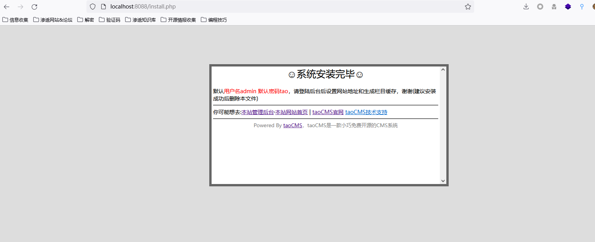
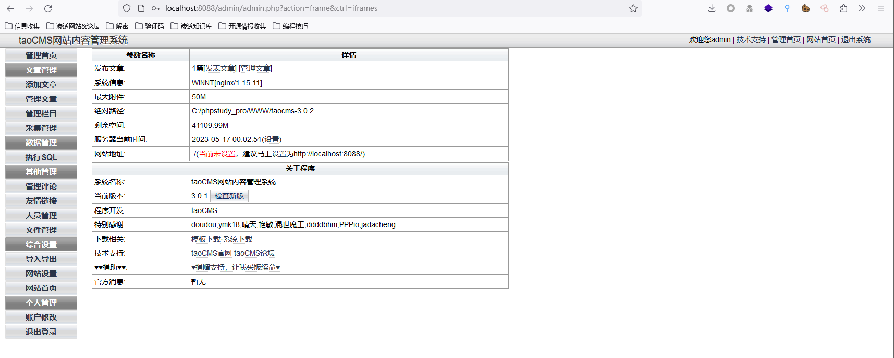
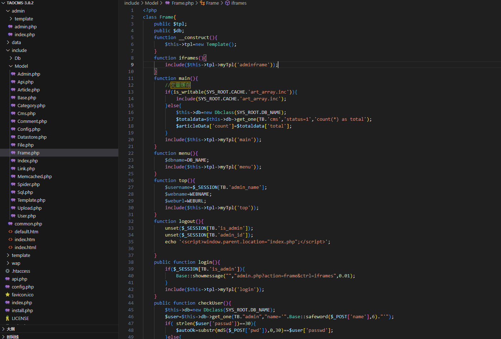
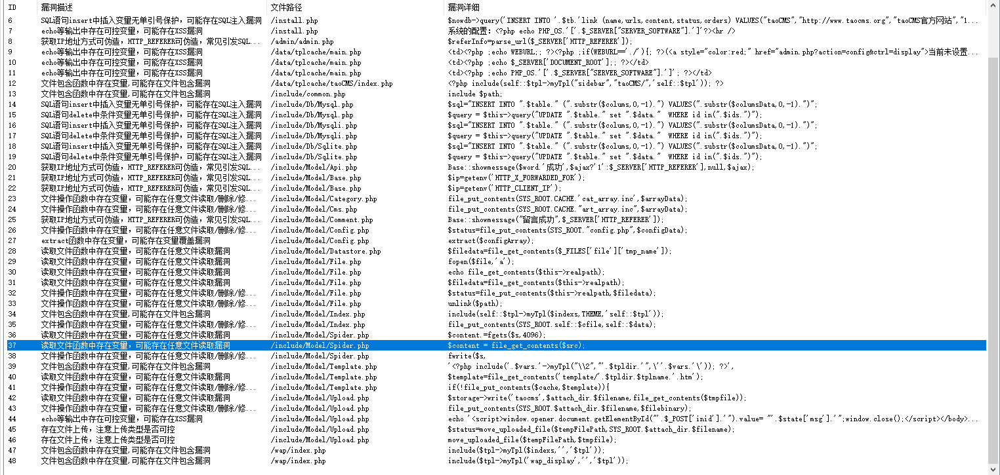
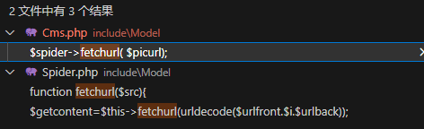
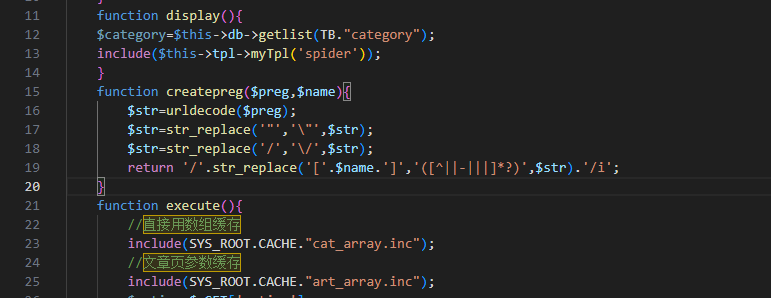
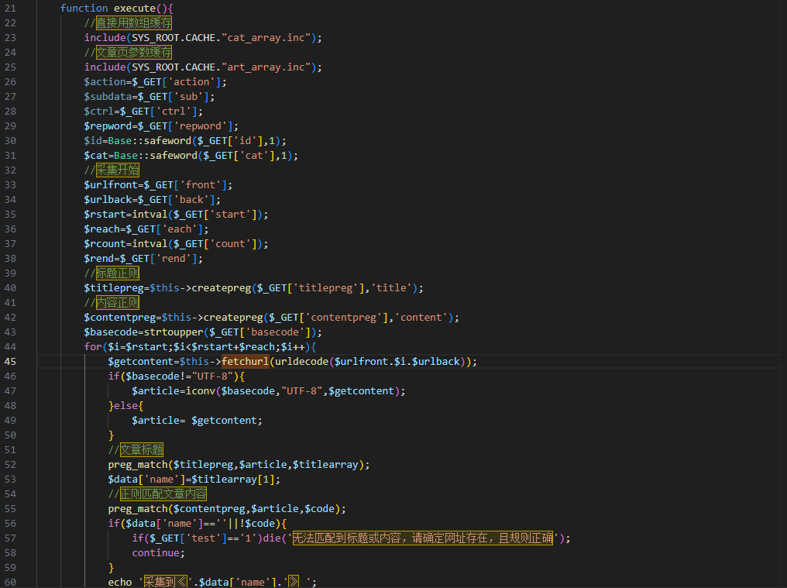
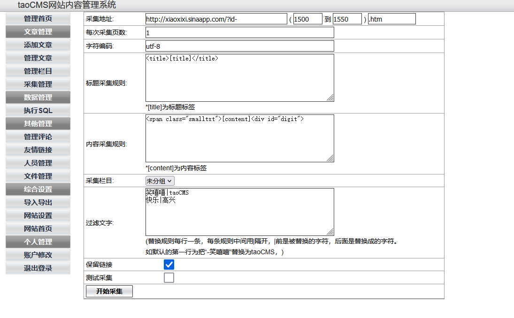
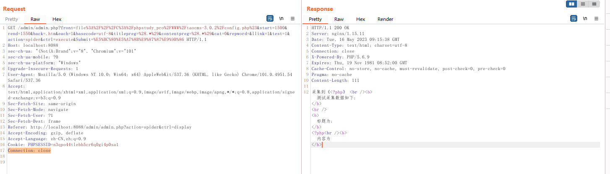

# 一、PHP中SSRF敏感函数
1. **file_get_contents()**。 该函数用于从指定的URL获取文件内容，可以用于HTTP或FTP访问，如果用户可以控制URL参数，则存在SSRF漏洞。 
	- 语法
	```PHP
	string file_get_contents(string $filename, bool $use_include_path = false, resource $context = null, int $offset = 0, int $maxlen = null)
	```
	- 其中， `$filename` 参数表示要读取的文件名或URL地址， `$use_include_path` 参数表示是否在include路径中搜索文件，默认为 `false` ， `$context` 参数表示上下文选项， `$offset` 参数表示开始读取的文件偏移量， `$maxlen` 参数表示读取的最大长度。 `file_get_contents()` 函数的返回值是文件内容的字符串。
	- 示例
	```PHP
	$content = file_get_contents('path/to/file.txt');
	```
2. **fsockopen()**。 该函数用于打开一个Socket连接，可以用于HTTP或SMTP访问等，如果用户可以控制URL参数，则存在SSRF漏洞。 
	- 语法
	```PHP
	resource fsockopen(string $hostname, int $port = -1, int &$errno = null, string &$errstr = null, float $timeout = null)
	```
	- 其中， `$hostname` 参数表示远程服务器的主机名或IP地址， `$port` 参数表示端口号，默认-1表示使用协议默认端口， `$errno` 和 `$errstr` 参数分别表示错误代码和错误信息， `$timeout` 参数表示连接超时时间。 `fsockopen()` 函数的返回值是socket连接的资源句柄。 该函数常用于与SMTP、POP3、IMAP等邮件服务器和FTP服务器进行通信，以及其他需要Socket连接的场景。
	- 示例，使用 `fsockopen()` 函数连接一个SMTP服务器，发送一封邮件可以使用以下代码：
	```PHP
	$smtp_server = 'smtp.example.com';
	$smtp_port = 25;
	$timeout = 30;
	if ($fp = fsockopen($smtp_server, $smtp_port, $errno, $errstr, $timeout)) {
	    // 连接成功
	    // 发送邮件内容
	    fwrite($fp, "EHLO example.com\r\n");
	    fwrite($fp, "MAIL FROM: <sender@example.com>\r\n");
	    fwrite($fp, "RCPT TO: <recipient@example.com>\r\n");
	    fwrite($fp, "DATA\r\n");
	    fwrite($fp, "Subject: Test\r\n\r\n");
	    fwrite($fp, "This is a test email.\r\n");
	    fwrite($fp, ".\r\n");
	    fwrite($fp, "QUIT\r\n");
	    // 关闭连接
	    fclose($fp);
	} else {
	    // 连接失败
	    echo "Error: {$errno} - {$errstr}";
	}
	```
	- 需要注意的是， `fsockopen()` 函数可能会被防火墙或安全软件阻止，需要在服务器上开放对应的端口或放行相关的权限。此外，还应该考虑网络连接的稳定性和错误处理的逻辑，及时关闭socket连接并释放资源。
3. **curl_exec()**。 该函数用于执行一个CURL会话，可以用于HTTP、FTP或SMTP等访问，如果用户可以控制URL参数，则存在SSRF漏洞。 CURL是一种在Web开发中常用的用于获取远程数据的工具，支持多种协议，例如HTTP、FTP、SMTP等。 `curl_exec()` 函数用于向指定的URL地址发送HTTP请求，并返回服务器响应的内容。
	- 语法
	```PHP
	mixed curl_exec ( resource $ch )
	```
	- 其中， `$ch` 参数是一个CURL句柄，用于执行CURL会话。CURL操作包括设置请求头信息、设置请求方式、设置请求参数等，可以通过在调用 `curl_exec()` 函数之前设置相应的参数来完成。 返回值： 如果成功执行，该函数返回服务器的响应结果字符串，否则返回false。
	- 示例
	```PHP
	$ch = curl_init();
	 // 设置请求的URL地址
	curl_setopt($ch, CURLOPT_URL, 'https://example.com');
	 // 设置请求的User-Agent参数
	curl_setopt($ch, CURLOPT_USERAGENT, 'Mozilla/5.0 (Windows NT 10.0; Win64; x64) AppleWebKit/537.36 (KHTML, like Gecko) Chrome/58.0.3029.110 Safari/537.36');
	 // 执行CURL会话
	$result = curl_exec($ch);
	 // 检查是否有错误
	if(curl_errno($ch)) {
	    echo 'Curl error: ' . curl_error($ch);
	} else {
	    // 处理返回结果
	    echo $result;
	}
	 // 关闭CURL句柄
	curl_close($ch);
	```
	- 需要注意的是， `curl_exec()` 函数需要在开启了CURL扩展的情况下才能使用。在执行CURL操作时，建议使用 `curl_setopt()` 函数来设置请求参数，以确保请求能够成功发送并获得正确的服务器响应。同时，还需要对返回结果进行适当的处理和验证，以确保数据的完整性和正确性。
4. **socket_bind()**。该函数用于绑定一个Socket地址，如果用户可以控制绑定的IP地址或端口，则存在SSRF漏洞。一般来说，在使用 Socket 进行网络编程时，我们需要首先绑定一个 IP 地址和端口号，以便于其他连接方可以通过这个地址和端口号来访问我们的服务器。
	- 语法
	```PHP
	bool socket_bind ( resource $socket , string $address [, int $port = 0 ] )
	```
	- 参数说明
	```PHP
	- $socket : 必需。socket_create() 返回的套接字资源； 
	- $address : 必需。IP 地址，形如 "xxx.xxx.xxx.xxx"，IPv4 地址或者IPv6地址，如果使用域名绑定，则需要使用 gethostbyname() 函数获取对应的 IP 地址； 
	- $port : 可选。端口号，默认值为 0。 
	- 返回值： 如果绑定成功，返回 true； 如果绑定失败，返回 false。
	```
	- 示例
	```PHP
	$host = "127.0.0.1"; //绑定的IP地址
	$port = 8888; //绑定的端口号
	 //创建一个TCP Socket
	$socket = socket_create(AF_INET, SOCK_STREAM, SOL_TCP);
	 //绑定Socket到指定地址和端口
	if (!socket_bind($socket, $host, $port)) {
	    echo "Error: " . socket_strerror(socket_last_error()) . "\n";
	    exit;
	}
	echo "Socket is bound to $host:$port \n";
	 //其它操作...
	```
	 - 需要注意的是：在绑定 Socket 地址时，需要根据协议类型（AF_INET 或 AF_INET6）指定相应的地址类型，否则可能会出现 Socket 绑定失败的问题；在绑定端口时，如果指定了远程主机的 IP 地址，那么在绑定端口时也应该考虑防火墙等因素及时封锁端口。
5. **curl_init()**。初始化一个 cURL 对象，用于发送 HTTP 请求。
	- 语法
	```PHP
	curl_init([string $url = NULL])
	```
	- 参数说明
	```PHP
	- $url ：可选。需要访问的URL地址。 
	- 返回值： 返回一个初始化后的cURL对象，如果初始化失败，则返回FALSE。
	```
	- 示例
	```PHP
	$ch=curl_init("http://www.example.com/test.php");
	curl_setopt($ch,CURLOPT_RETURNTRANSFER,true);
	$result=curl_exec($ch);
	curl_close($ch);
	```
	- 注意事项： 
		 - 在发送HTTP请求前，必须通过 `curl_init()` 函数初始化一个cURL对象。 
		 - 可以通过 `curl_setopt()` 函数设置cURL会话的一些参数，如URL地址、请求头、请求方式、超时时间、代理等。 
		 - 通过 `curl_exec()` 函数执行cURL会话，发送HTTP请求并返回响应内容。 
		 - 执行完cURL会话后，应该通过 `curl_close()` 函数关闭cURL会话，释放资源。 
		 - 如果需要同时发送多个HTTP请求，则应该为每个请求创建一个独立的cURL对象并执行相应的操作。
6. **curl_setopt()**。设置 cURL 传输选项，如 URL、请求头、请求方式、认证信息等。
	- 语法
	```PHP
	curl_setopt($ch, $option, $value);
	```
	- 参数说明
	```PHP
	- $ch ：必需。cURL会话句柄，即通过 curl_init() 函数初始化后返回的对象。 
	- $option ：必需。需要设置的选项。 
	- $value ：必需。选项需要设置的值。 
	- 返回值：如果设置选项成功，则返回 `TRUE` ，否则返回 `FALSE` 。
	```
	- 示例
	```PHP
	$ch = curl_init("http://www.example.com/test.php");
	//设置请求方式为POST
	curl_setopt($ch, CURLOPT_POST, true);
	//设置POST请求参数
	curl_setopt($ch, CURLOPT_POSTFIELDS, array('username'=>'tom','password'=>'123456'));
	//设置响应结果以字符串形式返回
	curl_setopt($ch, CURLOPT_RETURNTRANSFER, true);
	//执行HTTP请求
	$result = curl_exec($ch);
	//关闭cURL会话
	curl_close($ch);
	```
	- 注意事项：
		- 在使用 `curl_setopt()` 函数设置选项时，必须在 `curl_init()` 函数执行后、 `curl_exec()` 函数执行前设置。 
		- 可以设置的选项较多，包括请求方式、请求头、代理、超时时间、Cookies等。
7. **curl_exec()**。执行 cURL 会话，发送 HTTP 请求并返回响应内容。
	- 语法
	```PHP
	curl_exec($ch);
	```
	- 参数说明
	```PHP
	- $ch ：必需。cURL会话句柄，即通过 curl_init() 函数初始化后返回的对象。 
	- 返回值： 返回执行结果，如果出现错误返回 `FALSE` 。
	```
	- 示例
	```PHP
	$ch = curl_init("http://www.example.com/test.php");
	//设置请求方式为POST
	curl_setopt($ch, CURLOPT_POST, true);
	//设置POST请求参数
	curl_setopt($ch, CURLOPT_POSTFIELDS, array('username'=>'tom','password'=>'123456'));
	//设置响应结果以字符串形式返回
	curl_setopt($ch, CURLOPT_RETURNTRANSFER, true);
	//执行HTTP请求
	$result = curl_exec($ch);
	//关闭cURL会话
	curl_close($ch);
	//输出结果
	echo $result;
	```
	- 注意事项：
		- 在使用 `curl_exec()` 函数执行HTTP请求时，必须先使用 `curl_setopt()` 函数设置请求选项，否则会出现错误。 
		- `curl_exec()` 函数返回的是HTTP响应结果，响应结果的格式包括HTML、XML、JSON等格式，需要根据具体情况进行处理。
8. **curl_close()**。关闭 cURL 会话，释放资源。
	- 语法
	```PHP
	curl_close($ch);
	```
	- 参数说明
	```PHP
	- $ch ：必需。cURL会话句柄，即通过 curl_init()函数初始化后返回的对象。 
	- 返回值： 该函数没有返回值。
	```
	- 示例
	```PHP
	$ch = curl_init("http://www.example.com/test.php");
	//设置请求方式为POST
	curl_setopt($ch, CURLOPT_POST, true);
	//设置POST请求参数
	curl_setopt($ch, CURLOPT_POSTFIELDS, array('username'=>'tom','password'=>'123456'));
	//设置响应结果以字符串形式返回
	curl_setopt($ch, CURLOPT_RETURNTRANSFER, true);
	//执行HTTP请求
	$result = curl_exec($ch);
	//关闭cURL会话
	curl_close($ch);
	//输出结果
	echo $result;
	```
	- 注意事项： 在使用 `curl_close()` 函数关闭cURL会话句柄之前，必须先通过 `curl_exec()` 函数执行完HTTP请求并获取响应结果。
9. **fopen()** 和 **fread()**。打开并读取文件或 URL 内容，具体使用方式与读取本地文件相同。具体参考[5x02代码审计——PHP审计之文件包含、删除、下载、读取、写入](5x02代码审计——PHP审计之文件包含、删除、下载、读取、写入.md)
10. **stream_context_create()**。创建并返回一个新的上下文流，用于网络请求。 
	- 语法
	```PHP
	stream_context_create([options,[params]]);
	```
	- 参数说明
	```PHP
	- options ：可选。一个关联数组，用于设置上下文选项。 
	- params ：可选。一个关联数组，用于设置上下文参数。 
	- 返回值： 返回一个新的流上下文资源对象，如果创建失败返回FALSE。
	```
	- 示例
	```PHP
	$params = array(
	    'http' => array(
	        'method' => 'POST',
	        'header' => 'Content-type: application/x-www-form-urlencoded',
	        'content' => http_build_query(array('username'=>'tom','password'=>'123456')),
	        'timeout' => 10,
	    ),
	);
	//创建流上下文对象
	$context = stream_context_create($params);
	//发送HTTP请求
	$result = file_get_contents('http://www.example.com/test.php', false, $context);
	echo $result;
	```
	- 注意事项： 
		- `stream_context_create()` 函数可以设置HTTP请求头、代理、超时时间等参数，可以根据具体需求设置参数。 
		- 可以通过 `file_get_contents()` 等函数将请求结果读取到变量中。
11. **stream_context_get_params()**。设置上下文流的参数。 
	- 语法
	```PHP
	stream_context_get_params(stream_context);
	```
	- 参数说明
	```PHP
	- stream_context ：必需。流上下文资源对象。 
	- 返回值： 返回包含各种流上下文参数的数组，如果获取失败返回FALSE。
	```
	- 示例
	```PHP
	$opts = array(
	    'http'=>array(
	        'method'=>"GET",
	        'timeout'=>3,
	        'user_agent'=>"Mozilla/5.0 (Windows NT 6.1; Win64; x64) AppleWebKit/537.36 (KHTML, like Gecko) Chrome/58.0.3029.110 Safari/537.3"
	    )
	);
	$context = stream_context_create($opts);
	//获取流上下文参数
	var_dump(stream_context_get_params($context));
	```
12. **stream_socket_client()**。打开一个套接字连接，与 fsockopen() 相似。
	- 语法
	```PHP
	resource stream_socket_client ( string $remote_socket [, int &$errno = 0 [, string &$errstr = '' [, float $timeout = ini_get("default_socket_timeout") [, int $flags = STREAM_CLIENT_CONNECT [, resource $context = NULL ]]]]] )
	```
	- 参数说明
	```PHP
	- $remote_socket ：必需。要连接的Socket地址，格式为 transport:\/\/target ，其中 transport 可以是 tcp 、 udp 、 unix 等， target 可以是IP地址和端口号、域名和端口号、Unix socket文件路径等。 
	- $errno ：可选。引用类型，用于接收错误码。 
	- $errstr ：可选。引用类型，用于接收错误信息。 
	- $timeout ：可选。连接超时时间，单位为秒，默认为 default_socket_timeout 设置的值。 
	- $flags ：可选。连接标志，常用的有 STREAM_CLIENT_CONNECT 、 STREAM_CLIENT_ASYNC_CONNECT 、 STREAM_CLIENT_PERSISTENT 等。 
	- $context ：可选。流上下文资源对象。 
	- 返回值：成功时返回一个打开的套接字资源对象，失败时返回FALSE。
	```
	- 示例
	```PHP
	$client = stream_socket_client("tcp://www.example.com:80", $errno, $errstr, 30);
	if (!$client) {
	    echo "连接失败：" . $errno . " - " . $errstr . PHP_EOL;
	} else {
	    //发送HTTP请求
	    fwrite($client, "GET / HTTP/1.0\r\nHost: www.example.com\r\n\r\n");
	    //读取服务器响应
	    echo stream_get_contents($client);
	    //关闭套接字
	    fclose($client);
	}
	```
	- 注意事项
	```PHP
	- $remote_socket 参数需要根据具体情况设置，可以是IP地址和端口号、域名和端口号、Unix socket文件路径等。 
	- $timeout 参数可以设置为0或负数，表示不限制超时时间。 
	- $flags 参数常用的有 STREAM_CLIENT_CONNECT ，表示使用TCP协议进行连接，可以与 STREAM_CLIENT_ASYNC_CONNECT 和 STREAM_CLIENT_PERSISTENT 组合使用。 
	- 如果需要设置流上下文参数，可以使用 stream_context_create() 函数创建流上下文资源对象，并将其作为 $context 参数传递给 stream_socket_client() 函数。
	```
# 二、SSRF代码审计案例——TaoCMS 3.0.2
## （一）环境配置
1. 工具及环境如下
	- PHP 5.6
	- MySQL
	- phpstudy
	- vscode
	- seay源码审计系统
2. 使用phpstudy搭建网站后后访问网站URL会自动跳转到安装目录，按提示配置好数据库跳转到如下界面
	
2. 使用默认口令admin/tao进入管理后台，发现后台URL路由如下，可知该CMS是MVC设计模式的
	```
	http://localhost:8088/admin/admin.php?action=frame&ctrl=iframes
	```
	
3. 查看网站目录如下，可知网站功能点的文件所在目录为include/Model，进行审计时只需重点关注该目录下的文件即可
	
## （二）SSRF漏洞审计
1. 先使用seay源码审计系统扫描一遍源码，查看扫描报告，发现报告的第37个漏洞/include/Model/Spider.php文件，存在敏感函数file_get_contents()，函数中传入了变量src，从变量名来看应该是个URL的变量
	
2. 转到该函数查看源码，源码如下，发现fetchurl()函数传入了一个URL链接，然后将URL链接传入了parse_url()函数进行解析，接着对URL链接进行数组化操作后传入了fsockopen()函数，通过fsockopen()函数与URL链接地址进行socks连接并返回连接结果，中间没有看到对URL链接存在过滤，那么这里的URL链接就可以被用户所控制，从而导致SSRF漏洞
	```PHP
	function fetchurl($src){
		$content='';
		if(RUNONSAE){
			$scurl = new SaeFetchurl();
			$content = $scurl->fetch($src);
		}elseif (function_exists('curl_init')){
			$ch = curl_init(); 
			curl_setopt($ch,CURLOPT_URL,$src); 
			curl_setopt($ch,CURLOPT_HEADER,0); 
			curl_setopt($ch,CURLOPT_RETURNTRANSFER,1); 
			$content = curl_exec($ch);
			curl_close($ch);
		}elseif((boolean)ini_get('allow_url_fopen')){
			$content = file_get_contents($src);
		}else{
			$src=parse_url($src);
			$host=$src['host'];
			$path=$src['path'];
			$line='';
			if (($s = @fsockopen($host,80,$errno,$errstr,5))===false)
			{
				return false;
			}
			fwrite($s,
				'GET '.$path." HTTP/1.0\r\n"
				.'Host: '.$host."\r\n"
				."User-Agent: Mozilla/5.0 (Windows NT 6.1; Win64; x64; rv:2.0b13pre) Gecko/20110307 Firefox/4.0b13pre\r\n"
				."Accept: text/xml,application/xml,application/xhtml+xml,text/html,text/plain,image/png,image/jpeg,image/gif,*/*\r\n"
				."\r\n"
			);
			while (!feof($s))
			{
				$content.=fgets($s,4096);
			}
			fclose($s);
		}
		if ($content)
		{
			return $content;
		}
	}
	```
3. 查看该函数的调用情况，发现该漏洞函数存在三处引用，其中第二处为函数定义部分，另外还被/include/Model/Cms.php和/include/Model/Spider.php两个文件调用了
	
4. 先查看/include/Model/Cms.php的第一处调用，源码如下，从函数和代码来看应该是一处图片上传的保存功能，函数中对图片的URL进行了过滤，且只抓取非本站的URL，那么这里无法利用
	```PHP
	function saveremotepic( $content )
	{
		preg_match_all("/]+>/isU", $content,$matches);
		$spider=new Spider(null, null);
		foreach( $matches[2] as $picurl ){
			$fileinfo=pathinfo($picurl);
			$extension=$fileinfo['extension'];
			//不是图片跳过
			if( !in_array( $extension , array('png','jpg','gif','jpeg'))){
				continue;
			}
			//http打头，且域名与当前网站不一样，则抓取
			if( strpos($fileinfo['dirname'] ,'http')!==false && $fileinfo['dirname'] != substr(WEBURL,0,-1)){
				$picsrc=$spider->fetchurl( $picurl);
				
				$attach_dir='pictures/month_'.date('ym').'/';
				$filename=date("YmdHis").rand(1000,9999).'.'.$extension;
				$upload=new Upload(null);
				$upfile=$upload->saveFile($picurl, $filename, $attach_dir,WEBURL,$picsrc);
	
				$content=str_replace($picurl, $upfile['msg'], $content );
			}
	
		}
		
		return $content;
	}
	```
5. 查看/include/Model/Spider.php的第二处调用，如下，发现是一处文章采集的功能点，通过GET请求的方式传入参数，函数中调用了createpreg()函数进行正则的自定义，然后对采集文章的标题、内容进行匹配是否符合自定义的正则，但也没有对URL进行过滤，基本上可以确定这个功能点存在SSRF漏洞了
	
	
6. 到网站后台查看一下该功能点，如下，发现采集的正则是可以自定义进行修改的，那么直接将正则修改为`(.*)`就好，这样就可以避免正则的影响了
	
7. 抓包测试，尝试读取网站根目录下的config.php文件，如下
	