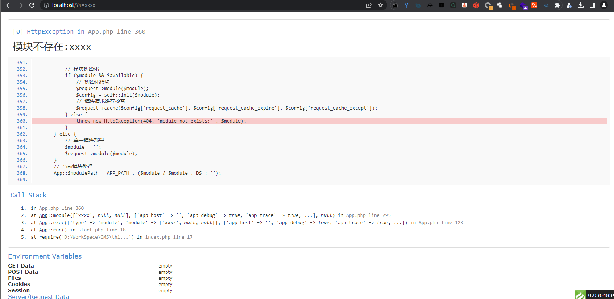

# 一、ThinkPHP概述
1. ThinPHP是一个轻量级的PHP框架，旨在提供快速开发Web应用程序的工具和资源。它采用了MVC（Model-View-Controller）架构，使开发人员可以更好地组织和管理代码。ThinPHP还提供了许多有用的功能，如路由、数据库抽象层、模板引擎等，使开发人员可以更快地构建Web应用程序。相比其他PHP框架，ThinPHP的优点在于它的轻量级和易用性。它的代码库非常小，因此可以快速下载和安装。它支持多种数据库（MySQL、PostgreSQL、SQLite等），同时还支持多种模板引擎（Smarty、Twig等）。此外，它还具有强大的缓存机制和安全性，提供了一些内置的安全功能，如防止SQL注入、XSS攻击、CSRF攻击等。
2. MVC是一种常见的软件设计模式，用于将应用程序分为三个主要组件：模型、视图和控制器。在ThinkPHP中，MVC是框架的核心，它使开发人员可以更好地组织和管理代码。 
	- 模型是应用程序的数据层，用于处理与数据库交互的所有操作。在ThinkPHP中，模型通常是一个继承自think\Model类的PHP类。模型类包含与数据库表对应的属性和方法，例如find、save和delete等方法。 
	- 视图是应用程序的表示层，用于呈现数据和用户界面。在ThinkPHP中，视图通常是一个包含HTML和PHP代码的模板文件。模板文件可以使用模板引擎来动态生成HTML代码，例如ThinkPHP的内置模板引擎Think\Template。 
	- 控制器是应用程序的业务逻辑层，用于处理用户请求并返回响应。在ThinkPHP中，控制器通常是一个继承自think\Controller类的PHP类。控制器类包含与用户请求对应的方法，例如index、login和register等方法。当用户发出请求时，控制器将根据请求的URL调用相应的方法，并将结果返回给用户。控制器还可以使用模型来访问数据库，并使用视图来呈现数据和用户界面。
3. 在MVC模式下，Web程序的功能通常在控制器部分实现。控制器是应用程序的业务逻辑层，用于处理用户请求并返回响应。它们是MVC架构的一部分，用于将应用程序的业务逻辑与其表示层分离。控制器通常包含与用户请求对应的方法，例如index、login和register等方法。当用户发出请求时，控制器将根据请求的URL调用相应的方法，并将结果返回给用户。控制器还可以使用模型来访问数据库，并使用视图来呈现数据和用户界面。因此，控制器是Web程序中实现功能的关键部分。这也说明，MVC模式的应用程序，其漏洞也通常在控制器下产生
# 二、ThinkPHP的目录结构与入口文件
1. 初始目录结果如下
~~~
www  WEB部署目录（或者子目录）
	├─application           应用目录
	│  ├─common             公共模块目录（可以更改）
	│  ├─module_name        模块目录
	│  │  ├─config.php      模块配置文件
	│  │  ├─common.php      模块函数文件
	│  │  ├─controller      控制器目录
	│  │  ├─model           模型目录
	│  │  ├─view            视图目录
	│  │  └─ ...            更多类库目录
	│  │
	│  ├─command.php        命令行工具配置文件
	│  ├─common.php         公共函数文件
	│  ├─config.php         公共配置文件
	│  ├─route.php          路由配置文件
	│  ├─tags.php           应用行为扩展定义文件
	│  └─database.php       数据库配置文件
	│
	├─public                WEB目录（对外访问目录）
	│  ├─index.php          入口文件
	│  ├─router.php         快速测试文件
	│  └─.htaccess          用于apache的重写
	│
	├─thinkphp              框架系统目录
	│  ├─lang               语言文件目录
	│  ├─library            框架类库目录
	│  │  ├─think           Think类库包目录
	│  │  └─traits          系统Trait目录
	│  │
	│  ├─tpl                系统模板目录
	│  ├─base.php           基础定义文件
	│  ├─console.php        控制台入口文件
	│  ├─convention.php     框架惯例配置文件
	│  ├─helper.php         助手函数文件
	│  ├─phpunit.xml        phpunit配置文件
	│  └─start.php          框架入口文件
	│
	├─extend                扩展类库目录
	├─runtime               应用的运行时目录（可写，可定制）
	├─vendor                第三方类库目录（Composer依赖库）
	├─build.php             自动生成定义文件（参考）
	├─composer.json         composer 定义文件
	├─LICENSE.txt           授权说明文件
	├─README.md             README 文件
	├─think                 命令行入口文件
~~~

> router.php用于php自带webserver支持，可用于快速测试
> 切换到public目录后，启动命令：php -S localhost:8888  router.php
> 上面的目录结构和名称是可以改变的，这取决于你的入口文件和配置参数。
2. ThinkPHP的入口文件为public/index.php，实际部署网站的时候对外的访问目录为public，它负责处理所有进入应用程序的Web请求。每个请求都必须经过该文件进行路由和分发。 以下是该文件的基本结构：
	```PHP
	<?php
	define('APP_PATH', __DIR__ . '/../app/');
	//定义应用程序运行时目录路径
	define('RUNTIME_PATH', __DIR__ . '/../runtime/');
	//加载框架的入口文件
	require __DIR__ . '/../thinkphp/start.php';
	```
	- 第一行定义了应用程序根目录的路径。默认情况下，该路径设置为public目录的父目录，即应用程序的根目录。 
	- 第二行定义了应用程序运行时目录的路径。该目录用于存储框架生成的缓存文件和日志文件等运行时数据。 这一行代码有可能没有。
	- 第三行加载框架的入口文件。该文件包含了所有必要的类和函数，以及自动加载器和错误处理程序等功能。 
	- 在入口文件加载完成后，它会调用框架核心的启动程序think\App::run()方法。该方法负责初始化应用程序，并将请求传递给路由处理程序进行路由匹配和分发。路由和分发过程完成后，应用程序执行对应的控制器和动作方法，并输出结果。
# 三、ThinkPHP的调试模式
1. 在应用程序的配置文件config/app.php中，修改debug选项为true，修改app_trace选项为true：
	```PHP
	'debug' => true,
	'app_trace' => true,
	```
2. 然后当我们访问一个不存在或不正确的路由时，就会出现如下报错界面
	
# 四、ThinkPHP的URL访问模式
1. ThinkPHP在没有启用强制路由的情况下的典型访问URL为
	```shell
	http://serverName/index.php（或者其它应用入口文件）/模块/控制器/操作/[参数名/参数值...]
	```
2. 支持切换到命令行访问，如果切换到命令行模式下面的访问规则是
	```shell
	php.exe index.php(或者其它应用入口文件） 模块/控制器/操作/[参数名/参数值...]
	```
3. ThinkPHP5取消了URL模式的概念，普通的URL模式访问不再被支持，但参数可以通过普通URL模式传递
	```shell
	php.exe index.php(或者其它应用入口文件） 模块/控制器/操作?参数名=参数值&..
	http://serverName/index.php（或者其它应用入口文件）?s=/模块/控制器/操作/[参数名/参数值...]
	```
# 五、ThinkPHP的控制器
1. ThinkPHP的控制器是用于处理用户请求并返回响应的重要组成部分。它们是MVC架构的一部分，用于将应用程序的业务逻辑与其表示层分离。
	- ThinkPHP的控制器负责处理请求并将响应数据返回给客户端。控制器是一个类，它继承了框架的基础控制器类。每个控制器都映射到一个URL路由，并包含一组动作方法来处理不同的请求。当请求发送到特定路由时，相应的控制器和动作方法将被调用。 
	- 在控制器中，开发者可以定义其控制器逻辑并与模型或应用程序的其他组件交互。控制器可以访问请求参数、会话数据和其他应用程序资源。
	- ThinkPHP还提供了一种名为“约定优于配置”的特性，这意味着如果您遵循一定的控制器和动作方法的命名约定，框架将自动路由请求到正确的控制器和动作方法。
2. ThinkPHP默认的控制器为application/index/controller/index.php，我们可以在该文件中新建一个test方法
	```PHP
	public function test(){
        echo 'Hello, ThinkPHP!';
    }
	```
	- 访问该方法需要定位到该函数的路由，否则直接访问将会报错，正确的路由如下
	```PHP
	http://localhost/index.php/index/index/test
	```
	- 如下，成功访问application/index/controller/index.php中的test()方法
	
3. 要在ThinkPHP中创建一个控制器，只需要在application/index/controller目录下新建一个php文件，创建新的函数即可
	- 例如，新建一个hello.php文件，写入如下代码
	```PHP
	<?php
	namespace app\index\controller;
	
	class Hello
	{
	    public function index()
	    {
	        echo 'Hello, world!';
	    }
	
	    public function hello()
	    {
	        echo 'Hello, Web Security!';
	    }
	}
	```
	- 访问控制器路由
	```PHP
	http://localhost/index.php/index/hello/hello
	```
	- 如下，成功访问hello.php中的hello方法
	
4. 标准的ThinkPHP的URL访问格式
	```PHP
	http://domainName/index.php/模块/控制器/操作/[参数名/参数值...]
	```
# 六、ThinkPHP的路由
1. 路由是指在应用程序中定义URL和请求处理程序之间的映射关系。在ThinkPHP中，路由是由应用程序的路由表配置文件定义的。路由表指定了不同的URL模式以及在处理不同URL时应该调用哪个控制器和方法。 ThinkPHP支持多种路由风格，例如传统的PathInfo模式、兼容模式（支持PathInfo和查询字符串）、路由模式（支持正则表达式）等。这些路由风格可以通过应用程序配置文件进行设置。 通过路由，您可以将URL重定向到特定的控制器和动作方法。此外，您还可以使用路由变量来匹配特定的URL模式，并将URL参数传递到控制器中。 总之，路由在ThinkPHP中是非常重要的，因为它指定了应用程序的URL结构和请求处理方式。通过设置路由，您可以实现可读性更好的URL，并促进应用程序的可维护性和可扩展性。
2. 详细说明介绍ThinkPHP的路由
	- 首先，打开应用程序的路由配置文件config/route.php，添加以下内容：
		```PHP
		use think\Route;
		Route::get('user/:id', 'index/User/index');
		```
	- 在该例子中，我们创建了一条路由规则，该规则指定HTTP GET请求的URL必须由路由/user/:id匹配，并将匹配的请求转发到index控制器的User方法。 接下来，我们打开index控制器类的文件app\index\controller\User.php，添加以下代码：
		```PHP
		namespace app\index\controller;
		use think\Controller;
		
		class User extends Controller
		{
		    public function index($id)
		    {
		        echo 'User ID: '.$id;
		    }
		}
		```
	- 在该例子中，我们创建了名为User的控制器类，并在该类中创建了名为index的动作方法。该方法使用$id变量来接收通过路由传递的参数，并输出用户ID。
	- 最后，打开Web浏览器并输入http://localhost/index.php/user/123，应用程序将输出“User ID: 123”。
		
# 七、ThinkPHP的参数传入
1. 首先，在路由配置文件config/route.php中添加以下代码：
	```PHP
	use think\Route;
	Route::get('blog/:id', 'blog/read', ['ext' => 'html'], ['id' => '\d+']);
	```
2. 在该例子中，我们定义了一个路由规则，它允许HTTP GET请求匹配以“/blog/”开头，后跟数字参数的URL。规则将该请求传递到名为blog的控制器的名为read的动作方法。我们还指定了一个扩展名为“html”的参数，并使用正则表达式指定该参数必须是数字。 然后，我们在控制器文件app/controller/blog.php中添加以下代码：
	```PHP
	<?php
	namespace app\index\controller;
	use think\Controller;
	use think\Request;
	
	class Blog
	{
	    public function read($id)
	    {
	        $request = Request::instance();
	        echo 'Blog ID: ' . $id . '<br/>';
	        echo 'Extension: ' . $request->ext() . '<br/>';
	        echo 'URL: ' . $request->url() . '<br/>';
	    }
	}
	```
3. 在该例子中，我们创建了一个名为Blog的控制器类，并在该类中创建了一个名为read的动作方法，该方法使用$id变量接收从路由传递的参数，并输出该参数，以及请求的扩展名和URL。 最后，我们可以在Web浏览器中输入以下URL进行测试：http://example.com/blog/123.html，应用程序将匹配路由规则并调用Blog控制器的read方法。方法将输出以下内容：
	
# 八、ThinkPHP的框架执行流程
1. 首先，Web服务器（如Apache或Nginx）将请求发送到应用程序的入口文件public/index.php，它位于应用程序根目录下。 
	```PHP
	// [ 应用入口文件 ]
	// 定义应用目录
	define('APP_PATH', __DIR__ . '/../application/');
	// 加载框架引导文件
	require __DIR__ . '/../thinkphp/start.php';
	```
2. 入口文件初始化应用程序的核心实例化thinkphp/start.php，这将创建一个App对象并运行应用程序，最终输出响应内容。
	```PHP
	namespace think;

	// ThinkPHP 引导文件
	// 加载基础文件
	require __DIR__ . '/../thinkphp/base.php';
	//执行应用
	think\App::run()->send();
	```
3. 入口文件初始化应用程序的基础设置thinkphp/base.php，包括定义应用程序的常量和自动加载机制：
	- 环境常量
	- 载入Loader类
	- 注册自动加载
	- 注册错误和异常处理机制
	- 加载惯例配置文件
4. 应用程序在运行时，先通过路由系统解析URL路径和请求方法，找到对应的控制器和方法，控制器文件和方法文件分别位于应用程序的controller和model目录下
5. thinkphp/library/think/App.php执行控制器的方法，生成响应内容