# 一、环境配置
1. 使用工具
	- 集成环境工具——phpstudy
	- 代码审计及动态调试——vscode
	- 静态扫描——seay源码审计系统
2. 使用测试源码——基于ThinkPHP开发的DSCMS v3.0
3. 语言环境
	- php 7.2及以上，否则会报错
	- mysql
# 二、phpstudy配置xdebug
1. 先在phpstudy——>软件管理——>php中，安装好php7.2，然后点击设置，选择扩展设置，开启xdebug，监听端口修改为9001，默认为9000，可能会和php有冲突，因此建议修改一下，勾选Profiler输出、Trace输出
	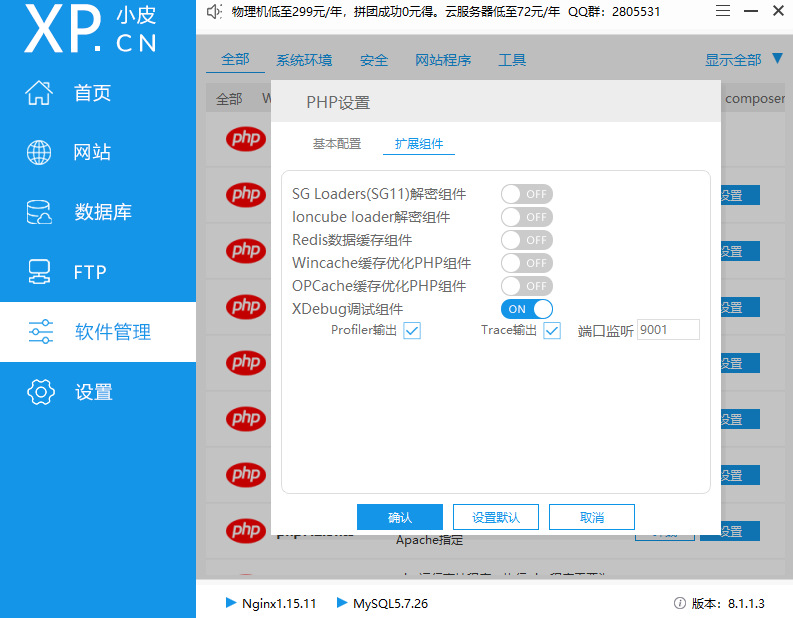
2. 到php 7.2的目录下，修改php.ini中的xdebug设置，phpstudy安装的php目录在phpstudy安装目录的Extensions/php下，修改xdebug.remote_enable=Off为On，修改xdebug.remote_port=9000为9001，与phpstudy中保持一致，添加xdebug.remote_autostart = 1
	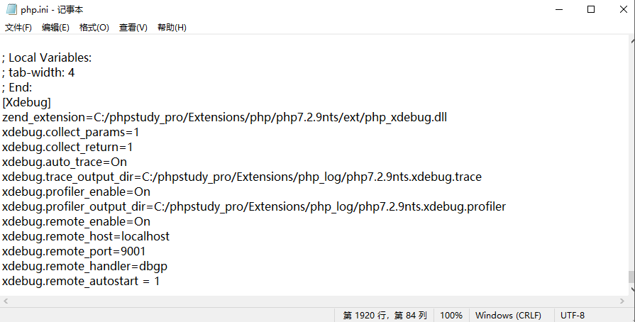
# 三、vscode配置php与xdebug
1. 到vscode中，安装插件PHP Debug、PHP Intelephense、PHP Extension Pack、PHP IntelliSense
	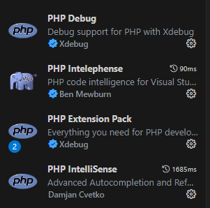
2. vscode中配置php环境，在设置中搜索php，找到PHP › Validate: Executable Path，打开setting.json
	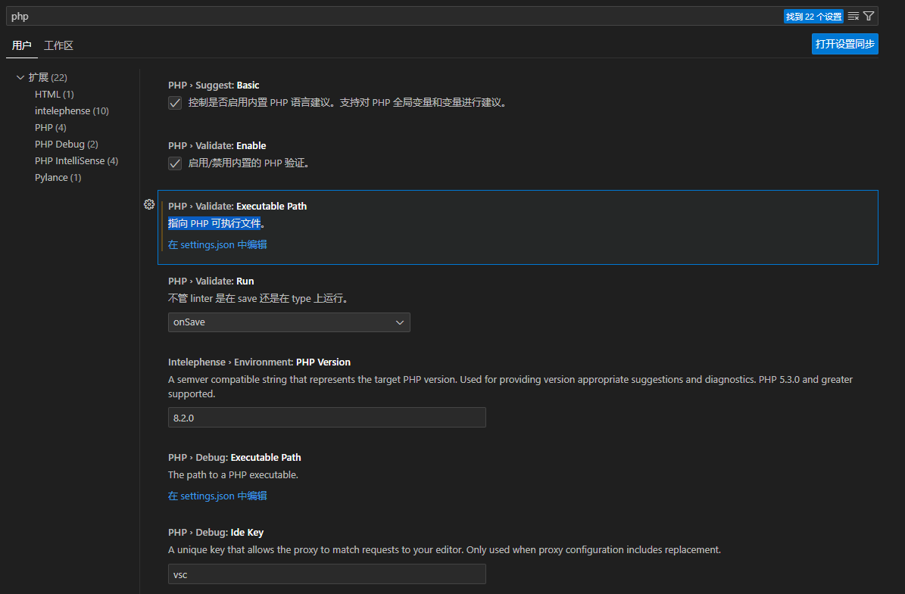
3. 将php 7.2的php.exe路径添加到setting.json中
	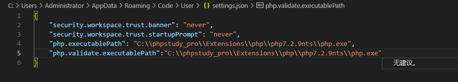
4. 点击vscode左侧栏的爬虫状选项，进入调试栏
	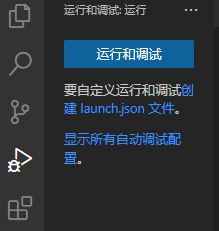
5. 点击创建launch.json，在选择调试配置中选择php
	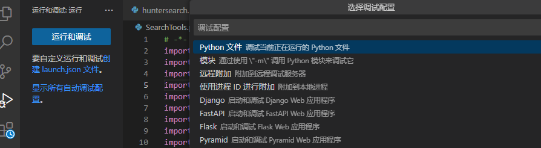
6. 在 launch.json中修改监听端口为9001，与phpstudy和php.ini中保持一致，如下，左侧的运行和调试中选择Listen for Xdebug
	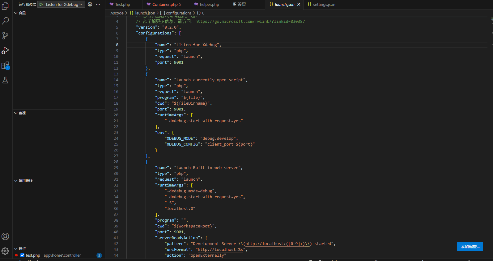
7. php调试环境配置完成，测试是否可以监听调试，打开dscms源码app/home/controller/，创建一个新文件Test.php，添加如下代码，然后在public function index()这一行断点，然后按F5刷新即进入调试监听界面
	```PHP
	<?php
	namespace app\home\controller;
	use app\BaseController;
	
	class Test extends BaseController{
	    public function index(){
	        echo  'Class: ' . __CLASS__ . '<br/>';
	        echo 'Function: ' . __FUNCTION__ . '<br/>';
	    }
	}
	```
	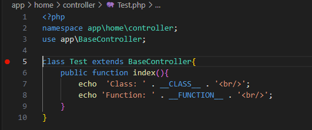
8. 浏览器访问搭建好的网站，我这里是localhost:8088，会跳转到localhost:8088/install/install.php，先完成安装
	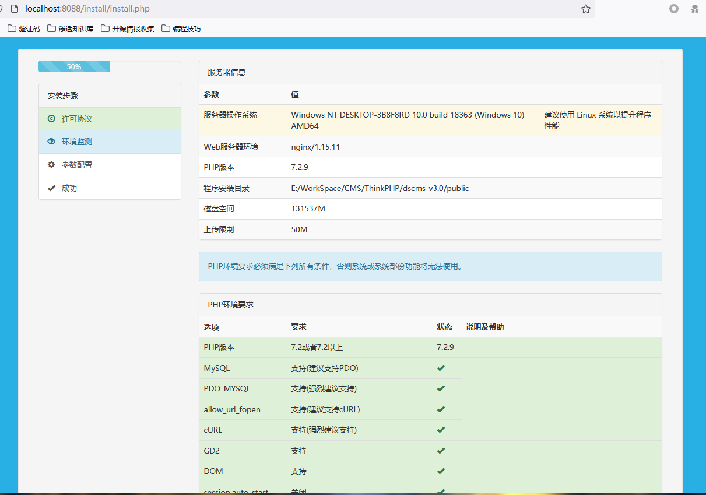
9. 完成安装后访问localhost:8088/index.php/home/test/index，vscode中成功监听到数据，然后就可以单步调试了，至此，phpstudy + vscode + xdebug的php动态调试配置完成
	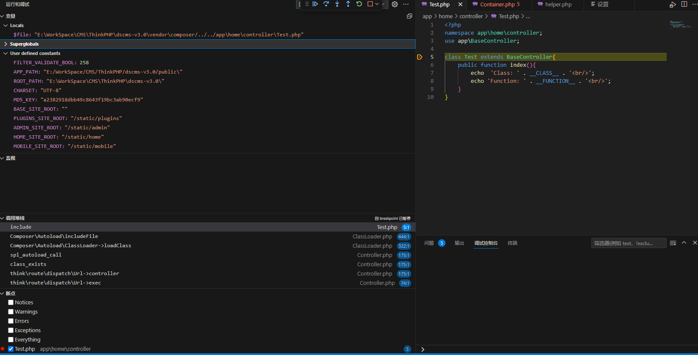