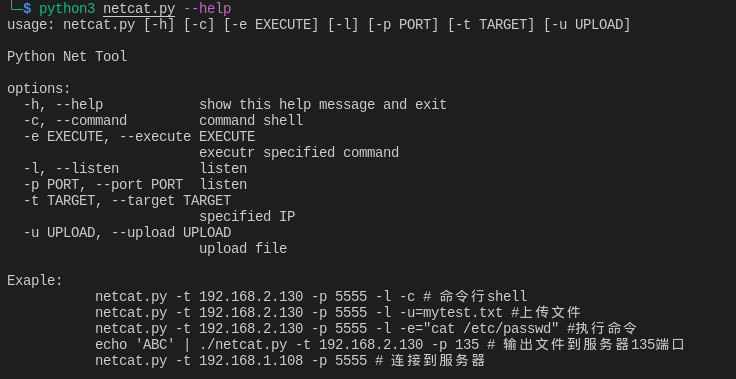
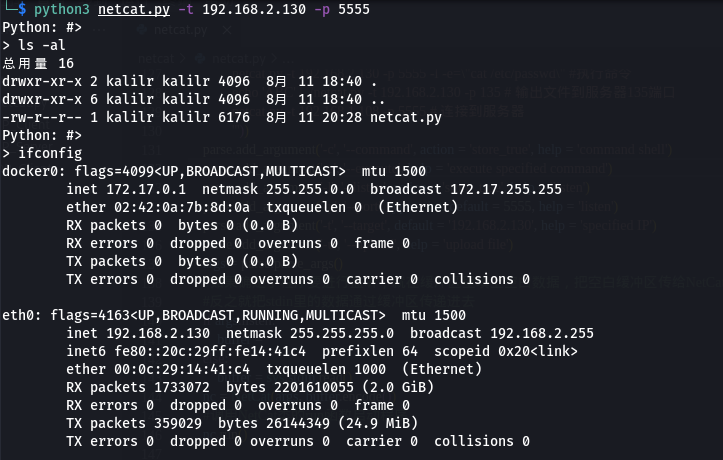

# 脚本工具——netcat工具

1. 导入Python库并创建execute函数，该函数会接受一条命令并执行

   ```python
   # -*- coding: utf-8 -*-
   import argparse
   import socket
   import shlex
   import subprocess
   import sys
   import textwrap
   import threading
   
   #导入Python库并创建execute函数，该函数会接受一条命令并执行
   def execute(cmd):
       cmd = cmd.strip()
       if not cmd:
           return
       output = subprocess.check_output(shlex.split(cmd), stderr=subprocess.STDOUT)
       return output.decode()

2. 创建main代码块，用于解析命令行参数并调用其他函数

   ``` python
   if __name__ == '__main__':
       #使用标准库中的argparse创建一个带命令行界面的程序，传递不同的参数执行不同的操作
       #编写帮助信息
       parse = argparse.ArgumentParser(
           description = 'Python Net Tool',
           formatter_class = argparse.RawDescriptionHelpFormatter,
           epilog = textwrap.dedent(''' Exaple:
               netcat.py -t 192.168.2.130 -p 5555 -l -c # 命令行shell
               netcat.py -t 192.168.2.130 -p 5555 -l -u=mytest.txt #上传文件
               netcat.py -t 192.168.2.130 -p 5555 -l -e=\"cat /etc/passwd\" #执行命令
               echo 'ABC' | ./netcat.py -t 192.168.2.130 -p 135 # 输出文件到服务器135端口
               netcat.py -t 192.168.1.108 -p 5555 # 连接到服务器
               '''))
       parse.add_argument('-c', '--command', action = 'store_true', help = 'command shell')
       parse.add_argument('-e', '--execute', help = 'execute specified command')
       parse.add_argument('-l', '--listen', action = 'store_true', help = 'listen')
       parse.add_argument('-p', '--port', type = int, default = 5555, help = 'listen')
       parse.add_argument('-t', '--target', default = '192.168.2.130', help = 'specified IP')
       parse.add_argument('-u', '--upload', help = 'upload file')
       args = parse.parse_args()
       #如果确定了程序要进行监听，就在缓冲区里填上空白数据，把空白缓冲区传给NetCat对象
       #反之就把stdin里的数据通过缓冲区传递进去
       if args.listen:
           buffer = ''
       else:
           buffer = sys.stdin.read()
       nc = NetCat(args, buffer.encode())
       #调用NetCat类的run函数启动程序
       nc.run()
   ```

3. 客户端代码，创建NetCat类，编写run函数、send函数、listen函数

   ``` python
   #客户端
   class NetCat:
       #用main代码块传递的命令行参数和缓冲区数据初始化一个NetCat对象
       def __init__(self, args, buffer = None):
           self.args = args
           self.buffer = buffer
           #创建一个socket对象
           self.socket = socket.socket(socket.AF_INET, socket.SOCK_STREAM)
           self.socket.setsockopt(socket.SOL_SOCKET, socket.SO_REUSEADDR, 1)
       
       def run(self):
           #如果NetCat是接收方，执行listen函数，如果是发送方，执行send函数
           if self.args.listen:
               self.listen()
           else:
               self.send()
   
       def send(self):
           #先连接到target和port
           self.socket.connect((self.args.target, self.args.port))
           #如果缓冲区里面有数据就先把这些数据发过去
           if self.buffer:
               self.socket.send(self.buffer)
           #创建try/catch块，这样就能用ctrl+c组合键手动关闭连接
           try:
               #创建大循环不断接收target返回的数据
               while True:
                   recv_len = 1
                   response = ''
                   #创建小循环用于读取socket本轮返回的数据，如果读取完毕退出循环
                   while recv_len:
                       data = self.socket.recv(4096)
                       recv_len = len(data)
                       response += data.decode()
                       if recv_len < 4096:
                           break
                   #检查读取的内容输出到屏幕上，暂停，等待用户输入新内容，再把新内容发给target，开始下一轮循环
                   if response:
                       print(response)
                       buffer = input('> ')
                       buffer += '\n'
                       self.socket.send(buffer.encode())
               except KeyboardInterrupt:
                   print('User terminated.')
                   self.socket.close()
                   sys.exit()
                   
       def listen(self):
           #把socket对象绑定到target和port
           self.socket.bind((self.args.target, self.args.port))
           self.socket.listen(5)
           #用循环开始监听新连接，把已连接对象传递给handler函数
           while True:
               client_socket, _ = self.socket.accept()
               client_thread = threading.Thread(
                   target = self.handler, args = (client_socket,)
               )
               client_thread.start()
   ```

4. 功能实现

   ``` python
       #功能实现
       def handler(self, client_socket):
           #执行命令，把命令传递给execute函数，把结果通过socket发回去
           #上传文件，用循环接收socket传来的文件内容，再将接收到的数据写到指定的文件里
           #创建shell，通过循环向发送方发送一个提示符，等待发回命令
           #每接收到一条命令，就用executr函数执行，然后把结果发送回发送方
           if self.args.execute:
               output = execute(self.args.execute)
               client_socket.send(output.endcode())
           elif self.args.upload:
               file_buffer = b''
               while True:
                   data = client_socket.recv(4096)
                   if data:
                       file_buffer += data
                   else:
                       break
               with open(self.args.upload, 'wb') as f:
                   f.write(file_buffer)
               message = f'Save file {self.args.upload}'
               client_socket.send(message.encode())
           elif self.args.command:
               cmd_buffer = b''
               while True:
                   try:
                       client_socket.send(b'Python: #> ')
                       while '\n' not in cmd_buffer.decode():
                           cmd_buffer += client_socket.recv(64)
                       response = execute(cmd_buffer.decode())
                       if response:
                           client_socket.send(response.encode())
                       cmd_buffer = b''
                   except:
                       print(f'server killed {e}')
                       self.socket.close()
                       sys.exit()
   ```

5. 完整的脚本代码如下

   ``` python
   # -*- coding: utf-8 -*-
   import argparse
   from ast import parse
   from operator import truediv
   import socket
   import shlex
   import subprocess
   import sys
   import textwrap
   import threading
   from urllib import response
   
   #导入Python库并创建execute函数，该函数会接受一条命令并执行
   def execute(cmd):
       cmd = cmd.strip()
       if not cmd:
           return
       output = subprocess.check_output(shlex.split(cmd), stderr=subprocess.STDOUT)
       return output.decode()
   
   #客户端
   class NetCat:
       #用main代码块传递的命令行参数和缓冲区数据初始化一个NetCat对象
       def __init__(self, args, buffer = None):
           self.args = args
           self.buffer = buffer
           #创建一个socket对象
           self.socket = socket.socket(socket.AF_INET, socket.SOCK_STREAM)
           self.socket.setsockopt(socket.SOL_SOCKET, socket.SO_REUSEADDR, 1)
       
       def run(self):
           #如果NetCat是接收方，执行listen函数，如果是发送方，执行send函数
           if self.args.listen:
               self.listen()
           else:
               self.send()
   
       def send(self):
           #先连接到target和port
           self.socket.connect((self.args.target, self.args.port))
           #如果缓冲区里面有数据就先把这些数据发过去
           if self.buffer:
               self.socket.send(self.buffer)
           #创建try/catch块，这样就能用ctrl+c组合键手动关闭连接
           try:
               #创建大循环不断接收target返回的数据
               while True:
                   recv_len = 1
                   response = ''
                   #创建小循环用于读取socket本轮返回的数据，如果读取完毕退出循环
                   while recv_len:
                       data = self.socket.recv(4096)
                       recv_len = len(data)
                       response += data.decode()
                       if recv_len < 4096:
                           break
                   #检查读取的内容输出到屏幕上，暂停，等待用户输入新内容，再把新内容发给target，开始下一轮循环
                   if response:
                       print(response)
                       buffer = input('> ')
                       buffer += '\n'
                       self.socket.send(buffer.encode())
           except KeyboardInterrupt:
                   print('User terminated.')
                   self.socket.close()
                   sys.exit()
   
       def listen(self):
           #把socket对象绑定到target和port
           self.socket.bind((self.args.target, self.args.port))
           self.socket.listen(5)
           #用循环开始监听新连接，把已连接对象传递给handler函数
           while True:
               client_socket, _ = self.socket.accept()
               client_thread = threading.Thread(
                   target = self.handler, args = (client_socket,)
               )
               client_thread.start()
   
       #功能实现
       def handler(self, client_socket):
           #执行命令，把命令传递给execute函数，把结果通过socket发回去
           #上传文件，用循环接收socket传来的文件内容，再将接收到的数据写到指定的文件里
           #创建shell，通过循环向发送方发送一个提示符，等待发回命令
           #每接收到一条命令，就用executr函数执行，然后把结果发送回发送方
           if self.args.execute:
               output = execute(self.args.execute)
               client_socket.send(output.endcode())
           elif self.args.upload:
               file_buffer = b''
               while True:
                   data = client_socket.recv(4096)
                   if data:
                       file_buffer += data
                   else:
                       break
               with open(self.args.upload, 'wb') as f:
                   f.write(file_buffer)
               message = f'Save file {self.args.upload}'
               client_socket.send(message.encode())
           elif self.args.command:
               cmd_buffer = b''
               while True:
                   try:
                       client_socket.send(b'Python: #> ')
                       while '\n' not in cmd_buffer.decode():
                           cmd_buffer += client_socket.recv(64)
                       response = execute(cmd_buffer.decode())
                       if response:
                           client_socket.send(response.encode())
                       cmd_buffer = b''
                   except Exception as e:
                       print(f'server killed {e}')
                       self.socket.close()
                       sys.exit()
   
   
   if __name__ == '__main__':
       #使用标准库中的argparse创建一个带命令行界面的程序，传递不同的参数执行不同的操作
       #编写帮助信息
       parse = argparse.ArgumentParser(
           description = 'Python Net Tool',
           formatter_class = argparse.RawDescriptionHelpFormatter,
           epilog = textwrap.dedent(''' Exaple:
               netcat.py -t 192.168.2.130 -p 5555 -l -c # 命令行shell
               netcat.py -t 192.168.2.130 -p 5555 -l -u=mytest.txt #上传文件
               netcat.py -t 192.168.2.130 -p 5555 -l -e=\"cat /etc/passwd\" #执行命令
               echo 'ABC' | ./netcat.py -t 192.168.2.130 -p 135 # 输出文件到服务器135端口
               netcat.py -t 192.168.1.108 -p 5555 # 连接到服务器
               '''))
       parse.add_argument('-c', '--command', action = 'store_true', help = 'command shell')
       parse.add_argument('-e', '--execute', help = 'executr specified command')
       parse.add_argument('-l', '--listen', action = 'store_true', help = 'listen')
       parse.add_argument('-p', '--port', type = int, default = 5555, help = 'listen')
       parse.add_argument('-t', '--target', default = '192.168.2.130', help = 'specified IP')
       parse.add_argument('-u', '--upload', help = 'upload file')
       args = parse.parse_args()
       #如果确定了程序要进行监听，就在缓冲区里填上空白数据，把空白缓冲区传给NetCat对象
       #反之就把stdin里的数据通过缓冲区传递进去
       if args.listen:
           buffer = ''
       else:
           buffer = sys.stdin.read()
       nc = NetCat(args, buffer.encode())
       #调用NetCat类的run函数启动程序
       nc.run()
   ```

6. 使用以下命令启动一个接收方，在指定IP的5555端口提供一个命令行shell，在另一个终端以客户端模式运行脚本，效果如下

   ``` python
   python3 netcat.py -t 192.168.2.130 -p 5555 -l -c #接收方
   python3 netcat.py -t 192.168.2.130 -p 5555 #客户端，按ctrl+d结束stdin文件读取，进入shell模式
   ```

   

   