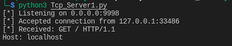

# 脚本工具——TCP与UDP客户端服务端

# TCP客户端

tcp是面向连接的协议，因此通信前需要先建立连接

``` python
# -*- coding: utf-8 -*-
import socket
from urllib import response

#设定通信目标host与端口
target_host = "www.baidu.com"
target_port = 80
#创建一个socket对象
# AF_INET表示`将使用IPV4地址或主机名，SOCK_STREAM表示这是一个TCP客户端
client = socket.socket(socket.AF_INET, socket.SOCK_STREAM)
#连接到客户端
client.connect((target_host,target_port))
#发送bytes数据
client.send(b"GET / HTTP/1.1\r\nHost: baidu.com\r\n\r\n")
#接收返回数据
response = client.recv(4096)
#打印接收到的返回数据
print(response.decode())
client.close()
```

# UDP客户端

udp是无连接协议，因此不需要事先连接

``` python
# -*- coding: utf-8 -*-
import socket

target_host = "127.0.0.1"
target_port = 9997
#创建socket对象
#AF_INET表示IPV4地址，SOCK_DGRAM表示UDP连接
client = socket.socket(socket.AF_INET, socket.SOCK_DGRAM)
#发送bytes数据
client.sendto(b"AAABBBCCC", (target_host, target_port))
#接收返回数据
data, addr = client.recvfrom(4096)
#打印接收到的返回数据
print(data.decode())
client.close()
```

# TCP服务端

``` python
# -*- coding: utf-8 -*-
import socket
import threading

IP = '0.0.0.0'
PORT = 9998

def main():
    #IPV4、TCP连接
    server = socket.socket(socket.AF_INET, socket.SOCK_STREAM)
    #监听IP和端口
    server.bind(IP, PORT)
    #服务器开始监听，最大连接数为5
    server.listen(5)
    print(f'[*] Listening on {IP}:{PORT}')

    while True:
        #客户端成功建立连接
        # 把接收到的客户端socket对象保存到client变量中，将远程连接信息保存到address变量中
        client, address = server.accept()
        print(f'[*] Accepted connection from {address[0]}:{address[1]}')
        #创建一个新的线程指向handler_client函数，并传入client变量
        client_handler = threading.Thread(target=handler_client, args=(client))
        #启动线程处理刚才接收到的连接，服务端主循环准备处理下一个连接
        client_handler.start()

def handler_client(client_socket):
    with client_socket as sock:
        #调用recv接收数据
        request = sock.recv(1024)
        #给客户端发送一段简短的回复
        print(f'[*] Received: {request.decode("utf-8")}')
        sock.send(b'ACK')

if __name__ == '__main__':
    main()
```

使用上面的TCP客户端脚本，把host改为127.0.0.1，与TCP服务端脚本进行通信，结果如下



