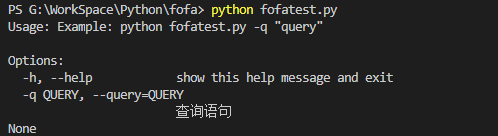

1.脚本完整代码如下
``` python
# -*- coding:utf-8 -*-

import requests
import base64
import sys
import datetime
import csv
import optparse

def main(query):
    if len(query) <= 1:
        print(parser.print_help())
        sys.exit(0)
    else:
        fofa_query(query)  

def fofa_query(query):
    email = r''
    api_key = r''
    arg = query
    sbase64 = (base64.b64encode(arg.encode('utf-8'))).decode('utf-8')
    api = r'https://fofa.info/api/v1/search/all?email={}&key={}&qbase64={}&size=10000'
    print('查询：' + arg)
    try:
        respone = requests.get(api.format(email,api_key,sbase64))
        results = respone.json()["results"]
        print("共搜索到{}条记录！".format(len(results)))
        #以时间命名爬取结果文件
        filename = r"{}.csv".format(datetime.datetime.now().strftime('%Y%m%d%H%M%S'))
        f = open(filename,"a+",newline='')
        csvwrite = csv.writer(f)
        #将URL和IP保存到csv文件
        for addr in results:
            URL = addr[0]
            ip = addr[1]
            csvwrite.writerow([URL,ip])
        f.close()
    except:
        print('请求出错，请检查后重试！') 

if __name__ == '__main__':
    parser = optparse.OptionParser('Example: python %prog -q "query"')
    #查询语法参数
    parser.add_option('-q', '--query', dest = 'query', default = ' ', type = 'string', help = '查询语句')
    (options, args) = parser.parse_args()
    main(options.query)
```
2. 效果如下



4. 