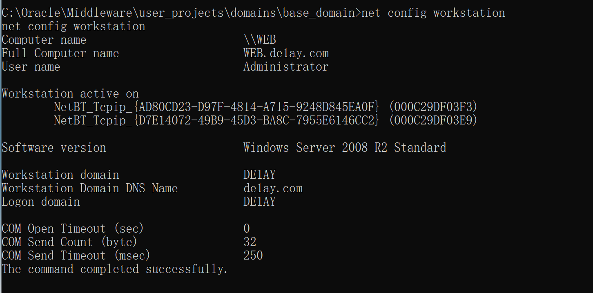

# 一、环境配置

1. web靶机有一块NAT网卡，只需要修改这块NAT网卡的网关，IP改成与攻击机器同网段就可以了

2. 到web靶机中C:/Oracle/Middleware/user_projects/domains/base_domain/bin目录下以管理员权限点击weblogic启动脚本开启weblogic服务，管理员口令是administrator/1qaz@WSX

3. 关闭防火墙
   
   # 二、信息收集

4. nmap扫描网段，如下图，192.168.10.130是我的武器库虚拟机的IP，128是虚拟机网关，128-254之间有两个IP136、137


2. nmap扫描一下这两个IP，如下图，两台主机均开放有135、139、445、3389、49152、49153、49154、49155端口，192.168.10.136主机还开放有80端口存在web服务、开放7001端口存在weblogic服务，weblogic版本为10.3.6.0


3. 先使用fscan扫描一下这些端口，如下，fscan扫描出两个IP都疑似存在ms17-010，192.168.10.137的RDP口令为administrator/1qaz@WSX


4. 使用goby扫描结果如下，同样扫描出两台主机都有ms17-010，但192.168.10.136的weblogic扫出大量高危漏洞


5. 访问一下192.168.10.136的80端口，发现页面是空的，再访问一下7001端口的weblogic，界面如下


# 三、getshell

1. 使用weblogic利用工具上传一个jsp冰蝎马，先利用rce获取系统信息，如下


2. 利用该工具的文件上传功能直接将冰蝎的jsp马上传到web主机的C:\Oracle\Middleware\wlserver_10.3\server\lib\consoleapp\webapp\framework\skins\wlsconsole\images\目录下，然后冰蝎访问http://IP:7001/console/framework/skins/wlsconsole/images/shell.jsp，成功连接


3. 反弹shell到msf，查看ipconfig/all，发现存在两个网卡


# 四、权限提升

1. 得想办法提升权限，先激活一下guest


2. 激活成功，但是guest无权连接3389远程桌面，使用de1ay\administrator用户登录远程桌面，提示必须修改密码，修改成de1ayAdmin.，修改成功后即可进入远程桌面，发现开启了360，直接将360退出


3. 启动cobalt strike，生成一个木马，通过冰蝎的文件管理上传到web主机上，此时我们再通过远程桌面的管理员权限启动cs的木马就不会被拦截和查杀了，web主机成功上线cs获取到administrator权限
   
   # 五、内网渗透
   
   ## （一）内网信息收集

4. 查看域信息，如下，域为delay.com



2. cs中执行域命令总是报错，到远程桌面中通过cmd执行命令，判断主域
   
   ```powershell
   net time /domain
   ```
   
   

3. 查看域控，域控IP为10.10.10.10
   
   ```powershell
   net dclist
   ```
   
   

4. 通过巨龙拉东插件获取域信息时发现域内另一台主机PC，IP：192.168.10.137、10.10.10.201


5. 抓一下密码
   
   ```powershell
   logonpasswords
   ```
   
   
   
   ## （二）横向移动

6. cs新建一个监听，然后点击视图——>目标


2. 点击Launch，等待一会后并没有上线，但查看过程应该是会话传递成功了的，估计是域控不出网无法形成反向shell


3. 扫描一下域控主机，发现开放有445、3389，既然域控不出网，可以考虑利用smb


4. 新建一个smb监听


5. 利用smb监听再次尝试会话传递


6. 成功上线，拿下域控权限


